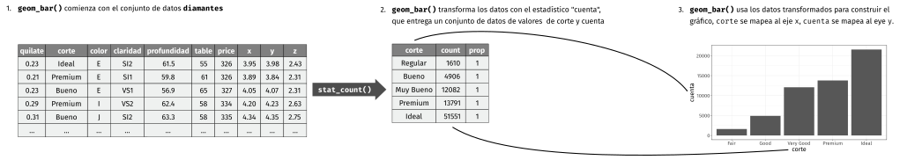
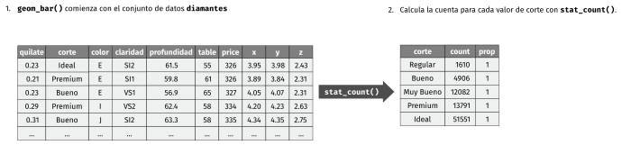

```{r include=FALSE, cache=FALSE}
set.seed(1014)
options(digits = 3)

knitr::opts_chunk$set(
 comment = "#>",
 collapse = TRUE,
 cache = TRUE,
 out.width = "70%",
 fig.align = "center",
 fig.width = 6,
 fig.asp = 0.618, # 1 / phi
 fig.show = "hold"
)

options(dplyr.print_min = 6, dplyr.print_max = 6)
```
# Visualización de datos

## Introducción

>"Un simple gráfico ha brindado más información a la mente del analista de datos
>que cualquier otro dispositivo". --- John Tukey

En este capítulo aprenderás cómo visualizar tus datos usando el paquete **ggplot2**. De los muchos sistemas que posee R para hacer gráficos, **ggplot2** es uno de los más elegantes y versátiles. Esto se debe a que **ggplot2** implementa un sistema coherente para describir y construir gráficos, conocido como la **gramática de gráficos**. Con **ggplot2** puedes hacer más cosas en menor tiempo, aprendiendo un único sistema y aplicándolo en diferentes ámbitos.

Si deseas obtener más información sobre los fundamentos teóricos de **ggplot2** antes de comenzar, te recomendamos leer "La gramática de gráficos en capas", <http://vita.had.co.nz/papers/layered-grammar.pdf>.

### Prerrequisitos

Este capítulo se centra en **ggplot2**, uno de los paquetes principales de tidyverse. Para acceder a los conjuntos de datos, las páginas de ayuda y las funciones que utilizaremos en este capítulo, debes cargar tidyverse ejecutando este código:

```{r setup}
library(tidyverse)
```

Esa única línea de código carga el núcleo del tidyverse; compuesto por los paquetes que usarás en casi todos tus análisis de datos. Al correr esta línea también verás cuáles funciones de tidyverse pueden tener conflicto con funciones de R base (o de otros paquetes que puedas haber cargado previamente).

Si ejecutas este código y recibes el mensaje de error "no hay ningún paquete llamado 'tidyverse'", primero deberás instalarlo y luego ejecutar `library()` una vez más.

```{r eval = FALSE}
install.packages("tidyverse")

library(tidyverse)
```

Solo necesitas instalar el paquete una única vez, pero debes volver a cargarlo siempre que inicies una nueva sesión.

Cuando necesitemos especificar la procedencia de una función (o un conjunto de datos), usaremos el formato especial `paquete::funcion()`. Por ejemplo, `ggplot2::ggplot()` dice explícitamente que estamos usando la función `ggplot()` del paquete ggplot2.

## Primeros pasos

Usemos nuestro primer gráfico para responder una pregunta: ¿Los automóviles con motores grandes consumen más combustible que los automóviles con motores pequeños? Probablemente ya tengas una respuesta, pero trata de responder de forma precisa. ¿Cómo es la relación entre el tamaño del motor y la eficiencia del combustible? ¿Es positiva? ¿Es negativa? ¿Es lineal o no lineal?

### El data frame `millas`

Puedes poner a prueba tu respuesta empleando el *data frame* `millas` que se encuentra en el paquete **datos** (`datos::millas`). Un data frame es una colección rectangular de variables (columnas) y observaciones (filas). El data frame `millas` contiene observaciones para 38 modelos de automóviles recopiladas por la Agencia de Protección Ambiental de los EE. UU.

```{r}
library(datos)

millas
```

Entre las variables en `millas` encontramos:

1. `motor`. Tamaño del motor de un automóvil, en litros.

2. `autopista`. La eficiencia del uso de combustible de un automóvil en la carretera, en millas por galón. Al recorrer la misma distancia, un automóvil de baja eficiencia consume más combustible que un automóvil de alta eficiencia.

Para obtener más información sobre el data frame millas, puedes abrir la página de ayuda ejecutando `?millas`.

### Creando un gráfico con ggplot

Para graficar `millas`, corre este código usando `motor` en el eje x y `autopista` en el eje y.

```{r}
ggplot(data = millas) +
 geom_point(mapping = aes(x = motor, y = autopista))
```

El gráfico muestra una relación negativa entre el tamaño del motor (`motor`) y la eficiencia del combustible (`autopista`). En otras palabras, los vehículos con motores grandes usan más combustible. Este resultado, ¿confirma o refuta tu hipótesis acerca de la relación entre la eficiencia del combustible y el tamaño del motor?

Para comenzar un gráfico con **ggplot2** se utiliza la función `ggplot()`. `ggplot()` crea un sistema de coordenadas al cual puedes agregar capas. El primer argumento de `ggplot()` es el conjunto de datos para usar en el gráfico. Si corres `ggplot(data = millas)`, obtendrás un gráfico vacío. Como no es muy interesante, no vamos a mostrarlo aquí.

Para completar tu gráfico debes agregar una o más capas a `ggplot()`. La función `geom_point()` agrega una capa de puntos al gráfico, que crea un diagrama de dispersión (*scatterplot*). **ggplot2** incluye muchas funciones geom, cada una de las cuales agrega un tipo de capa diferente a un gráfico. Aprenderás muchas de ellas a lo largo de este capítulo.

Cada función geom en **ggplot2** tiene un argumento de `mapping`. Este define cómo se "mapean" o se asignan las variables del conjunto de datos a propiedades visuales. El argumento de `mapping` siempre aparece emparejado con `aes()`, y los argumentos `x` e `y` dentro de `aes()` especifican qué variables asignar a los ejes x e y. **ggplot2** busca la variable asignada en el argumento `data`, en este caso, `millas`.

### Una plantilla de gráficos

Convirtamos ahora este código en una plantilla reutilizable para hacer gráficos con **ggplot2**. Para hacer un gráfico, reemplaza las secciones entre corchetes en el siguiente código con un conjunto de datos, una función geom o una colección de mapeos.

```{r eval = FALSE}
ggplot(data = <DATOS>) +
 <GEOM_FUNCION>(mapping = aes(<MAPEOS>))
```

El resto de este capítulo te mostrará cómo utilizar y adaptar esta plantilla para crear diferentes tipos de gráficos. Comenzaremos por el componente `<MAPEOS>`

### Ejercicios

1. Corre `ggplot(data = millas)`. ¿Qué observas?

2. ¿Cuántas filas hay en `millas`? ¿Cuántas columnas?

3. ¿Qué describe la variable `traccion`? Lee la ayuda de `?millas` para encontrar la respuesta.

4. Realiza un gráfico de dispersión de `autopista` versus `cilindros`.

5. ¿Qué sucede cuando haces un gráfico de dispersión de `clase` versus `traccion`? ¿Por qué no es útil este gráfico?

## Mapeos estéticos

> "El mayor valor de una imagen es cuando nos obliga a observar
> lo que no esperabamos ver". --- John Tukey

En el siguiente gráfico, un grupo de puntos (resaltados en rojo) parece quedar fuera de la tendencia lineal. Estos vehículos tienen un kilometraje mayor de lo que esperaríamos. ¿Cómo puedes explicar estos vehículos?

```{r, echo = FALSE}
ggplot(data = millas, mapping = aes(x = motor, y = autopista)) +
 geom_point() +
 geom_point(data = dplyr::filter(millas, motor > 5, autopista > 20), colour = "red", size = 2.2)
```

Supongamos que estos automóviles son híbridos. Una forma de probar esta hipótesis es observando la variable que indica la `clase` de cada automóvil. La variable `clase` del conjunto de datos de `millas` clasifica los autos en grupos como compacto, mediano y SUV. Si los puntos periféricos corresponden a automóviles híbridos, deberían estar clasificados como compactos o, tal vez, subcompactos (ten en cuenta que estos datos se recopilaron antes de que los camiones híbridos y SUV se hicieran populares).

Puedes agregar una tercera variable, como `clase`, a un diagrama de dispersión bidimensional asignándolo a una __estética__. Una estética es una propiedad visual de los objetos de un gráfico. La estética incluye cosas como el tamaño, la forma o el color de tus puntos. Puedes mostrar un punto (como el siguiente) de diferentes maneras cambiando los valores de sus propiedades estéticas. Como ya usamos la palabra "valor" para describir los datos, usemos la palabra "nivel" para describir las propiedades estéticas. Aquí cambiamos los niveles del tamaño, la forma y el color de un punto para que el punto sea pequeño, triangular o azul:

```{r, echo = FALSE, asp = 1/4}
ggplot() +
 geom_point(aes(1, 1), size = 20) +
 geom_point(aes(2, 1), size = 10) +
 geom_point(aes(3, 1), size = 20, shape = 17) +
 geom_point(aes(4, 1), size = 20, colour = "blue") +
 scale_x_continuous(NULL, limits = c(0.5, 4.5), labels = NULL) +
 scale_y_continuous(NULL, limits = c(0.9, 1.1), labels = NULL) +
 theme(aspect.ratio = 1/3)
```

El mapeo entre las propiedades estéticas del gráfico y las variables del conjunto de datos te permite comunicar información de los mismos. Por ejemplo, puedes asignar los colores de los puntos de acuerdo con la variable `clase` para indicar la clase de cada automóvil.

```{r}
ggplot(data = millas) +
 geom_point(mapping = aes(x = motor, y = autopista, color = clase))
```

(Si prefieres el inglés británico, como Hadley, puedes usar `colour` en lugar de `color`).

Para mapear (o asignar) una estética a una variable, debes asociar el nombre de la estética al de la variable dentro de `aes()`. **ggplot2** asignará automáticamente un nivel único de la estética (en este ejemplo, un color) a cada valor único de la variable. Este proceso es conocido como __escalamiento__ (*scaling*). **ggplot2** acompañará el gráfico con una leyenda que explica qué niveles corresponden a qué valores.

Los colores revelan que muchos de los puntos inusuales son los automóviles de dos asientos. ¡Estos automóviles no parecen híbridos, y son, de hecho, automóviles deportivos! Los automóviles deportivos tienen motores grandes, así como las camionetas todo terreno o pickups, a diferencia de los automóviles pequeños, medianos y compactos, lo que mejora su consumo de gasolina. En retrospectiva, es poco probable que estos automóviles sean híbridos ya que tienen motores grandes.

En el ejemplo anterior, asignamos la variable `clase` a la estética del color , pero podríamos haber asignado a la estética del tamaño de la misma manera. En este caso, el tamaño exacto de cada punto revelaría clase. Recibimos aquí una __advertencia__ (*warning*), porque mapear una variable desordenada (`clase`) a una estética ordenada (`size`) no es una buena idea.

```{r}
ggplot(data = millas) +
 geom_point(mapping = aes(x = motor, y = autopista, size = clase))
```

También podríamos haber asignado la `clase` a la estética *alfa*, que controla la transparencia de los puntos o a la estética *shape* que controla la forma (shape) de los puntos.

```{r out.width = "50%", fig.align = 'default', warning = FALSE, fig.asp = 1/2, fig.cap =""}
# Izquierda
ggplot(data = millas) +
 geom_point(mapping = aes(x = motor, y = autopista, alpha = clase))

# Derecha
ggplot(data = millas) +
 geom_point(mapping = aes(x = motor, y = autopista, shape = clase))
```

¿Qué pasó con los SUV? **ggplot2** solo puede usar seis formas a la vez. De forma predeterminada, los grupos adicionales no se grafican cuando se emplea la estética de la forma.

Para cada estética, se usa `aes()` para asociar el nombre de la estética con la variable seleccionada para graficar. La función `aes()` reúne cada una de las asignaciones estéticas utilizadas por una capa y las pasa al argumento de mapeo de la capa. La sintaxis resalta una visión útil sobre `x` e `y`: las ubicaciones de x e y de un punto son en sí mismas también estéticas, es decir propiedades visuales que se puede asignar a las variables para mostrar información sobre los datos.

Una vez que asignas una estética, **ggplot2** se ocupa del resto. El paquete selecciona una escala razonable para usar con la estética elegida y construye una leyenda que explica la relación entre niveles y valores. Para la estética x e y, **ggplot2** no crea una leyenda, pero crea una línea que delimita el eje con sus marcas de graduación y una etiqueta. La línea del eje actúa como una leyenda; explica el mapeo entre ubicaciones y valores.

También puedes *fijar* las propiedades estéticas de tu geom manualmente. Por ejemplo, podemos hacer que todos los puntos del gráfico sean azules:

```{r}
ggplot(data = millas) +
 geom_point(mapping = aes(x = motor, y = autopista), color = "blue")
```

Aquí, el color no transmite información sobre una variable, sino que cambia la apariencia del gráfico. Para establecer una estética de forma manual, debes usar el nombre de la estética como un argumento de la función geom; es decir, va *fuera* de `aes()`. Tendrás que elegir un nivel que tenga sentido para esa estética:

*	El nombre de un color como una cadena de caracteres.

*	El tamaño de un punto en mm.

*	La forma de un punto como un número, como se muestra en la Figura \@ref(fig:shapes).

```{r shapes, echo = FALSE, out.width = "75%", fig.asp = 1/3, fig.cap="R tiene 25 formas de default que están identificadas por números. Hay algunas que parecen duplicados: por ejemplo 0, 15 y 22 son todos cuadrados. La diferencia viene de la interacción entre las estéticas `color` y `fill` (*relleno*). Las formas vacías (0--14) tienen un borde determinado por `color`; las formas sólidas (15--18) están rellenas con `color`; las formas rellenas (21--24) tienen un borde de `color` y están renellas por `fill`.", warning = FALSE}

shapes <- tibble(
 shape = c(0, 1, 2, 5, 3, 4, 6:19, 22, 21, 24, 23, 20),
 x = (0:24 %/% 5) / 2,
 y = (-(0:24 %% 5)) / 4
)
ggplot(shapes, aes(x, y)) +
 geom_point(aes(shape = shape), size = 5, fill = "red") +
 geom_text(aes(label = shape), hjust = 0, nudge_x = 0.15) +
 scale_shape_identity() +
 expand_limits(x = 4.1) +
 scale_x_continuous(NULL, breaks = NULL) +
 scale_y_continuous(NULL, breaks = NULL, limits = c(-1.2, 0.2)) +
 theme_minimal() +
 theme(aspect.ratio = 1/2.75)
```

### Ejercicios

1. ¿Qué no va bien en este código? ¿Por qué hay puntos que no son azules?

 ```{r}
 ggplot(data = millas) +
 geom_point(mapping = aes(x = motor, y = autopista, color = "blue"))
 ```

2. ¿Qué variables en `millas` son categóricas? ¿Qué variables son continuas? (Sugerencia: escribe `? millas` para leer la documentación de ayuda para este conjunto de datos). ¿Cómo puedes ver esta información cuando ejecutas `millas`?

3. Asigna una variable continua a `color`, ` size`, y `shape`. ¿Cómo se comportan estas estéticas de manera diferente para variables categóricas y variables continuas?

4. ¿Qué ocurre si asignas o mapeas la misma variable a múltiples estéticas?

5. ¿Qué hace la estética `stroke`? ¿Con qué formas trabaja? (Sugerencia: consultar `?geom_point`)

6. ¿Qué ocurre si se asigna o mapea una estética a algo diferente del nombre de una variable, como ser `aes(color = motor < 5)`?

## Problemas comúnes

Es probable que encuentres problemas con los primeros códigos que ejecutes en R, e. No te preocupes, es lo más común. He estado escribiendo código en R durante años, ¡y todos los días sigo escribiendo código que no funciona!

Comienza comparando cuidadosamente el código que estás ejecutando con el código en este libro. R es extremadamente exigente, y un carácter fuera de lugar puede marcar la diferencia. Asegúrate de que cada `(` coincida con un `)` y cada `" ` esté emparejado con otro` "`. Algunas veces ejecutarás el código y no pasará nada. Comprueba la parte izquierda de tu consola: si es un `+`, significa que R no cree que hayas escrito una expresión completa y está esperando que la termines. En este caso, normalmente es fácil comenzar nuevamente desde cero presionando ESCAPE para cancelar el procesamiento del comando actual.

Un problema común al crear gráficos con **ggplot2** es colocar el `+` en el lugar equivocado: debe encontrarse al final de la línea, no al inicio. En otras palabras, asegúrate de no haber escrito accidentalmente un código como este:

```R
ggplot(data = millas)
+ geom_point(mapping = aes(x = motor, y = autopista))
```

Si esto no resuelve el problema, prueba la ayuda. Puedes obtener ayuda sobre cualquier función R ejecutando ?nombre_de_la_funcion en la consola, o seleccionando el nombre de la función y presionando F1 en RStudio. No te preocupes si la ayuda no te parece tan útil, trata entonces de saltar a los ejemplos y buscar un pedazo de código que coincida con lo que intentas hacer.

Si eso no ayuda, lee cuidadosamente el mensaje de error. ¡A veces la respuesta estará oculta allí! Cuando eres nuevo en R, la respuesta puede estar en el mensaje de error, pero aún no sabes cómo entenderlo. Otra gran herramienta es Google: intenta buscar allí el mensaje de error, ya que es probable que otra persona haya tenido el mismo problema y haya obtenido ayuda en línea.

## Separar en facetas

Una forma de agregar variables adicionales es con las estéticas. Otra forma particularmente útil para las variables categóricas consiste en dividir el gráfico en __facetas__, sub-gráficos que muestran cada uno un subconjunto de los datos.

Para separar en facetas un gráfico según una sola variable, usa `facet_wrap()` - del inglés *envolver una faceta*. El primer argumento de `facet_wrap()` debería ser una fórmula creada con `~` seguido por el nombre de una de las variable (aquí "fórmula" es el nombre de un tipo de estructura en R, no un sinónimo de "ecuación"). La variable que uses en `facet_wrap()` debe ser discreta.

```{r}
ggplot(data = millas) +
 geom_point(mapping = aes(x = motor, y = autopista)) +
 facet_wrap(~ clase, nrow = 2)
```

Para separar en facetas un gráfico según las combinaciones de dos variables, agregua `facet_grid()` a tu código del gráfico. El primer argumento de `facet_grid()` también corresponde a una fórmula. Esta vez, la fórmula debe contener dos nombres de variables separados por un `~`.

```{r}
ggplot(data = millas) +
 geom_point(mapping = aes(x = motor, y = autopista)) +
 facet_grid(traccion ~ cilindros)
```

Si prefieres no separar en facetas las filas o columnas, remplaza por un `.` el nombre de alguna de las variables, por ejemplo ` + facet_grid(. ~ cyl)`.

### Ejercicios

1. Qué ocurre si intentas separar en facetas a una variable continua?

2. ¿Qué significan las celdas vacías que aparecen en el gráfico generado usando `facet_grid(traccion ~ cilindros)`?
¿Cómo se relacionan con este gráfico?

 ```{r, eval = FALSE}
 ggplot(data = millas) +
 geom_point(mapping = aes(x = traccion, y = cilindros))
 ```

3. ¿Qué gráfica el siguiente código? ¿Qué hace `.` ?

 ```{r eval = FALSE}
 ggplot(data = millas) +
 geom_point(mapping = aes(x = motor, y = autopista)) +
 facet_grid(traccion ~ .)


 ggplot(data = millas) +
 geom_point(mapping = aes(x = motor, y = autopista)) +
 facet_grid(. ~ cilindros)
 ```

4. Mira de nuevo el primer gráfico en facetas presentado en esta sección:

 ```{r, eval = FALSE}
 ggplot(data = millas) +
 geom_point(mapping = aes(x = motor, y = autopista)) +
 facet_wrap(~ clase, nrow = 2)
 ```

 ¿Cuáles son las ventajas de separar en facetas en lugar de aplicar una estética de color?
 ¿Cuáles son las desventajas?
 ¿Cómo cambiaría este balance si tuvieras un conjunto de datos más grande?

5. Lee `?facet_wrap`. ¿Qué hace `nrow`? ¿Qué hace `ncol`?
¿Qué otras opciones controlan el diseño de los paneles individuales?
¿Por qué `facet_grid()` no tiene argumentos `nrow` y `ncol`?

6. Cuando usas `facet_grid()`, generalmente deberías poner la variable con un mayor número de niveles únicos en las columnas. ¿Por qué?

## Objetos geométricos

¿Cómo son estos dos gráficos similares?

```{r echo = FALSE, out.width = "50%", fig.align="default", message = FALSE}
ggplot(data = millas) +
 geom_point(mapping = aes(x = motor, y = autopista))

ggplot(data = millas) +
 geom_smooth(mapping = aes(x = motor, y = autopista))
```

Ambos gráficos contienen las mismas variables x e y, y describen los mismos datos. Pero los gráficos no son idénticos. Cada gráfico usa un objeto visual diferente para representar los datos. En la sintaxis **ggplot2**, decimos que usan diferentes __geoms__.

Un __geom__ es el objeto geométrico usado para representar datos de forma gráfica. La gente a menudo llama los gráficos por el tipo de geom que utiliza. Por ejemplo, los diagramas de barras usan geoms de barra (*bar*), los diagramas de líneas usan geoms de línea (*line*), los diagramas de caja usan geoms de diagrama de caja (*boxplot*), y así sucesivamente. En inglés, los diagramas de puntos (llamados *scatterplots*) rompen la tendencia; ellos usan geom de punto (o *point*). Como vemos arriba, puedes usar diferentes geoms para graficar los mismos datos. La gráfica de la izquierda usa el geom de punto (`geom_point()`), y la gráfica de la derecha usa el geom liso (`geom_smooth()`), una línea suave ajustada a los datos.

Para cambiar el geom de tu gráfico, modifica la función geom que acompaña a `ggplot()`. Por ejemplo, para hacer los gráficos que se muestran arriba, puedes usar este código:

```{r eval = FALSE}
# izquierda
ggplot(data = millas) +
 geom_point(mapping = aes(x = motor, y = autopista))

# derecha
ggplot(data = millas) +
 geom_point(mapping = aes(x = motor, y = autopista))
```

Cada función geom en **ggplot2** toma un argumento de `mapping`. Sin embargo, no todas las estéticas funcionan con todos los geom. Podrías establecer la forma para un punto, pero no podrías establecer la "forma" de una línea. Por otro lado, para una línea es posible elegir el *tipo* de línea (*linetype*). `geom_smooth()` dibujará una línea diferente, con un tipo de línea diferente, para cada valor único de la variable que asignes al tipo de línea.

```{r message = FALSE}
ggplot(data = millas) +
 geom_smooth(mapping = aes(x = motor, y = autopista, linetype = traccion))
```

Aquí `geom_smooth()` separa los automóviles en tres líneas en función de su valor de `traccion`, que describe el tipo de transmisión de un automóvil. Una línea describe todos los puntos con un valor de 4, otra línea los de valor d, y una tercera línea describe los puntos con un valor t. Aquí, `4` significa tracción en las cuatro ruedas, `d` tracción delantera y `t` tracción trasera.

Si esto suena extraño, podemos hacerlo más claro al superponer las líneas sobre los datos brutos y luego colorear todo según `traccion`.

```{r echo = FALSE, message = FALSE}
ggplot(data = millas, mapping = aes(x = motor, y = autopista, color = traccion)) +
 geom_point()+
 geom_smooth(mapping = aes(linetype = traccion))
```

¡Observa que generamos un gráfico que contiene dos geoms! Si esto te emociona, abróchate el cinturón. En la siguiente sección aprenderemos cómo colocar múltiples geoms en el mismo gráfico.

**ggplot2** proporciona más de 30 geoms, y los paquetes de extensión proporcionan aún más (consulta <https://www.ggplot2-exts.org> para obtener una muestra). La mejor forma de obtener un panorama completo sobre las posibilidades que brinda **ggplot2** es consultando la hoja de referencia (*cheatsheet*), que puedes encontrar en <http://rstudio.com/cheatsheets>. Para obtener más información sobre un tipo dado de geoms, usa la ayuda: `?geom_smooth`.

Muchos geoms, tal como `geom_smooth()`, usan un único objeto geométrico para mostrar múltiples filas de datos. Para estos geoms, puedes asignar la estética de `group` a una variable categórica para graficar múltiples objetos. **ggplot2** representará un objeto distinto por cada valor único de la variable de agrupamiento. En la práctica, **ggplot2** agrupará automáticamente los datos para estos geoms siempre que se asigne una estética a una variable discreta (como en el ejemplo del tipo de línea o `linetype`). Es conveniente confiar en esta característica porque la estética del grupo en sí misma no agrega una leyenda o características distintivas a los geoms.

```{r, fig.width = 3, fig.align = 'default', out.width = "33%", message = FALSE}
ggplot(data = millas) +
 geom_smooth(mapping = aes(x = motor, y = autopista))

ggplot(data = millas) +
 geom_smooth(mapping = aes(x = motor, y = autopista, group = traccion))

ggplot(data = millas) +
 geom_smooth(mapping = aes(x = motor, y = autopista, color = traccion), show.legend = FALSE)
```

Para mostrar múltiples geoms en el mismo gráfico, agrega varias funciones geom a `ggplot()`:

```{r, message = FALSE}
ggplot(data = millas) +
 geom_point(mapping = aes(x = motor, y = autopista)) +
 geom_smooth(mapping = aes(x = motor, y = autopista))
```

Esto introduce sin embargo cierta duplicación en nuestro código. Imagina que deseas cambiar el eje y para mostrar `ciudad` en lugar de `autopista`. Necesitarías cambiar la variable en dos lugares, y podrías olvidarte de actualizar uno. Puedes evitar este tipo de repetición pasando un conjunto de mapeos a `ggplot()`. **ggplot2** tratará estos mapeos como mapeos globales que se aplican a cada geom en el gráfico. En otras palabras, este código producirá la misma gráfica que el código anterior:

```{r, eval = FALSE}
ggplot(data = millas, mapping = aes(x = motor, y = autopista)) +
 geom_point() +
 geom_smooth()
```

Si colocas mapeos en una función geom, ggplot2 los tratará como mapeos locales para la capa. Estas asignaciones serán usadas para extender o sobrescribir los mapeos globales *de solo esa capa*. Esto permite mostrar diferentes estéticas en diferentes capas.

```{r, message = FALSE}
ggplot(data = millas, mapping = aes(x = motor, y = autopista)) +
 geom_point(mapping = aes(color = clase)) +
 geom_smooth()
```

La misma idea se puede emplear para especificar distintos conjuntos de datos (`data`) para cada capa. Aquí, nuestra línea suave muestra solo un subconjunto del conjunto de datos de `millas`, los autos subcompactos. El argumento de datos locales en `geom_smooth()` anula el argumento de datos globales en `ggplot()` solo para esa capa.

```{r, message = FALSE}
ggplot(data = millas, mapping = aes(x = motor, y = autopista)) +
 geom_point(mapping = aes(color = clase)) +
 geom_smooth(data = filter(millas, clase == "subcompacto"), se = FALSE)
```

(Aprenderás cómo funciona `filter()` en el próximo capítulo: por ahora, solo recuerda que este comando selecciona los automóviles subcompactos).

### Ejercicios

1. ¿Qué geom usarías para generar un gráfico de líneas?
¿Un diagrama de caja? ¿Un histograma? ¿Un gráfico de área?

2. Ejecuta este código en tu mente y predice cómo se verá el *output*.
Luego, ejecuta el código en R y verifica tus predicciones.

 ```{r, eval = FALSE}
 ggplot(data = millas, mapping = aes(x = motor, y = autopista, color = traccion)) +
 geom_point() +
 geom_smooth(se = FALSE)
 ```
3. ¿Qué muestra `show.legend = FALSE`? ¿Qué pasa si lo quitas?
 ¿Por qué crees que lo usé antes en el capítulo?

4. ¿Qué hace el argumento `se` en `geom_smooth()`?

5. ¿Se verán distintos estos gráficos? ¿Por qué sí o por qué no?

 ```{r, eval = FALSE}
 ggplot(data = millas, mapping = aes(x = motor, y = autopista)) +
 geom_point() +
 geom_smooth()

 ggplot() +
 geom_point(data = millas, mapping = aes(x = motor, y = autopista)) +
 geom_smooth(data = millas, mapping = aes(x = motor, y = autopista))
 ```

6. Recrea el código R necesario para generar los siguientes gráficos:

 ```{r echo = FALSE, fig.width = 3, out.width = "50%", fig.align = "default", message = FALSE}
 ggplot(data = millas, mapping = aes(x = motor, y = autopista)) +
 geom_point() +
 geom_smooth(se = FALSE)

 ggplot(data = millas, mapping = aes(x = motor, y = autopista)) +
 geom_smooth(aes(group = traccion), se = FALSE) +
 geom_point()

 ggplot(data = millas, mapping = aes(x = motor, y = autopista, color = traccion)) +
 geom_point() +
 geom_smooth(se = FALSE)

 ggplot(data = millas, mapping = aes(x = motor, y = autopista)) +
 geom_point(aes(color = traccion)) +
 geom_smooth(se = FALSE)

 ggplot(data = millas, mapping = aes(x = motor, y = autopista)) +
 geom_point(aes(color = traccion)) +
 geom_smooth(aes(linetype = traccion), se = FALSE)

 ggplot(data = millas, mapping = aes(x = motor, y = autopista)) +
 geom_point(size = 4, colour = "white") +
 geom_point(aes(colour = traccion))
 ```

## Transformaciones estadísticas

A continuación, echemos un vistazo a un gráfico de barras. Los gráficos de barras parecen simples, pero son interesantes porque revelan algo sutil sobre los gráficos. Considera un gráfico de barras básico, como se realizó con `geom_bar()`. El siguiente cuadro muestra la cantidad total de diamantes en el conjunto de datos de `diamantes`, agrupados por la variable `corte`. El conjunto de datos de `diamantes` se encuentra en el paquete **datos** y contiene información sobre ~ 54000 diamantes, incluido el `precio`, el `quilate`, el `color`, la `claridad` y el `corte` de cada diamante. El gráfico muestra que hay más diamantes disponibles con cortes de alta calidad que con cortes de baja calidad.

```{r}
ggplot(data = diamantes) +
 geom_bar(mapping = aes(x = corte))
```

En el eje x, el gráfico muestra `corte`, una variable de `diamantes`. En el eje y muestra recuento, ¡pero el recuento no es una variable en `diamantes`! ¿De dónde viene el recuento? Muchos gráficos, como los diagramas de dispersión, grafican los valores brutos de su conjunto de datos. Otros gráficos, como los gráficos de barras, calculan nuevos valores para presentar:

*	los gráficos de barras, los histogramas y los polígonos de frecuencia almacenan los datos y luego grafican los conteos de contenedores, sea el número de puntos que caen en cada contenedor.

*	los suavizadores ajustan un modelo a los datos y luego grafican las predicciones del modelo.

*	los diagramas de caja calculan un sólido resumen de la distribución y luego muestran un cuadro con formato especial.

El algoritmo utilizado para calcular nuevos valores para un gráfico se llama *stat*, abreviatura en inglés de transformación estadística. La siguiente figura describe cómo funciona este proceso con `geom_bar()`.

```{r, echo = FALSE, out.width = "100%"}

```

Puedes aprender qué stat usa cada geom inspeccionando el valor predeterminado para el argumento stat. Por ejemplo, `?geom_bar` muestra que el valor predeterminado para `stat` es "count", lo que significa que `geom_bar()` usa `stat_count()`. `stat_count()` está documentado en la misma página que `geom_bar()`, y si te desplazas hacia abajo puedes encontrar una sección llamada "Variables calculadas" (*Computed variables*). Eso describe cómo calcula dos nuevas variables: `count` y `prop`.

Por lo general puedes usar geoms y estadísticas de forma intercambiable. Por ejemplo, puedes volver a crear la gráfica anterior usando `stat_count()` en lugar de `geom_bar()`:

```{r}
ggplot(data = diamantes) +
 stat_count(mapping = aes(x = corte))
```

Esto funciona porque cada geom tiene una estadística predeterminada; y cada estadística tiene un geom predeterminado. Esto significa que generalmente puedes usar geoms sin preocuparte por la transformación estadística subyacente. Hay tres razones por las que podrías necesitar usar una estadística explícitamente:

1.	Es posible que desees anular la estadística predeterminada. En el siguiente código, cambio la estadística de `geom_bar()` de recuento (el valor predeterminado) a identidad. Esto me permite asignar la altura de las barras a los valores brutos de una variable $y$. Desafortunadamente, cuando la gente habla de gráficos de barras casualmente, podrían estar refiriéndose a este tipo de gráfico de barras, donde la altura de la barra ya está presente en los datos, o al gráfico de barras anterior, donde la altura de la barra se determina contando filas.


 ```{r, warning = FALSE}
 demo <- tribble(
 ~corte, ~freq,
 "Regular", 1610,
 "Bueno", 4906,
 "Muy Bueno", 12082,
 "Premium", 13791,
 "Ideal", 21551
 )

 ggplot(data = demo) +
 geom_bar(mapping = aes(x = corte, y = freq), stat = "identity")

 ```

 (No te preocupes si nunca has visto `<-` o `tribble()`. Puede que seas capaz de adivinar su significado por el contexto. ¡Aprenderás lo que hacen exactamente pronto!)

2. Es posible que desees anular el mapeo predeterminado de las variables transformadas a la estética.
Por ejemplo, es posible que desees mostrar un gráfico de barras de proporciones, en lugar de un recuento:

 ```{r}
 ggplot(data = diamantes) +
 geom_bar(mapping = aes(x = corte, y = ..prop.., group = 1))
 ```

 Para encontrar las variables calculadas por la estadística, busca la sección de ayuda titulada "Variables calculadas".

3. Es posible que desees resaltar la transformación estadística en tu código.
Por ejemplo, puedes usar `stat_summary()`, que resume los valores de y para cada valor único de x, para resaltar el resumen que se está computando:

 ```{r}
 ggplot(data = diamantes) +
 stat_summary(
 mapping = aes(x = corte, y = profundidad),
 fun.ymin = min,
 fun.ymax = max,
 fun.y = median
 )
 ```

**ggplot2** proporciona más de 20 estadísticas para que uses. Cada estadística es una función, por lo que puedes obtener ayuda de la manera habitual, por ejemplo: `?stat_bin`. Para ver una lista completa de estadísticas disponibles para **ggplot2**, consulta la hoja de referencia.

### Ejercicios

1. ¿Cuál es el geom predeterminado asociado con `stat_summary()`?
¿Cómo podrías reescribir el gráfico anterior para usar esa función geom en lugar de la función stat?

2. ¿Qué hace `geom_col()`? ¿Cómo es diferente a `geom_bar()`?

3. La mayoría de los geoms y las estadísticas vienen en pares que casi siempre se usan en conjunto.
Lee la documentación y has una lista de todos los pares. ¿Qué tienen en común?

4. ¿Qué variables calcula `stat_smooth()`? ¿Qué parámetros controlan su comportamiento?

1. En nuestro gráfico de barras de proporción , necesitamos establecer `group = 1`. ¿Por qué?
En otras palabras, ¿cuál es el problema con estos dos gráficos?


 ```{r, eval = FALSE}

 ggplot(data = diamantes) +
 geom_bar(mapping = aes(x = corte, y = ..prop..))

 ggplot(data = diamantes) +
 geom_bar(mapping = aes(x = corte, fill = color, y = ..prop..))
 ```

## Ajustes de posición

Hay una pieza más de magia asociada con los gráficos de barras. Puede colorear un gráfico de barras usando la estética de `color` o, tal vez con el más útil `fill`:

```{r out.width = "50%", fig.align = "default"}
ggplot(data = diamantes) +
 geom_bar(mapping = aes(x = corte, colour = corte))

ggplot(data = diamantes) +
 geom_bar(mapping = aes(x = corte, fill = corte))
```

Mira lo que sucede si asigna la estética de relleno a otra variable, como `claridad`: las barras se apilan automáticamente. Cada rectángulo de color representa una combinación de `corte` y `claridad`.

```{r}
ggplot(data = diamantes) +
 geom_bar(mapping = aes(x = corte, fill = claridad))
```

El apilamiento se realiza automáticamente mediante el ajuste de posición especificado por el argumento `position`. Si no deseas un gráfico de barras apiladas , puedes usar una de las otras tres opciones: `"identity"`, `"dodge"` o `"fill"`, del inglés *identidad*, *esquivar* y *llenar* respectivamente.

*	`position = "identity"` colocará cada objeto exactamente donde cae en el contexto del gráfico. Esto no es muy útil al momento de graficar barras, porque las superpone. Para ver esa superposición, debemos hacer que las barras sean ligeramente transparentes al configurar alfa a un valor pequeño, o completamente transparente al establecer `fill = NA`.

```{r out.width = "50%", fig.align = "default"}
ggplot(data = diamantes, mapping = aes(x = corte, fill = claridad)) +
 geom_bar(alpha = 1/5, position = "identity")

ggplot(data = diamantes, mapping = aes(x = corte, colour = claridad)) +
 geom_bar(fill = NA, position = "identity")
```

El ajuste de `position = identity` es más útil para geoms 2-D, como puntos, donde es la opción predeterminada.

* `position = "fill"` funciona como el apilamiento, pero hace que cada conjunto de barras apiladas tenga la misma altura. Esto hace que sea más fácil comparar proporciones entre grupos.

```{r}
ggplot(data = diamantes) +
 geom_bar(mapping = aes(x = corte, fill = claridad), position = "fill")
```

* `position = "dodge"` coloca objetos superpuestos directamente uno al lado del otro. Esto hace que sea más fácil comparar valores individuales.

```{r}
ggplot(data = diamantes) +
 geom_bar(mapping = aes(x = corte, fill = claridad), position = "dodge")
```

Hay otro tipo de ajuste que no es útil para gráficos de barras, pero puede ser muy útil para diagramas de dispersión. Recuerda nuestro primer diagrama de dispersión. ¿Notaste que la trama muestra solo 126 puntos, a pesar de que hay 234 observaciones en el conjunto de datos?

```{r echo = FALSE}
ggplot(data = millas) +
 geom_point(mapping = aes(x = motor, y = autopista))
```

Los valores de las variables `autopista` y `motor` se redondean de modo que los puntos aparecen en una cuadrícula y muchos se superponen entre sí. Este problema se conoce como __sobregraficado__ (*overplotting*). Esta disposición hace que sea difícil ver dónde está la masa de datos. ¿Los puntos de datos se distribuyen equitativamente a lo largo de la gráfica, o hay una combinación especial de `autopista` y `motor` que contiene 109 valores?

Puedes evitar esta grilla estableciendo el ajuste de posición en "jitter". `position = "jitter"` agrega una pequeña cantidad de ruido aleatorio a cada punto. Esto dispersa los puntos ya que no es probable que dos puntos reciban la misma cantidad de ruido aleatorio.

```{r}
ggplot(data = millas) +
 geom_point(mapping = aes(x = motor, y = autopista), position = "jitter")
```

Si bien agregar aleatoriedad a los puntos puede parecer una forma extraña de mejorar tu gráfico ya que hace que sea menos preciso a escalas pequeñas, lo hace ser más revelador a gran escala. Como esta es una operación tan útil, ggplot2 viene con una abreviatura de `geom_point(position = "jitter")`: `geom_jitter()`.

Para obtener más información sobre ajustes de posición, busca la página de ayuda asociada con cada ajuste: `?position_dodge`, `?position_fill`, `?position_identity`, `?position_jitter` y `?position_stack`.

### Ejercicios

1. ¿Cuál es el problema con este gráfico? ¿Cómo podrías mejorarlo?

```{r}
ggplot(data = millas, mapping = aes(x = ciudad, y = autopista)) +
 geom_point()
```

2. ¿Qué parámetros de `geom_jitter()` controlan la cantidad de ruido?

3. Compara y contrasta `geom_jitter()` con `geom_count()`

4. ¿Cuál es el ajuste de posición predeterminado de `geom_boxplot()`? Crea una visualización del conjunto de datos de `millas` que lo demuestre.

## Sistemas de coordenadas

Los sistemas de coordenadas son probablemente la parte más complicada de ggplot2. El sistema predeterminado es el sistema de coordenadas cartesianas, donde las posiciones x e y actúan independientemente para determinar la ubicación de cada punto. Hay varios otros sistemas de coordenadas que ocasionalmente son útiles.

* `coord_flip()` cambia los ejes x e y. Esto es útil (por ejemplo), si quieres diagramas de caja horizontales. También es útil para etiquetas largas: es difícil ajustarlas sin superposición en el eje x.

 ```{r fig.width = 3, out.width = "50%", fig.align = "default"}

 ggplot(data = millas, mapping = aes(x = clase, y = autopista)) +
 geom_boxplot()

 ggplot(data = millas, mapping = aes(x = clase, y = autopista)) +
 geom_boxplot() +
 coord_flip()
 ```

* `coord_quickmap()` establece la relación de aspecto correctamente para los mapas. Esto es muy importante si graficas datos espaciales con ggplot2 (tema que desafortunadamente no contamos con espacio para desarrollar en este libro).

 ```{r fig.width = 3, out.width = "50%", fig.align = "default", message = FALSE}
 nz <- map_data("nz")

 ggplot(nz, aes(long, lat, group = group)) +
 geom_polygon(fill = "white", colour = "black")

 ggplot(nz, aes(long, lat, group = group)) +
 geom_polygon(fill = "white", colour = "black") +
 coord_quickmap()
 ```

* `coord_polar()` usa coordenadas polares. Las coordenadas polares revelan una conexión interesante entre un gráfico de barras y un gráfico de Coxcomb.

 ```{r fig.width = 3, out.width = "50%", fig.align = "default", fig.asp = 1}
 bar <- ggplot(data = diamantes) +
 geom_bar(
 mapping = aes(x = corte, fill = corte),
 show.legend = FALSE,
 width = 1
 ) +
 theme(aspect.ratio = 1) +
 labs(x = NULL, y = NULL)

 bar + coord_flip()
 bar + coord_polar()
 ```

### Ejercicios

1. Convierte un gráfico de barras apiladas en un gráfico circular usando `coord_polar()`.

2. ¿Qué hace `labs()`? Lee la documentación.

3. ¿Cuál es la diferencia entre `coord_quickmap()` y `coord_map()`?

4. ¿Qué te dice la gráfica siguiente sobre la relación entre la ciudad y la `autopista`? ¿Por qué es `coord_fixed()` importante? ¿Qué hace `geom_abline()`?

 ```{r, fig.asp = 1, out.width = "50%"}
 ggplot(data = millas, mapping = aes(x = ciudad, y = autopista)) +
 geom_point() +
 geom_abline() +
 coord_fixed()
 ```

## La gramática de gráficos en capas

En las secciones anteriores, aprendiste mucho más que cómo hacer diagramas de dispersión, gráficos de barras y diagramas de caja. Aprendiste una base que se puede usar para hacer cualquier tipo de gráfico con **ggplot2**. Para ver esto, agreguemos ajustes de posición, estadísticas, sistemas de coordenadas y facetas a nuestra plantilla de código:

```
ggplot(data = <DATOS>) +
 <GEOM_FUNCION>(
 mapping = aes(<MAPEOS>),
 stat = <ESTADISTICA>,
 position = <POSICION>
 ) +
 <FUNCION_COORDENADAS> +
 <FUNCION_FACETAS>

```

Nuestra nueva plantilla tiene siete parámetros que se corresponde con las palabras entre corchetes que aparecen en la plantilla. En la práctica, rara vez necesitas proporcionar los siete parámetros para hacer un gráfico porque **ggplot2** proporcionará valores predeterminados útiles para todos excepto para los datos, las asignaciones y la función geom.

Los siete parámetros en la plantilla componen la gramática de los gráficos, un sistema formal de construcción de gráficos. La gramática de los gráficos se basa en la idea de que puedes describir de manera única *cualquier* gráfico como una combinación de un conjunto de datos, un geom, un conjunto de asignaciones, una estadística, un ajuste de posición, un sistema de coordenadas y un esquema de facetado.

Para ver cómo funciona esto, considera cómo podrías construir un gráfico básico desde cero: podrías comenzar con un conjunto de datos y luego transformarlo en la información que deseas mostrar (con una estadística).

```{r, echo = FALSE, out.width = "100%"}

```

A continuación, podrías elegir un objeto geométrico para representar cada observación en los datos transformados. Luego podrías usar las propiedades estéticas de los geoms para representar variables de los datos. Asignarías los valores de cada variable a los niveles de una estética.

```{r, echo = FALSE, out.width = "100%"}
knitr::include_graphics("diagrams_w_text_as_path/es/visualization-grammar-2.svg")
```

Posteriormente, seleccionarías un sistema de coordenadas para colocar los geoms. Podrías utilizar la ubicación de los objetos (que es en sí misma una propiedad estética) para mostrar los valores de las variables x e y. Ya en este punto podrías tener un gráfico completo, pero también podrías ajustar aún más las posiciones de los geoms dentro del sistema de coordenadas (un ajuste de posición) o dividir el gráfico en subtramas (facetas). También podrías extender el gráfico agregando una o más capas adicionales, donde cada capa adicional usaría un conjunto de datos, un geom, un conjunto de asignaciones, una estadística y un ajuste de posición.

```{r, echo = FALSE, out.width = "100%"}
knitr::include_graphics("diagrams_w_text_as_path/es/visualization-grammar-3.svg")
```

Puedes usar este método para construir *cualquier* gráfico que imagines. En otras palabras, puedes usar la plantilla de código aprendiste en este capítulo para construir cientos de miles de gráficos únicos.
