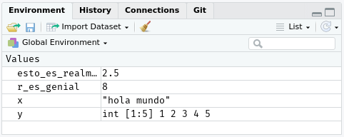

# Flujo de trabajo: conocimientos básicos

Ya tienes un poco de experiencia ejecutando código R. No te hemos dado demasiados detalles, pero es evidente que has podido resolver lo básico ¡o ya habrías arrojado lejos este libro en un acceso de frustración! Es natural frustrarte cuando empiezas a programar en R ya que es muy estricto en cuanto a la puntuación: incluso un único caracter fuera de lugar provocará que se queje. Si bien deberías esperar sentir un poco de frustración, confía en que esta sensación es normal y transitoria: le pasa a todas las personas y la única forma de superarla es seguir intentando.

Antes de avanzar vamos a asegurarnos de que tengas una base sólida ejecutando código R, y que conozcas algunas de las características más útiles de RStudio. 

## Conocimientos básicos de programación

Revisemos algunos conocimientos básicos que omitimos hasta ahora para que pudieras empezar a hacer gráficos lo más rápido posible. Puedes usar R como una calculadora:

```{r}
1 / 200 * 30
(59 + 73 + 2) / 3
sin(pi / 2)
```

(`sin` calcula por defecto la función trigonométrica *seno*)

Puedes crear objetos nuevos usando `<-`:

```{r}
x <- 3 * 4
```

Todas las instrucciones en R en las que crees objetos, es decir, las instrucciones de __asignación__, tienen la misma estructura:

```{r eval = FALSE}
nombre_objeto <- valor
```

Cuando leas esa línea de código di mentalmente "nombre_objeto recibe valor".

Harás una gran cantidad de asignaciones y `<-` es incómodo de escribir. Que no te gane la pereza de usar `=`: sí, funcionará, pero provocará confusión más adelante. En cambio, usa el atajo de teclado de RStudio Alt + - (signo menos). RStudio automágicamente rodeará `<-` con espacios, lo que es un buena costumbre para dar formato al código. El código puede ser horrible para leer incluso en un buen día, por lo que ayudará a tu vista usar espacios. 

## La importancia de los nombres

Los nombres de los objetos deben comenzar con una letra y solo pueden contener letras, números, `_` y `.`. Es mejor que los nombres sean descriptivos. Por eso necesitarás una convención para usar más de una palabra. Nosotros recomendamos __guion_bajo__ (o *snake_case*) en el que las palabras en minúscula y sin tilde se separan con `_`.

```{r, eval = FALSE}
yo_uso_guion_bajo
OtraGenteUsaMayusculas
algunas.personas.usan.puntos
Y_algunasPocas.Personas_RENIEGANdelasconvenciones
```

Volveremos a tratar el estilo del código más adelante, en [funciones].

Puedes examinar un objeto escribiendo su nombre:
```{r}
x
```

Hagamos otra asignación:
```{r}
este_es_un_nombre_muy_largo <- 2.5
```

Para examinar este objeto utiliza la capacidad de RStudio para completar: escribe "este", presiona TAB, agrega caracteres hasta conseguir una única opción y finaliza apretando Enter.

¡Oh, cometiste un error! `este_es_un_nombre_muy_largo` debería valer 3.5 y no 2.5. Usa otro atajo del teclado para corregirlo. Escribe "este", luego presiona Cmd/Ctrl + ↑. Aparecerá una lista con todas los comandos que has escrito que empiezan con esas letras. Usa las flechas para navegar y presiona Enter para reescribir el comando elegida. Cambia 2.5 por 3.5 y vuelve a ejecutarlo.

Hagamos una asignación más:

```{r}
viva_r <- 2 ^ 3
```

Probemos examinar el objeto
```{r, eval = FALSE}
viv_r
#> Error: object 'viv_r' not found
viva_R
#> Error: object 'viva_R' not found
```

Los mensajes de error señalan que R no encontró entre los objetos definidos ninguno que se llame `viv_r` ni `viva_R`.

Existe un acuerdo implícito entre tú y R: R hará todos los tediosos cálculos por ti, pero a cambio tú debes dar las instrucciones con total precisión. Importa si hay errores ortotipográficos (_typos_). Importa si algo está en mayúscula o minúscula.

## Usando funciones

R tiene una gran colección de funciones integradas que se usan así:
```{r eval = FALSE}
nombre_funcion(arg1 = val1, arg2 = val2, ...)
```

Probemos usar `seq()` que construye **sec**uencias regulares de números y, mientras tanto, aprendamos otras características útiles de RStudio. Escribe `se` y presiona TAB. Una ventana emergente te mostrará opciones para completar tu instrucción. Especifica `seq()` agregando caracteres que permitan desambiguar (agrega una `q`), o usando las flechas ↑/↓. Si necesitas ayuda, presiona F1 para obtener información detallada en la pestaña de ayuda del panel inferior derecho.

Presiona TAB una vez más cuando hayas seleccionado la función que quieras. RStudio colocará por tí paréntesis de apertura (`(`) y cierre (`)`)  de a pares. Escribe los argumentos `1, 10` y presiona Enter.

```{r}
seq(1, 10)
```

Escribe este código y observa que RStudio también te asiste al utilizar comillas:
```{r}
x <- "hola mundo"
```

Comillas y paréntesis siempre se usan de a pares. RStudio hace lo mejor que puede para ayudarte; sin embargo puede ocurrir que nos enredemos y terminemos con una disparidad. Si esto ocurre R te mostrará el caracter de continuación "+": 

```
> x <- "hola
+
```

El `+` te indica que R está esperando que completes la instrucción; no cree que hayas terminado. Usualmente esto implica que olvidaste escribir `"` o `)`. Puedes agregar el caracter par faltante o presionar ESCAPE para abandonar la expresión y escribirla de nuevo.

Cuando realizas una asignación no se imprime en la consola el valor asignado. Es una tentación confirmar inmediatamente el resultado:

```{r}
y <- seq(1, 10, length.out = 5)
y
```

Esta acción común puede acortarse rodeando la instrucción con paréntesis, lo que resulta en una asignación e "impresión en la pantalla".

```{r}
(y <- seq(1, 10, length.out = 5))
```

Mira tu entorno de trabajo en el panel superior derecho:

```{r, echo = FALSE, out.width = NULL}

```

Allí puedes ver todos los objetos que creaste.

## Ejercicios

1.  ¿Por qué no funciona este código?

    ```{r, error = TRUE}
    mi_variable <- 10
    mi_varıable
    ```
    
    ¡Mira detenidamente! (Esto puede parecer un ejercicio inútil, pero entrenar tu cerebro para detectar incluso las diferencias más pequeñas será muy útil cuando comiences a programar.)
    
2.  Modifica cada una de las instrucciones de R a continuación para que puedan ejecutarse correctamente:

    ```{r, eval = FALSE}
    library(tidyverse)

    ggplot(dota = millas) + 
      geom_point(mapping = aes(x = cilindrada, y = autopista))
    
    fliter(millas, cilindros = 8)
    filter(diamante, quilate > 3)
    ```
    
3.  Presiona Alt + Shift + K. ¿Qué ocurrió? ¿Cómo puedes llegar al mismo lugar utilizando los menús?
