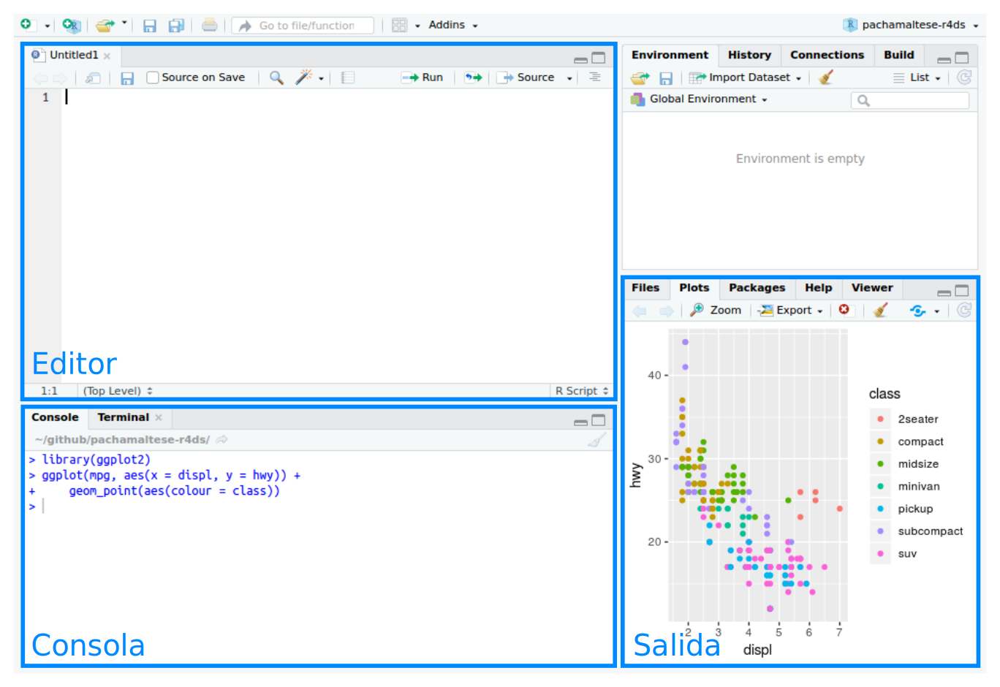

# Flujo de trabajo: *Scripts*

Hasta ahora estuviste utilizando la consola para ejecutar código. Ese es un buen punto de partida, pero verás que se vuelve incómodo rápidamente a medida que creas gráficos de **ggplot2** y *pipes* en **dplyr** más complejos. Para tener más espacio de trabajo, una buena idea es usar el editor de *script*. Ábrelo ya sea haciendo clic en el menú de Archivo (*File*), seleccionando Nuevo Archivo (*New File*), y luego Script de R (*R Script*), o bien, utilizando el atajo del teclado `Cmd/Ctrl` + `Shift` + `N`. Ahora verás cuatro paneles: 
```{r echo = FALSE, out.width = "75%"}

```
El editor de *script* es un excelente espacio para colocar el código que te importa. Continúa experimentando en la consola, pero una vez que has escrito un código que funciona y hace lo que quieres, colócalo en el editor de *script*. RsStudio guardará automáticamente los contenidos del editor cuando salgas del programa, y los cargará automáticamente cuando vuelvas a abrirlo. De todas formas, es una buena idea que guardes los *scripts* regularmente y que los respaldes.


## Ejecutando código


El editor de *script* es también un excelente espacio para desarrollar gráficos de **ggplot2** complejos o largas secuencias de manipulación con **dplyr**. La clave para utilizar el editor de *script* efectivamente es memorizar uno de los atajos del teclado más importantes: Cmd/Ctrl + Enter. Esto ejecuta la expresión actual de R en la consola. Por ejemplo, toma el código de abajo. Si tu cursor está sobre `no_cancelado <- vuelos %>%`, presionar `Cmd/Ctrl` + `Enter` ejecutará el comando completo que genera `no_cancelado`. También moverá el cursor al siguiente enunciado (que comienza con `no_cancelado %>%`). Esto facilita ejecutar todo tu *script* presionando repetidamente Cmd/Ctrl + Enter.


```{r, eval = FALSE}
library(dplyr)
library(datos)
no_cancelado <- vuelos %>% 
  filter(!is.na(atraso_salida), !is.na(atraso_llegada))
no_cancelado %>% 
  group_by(anio, mes, dia) %>% 
  summarise(media = mean(atraso_salida))
```

En lugar de correr expresión por expresión, también puedes ejecutar el *script* completo en un paso: `Cmd/Ctrl` + `Shift` + `S`. Hacer esto regularmente es una buena forma de verificar que has capturado todas las partes importantes de tu código en el *script*.
Te recomendamos que siempre comiences tu *script* cargando los paquetes que necesitas. De este modo, si compartes tu código con otras personas, quienes lo utilicen pueden fácilmente ver qué paquetes necesitan instalar. Ten en cuenta, sin embargo, que nunca deberías incluir `install.packages()` (del inglés, _instalar paquetes_)  o `setwd()` (del inglés  *set working directory*, establecer directorio de trabajo) en un *script* que compartes. ¡Es muy antisocial cambiar la configuración en la computadora de otra persona!

Cuando trabajes en los capítulos que siguen, te sugierimos comenzar en el editor y practicar los atajos de tu teclado.  Con el tiempo, enviar código a la consola de esta forma se volverá tan natural que ni siquiera tendrás que pensarlo.


## Diagnósticos de RStudio

El editor de *script* resaltará errores de sintaxis con una línea roja serpenteante bajo el código y una cruz en la barra lateral:   

```{r echo = FALSE, out.width = NULL}
knitr::include_graphics("screenshots/rstudio-diagnostic.png")
```

Sitúate sobre la cruz para ver cuál es el problema: 

```{r echo = FALSE, out.width = NULL}
knitr::include_graphics("screenshots/rstudio-diagnostic-tip.png")
```

RStudio te informará también sobre posibles problemas:

```{r echo = FALSE, out.width = NULL}
knitr::include_graphics("screenshots/rstudio-diagnostic-warn.png")
```

## Ejercicios

1. Visita la cuenta de Twitter de RStudio Tips, <https://twitter.com/rstudiotips>, y encuentra algún *tip* que parezca interesante. Practica utilizándolo.

2. ¿Qué otros errores comunes reportarán los diagnósticos de RStudio? Lee <https://support.rstudio.com/hc/en-us/articles/205753617-Code-Diagnostics> para descubrirlo.
