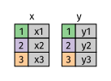
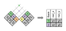
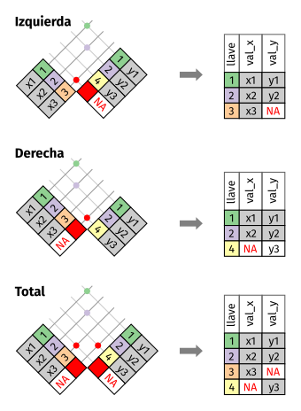
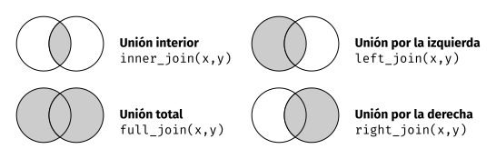
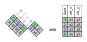
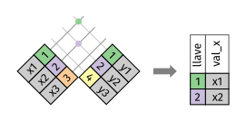

# Datos relacionales

## Introducción

Es raro que un análisis de datos involucre una única tabla de datos. Típicamente tienes muchas tablas de datos y debes combinarlas para responder las preguntas de tu interés. Colectivamente, múltiples tablas de datos se llaman _datos relacionales_ debido a que sus relaciones, no sólo los conjuntos de datos individuales, son importantes.

Las relaciones siempre se definen sobre un par de tablas. Todas las otras relaciones se construyen sobre esta idea simple: las relaciones entre tres o más tablas son siempre una propiedad de las relaciones entre cada par. ¡A veces ambos elementos de un par pueden ser la misma tabla! Esto se necesita si, por ejemplo, tienes una tabla de personas y cada persona tiene una referencia a sus padres.

Para trabajar con datos relacionales necesitas verbos para trabajar con pares de tablas. Existen tres familias de verbos diseñadas para trabajar con datos relacionales:

* __Uniones de transformación__ (del inglés _transforming join_), que agregan nuevas variables a un *data frame* a partir de las observaciones coincidentes en otra tabla.

* __Uniones de filtro__ (del inglés _filtering join_), que filtran observaciones en un *data frame* con base en si coinciden con las observaciones en otra tabla.

* __Operaciones de conjuntos__ (del inglés _set operations_), que tratan las observaciones como elementos de un conjunto.

El lugar más común para encontrar datos relacionales es en un sistema _relacional_ de administración de bases de datos (*Relational Data Base Management System* en inglés), un concepto que abarca casi todas las bases de datos modernas. Si has usado una base de datos con anterioridad, casi seguramente usaste SQL. Si es así, los conceptos de este capítulo debiesen ser familiares, aunque su expresión en dplyr es ligeramente distinta. Generalmente, dplyr es un poco más fácil de usar que SQL ya que dplyr se especializa en el análisis de datos: facilita las operaciones habituales de análisis de datos, a expensas de dificultar otras operaciones que no se requieren a menudo para el análisis.

### Prerequisitos

Vamos a explorar datos relacionales de `datos` usando los verbos de dos tablas de dplyr.

```{r setup, message = FALSE}
library(tidyverse)
library(datos)
```

## datos {#nycflights13-relational}

Usaremos el paquete datos^[NdT. El texto original se refiere al paquete nycflights13 cuya traducción se incluye en el paquete datos.] para aprender de los datos relacionales. datos contiene cuatro tablas que se relacionan con la tabla `vuelos` que se usó en [data transformation]:

* `aerolineas` permite observar el nombre completo de la aerolínea a partir de su código abreviado:

 ```{r}
aerolineas
 ```

* `aeropuertos` entrega información de cada aeropuerto, identificado por su código de aeropuerto:

 ```{r}
aeropuertos
 ```

* `aviones` entrega información de cada avión, identificado por su `codigo_cola`:

 ```{r}
aviones
 ```

* `clima` entrega información del clima en cada aeropuerto de Nueva York para cada hora:

 ```{r}
clima
 ```

Una forma de mostrar las relaciones entre las diferentes tablas es mediante un diagrama:

```{r, echo = FALSE}
knitr::include_graphics("diagrams_w_text_as_path/es/relational-nycflights.svg")
```

Este diagrama es un poco sobrecogedor, ¡pero es simple comparado con algunos que verás en el exterior! La clave para entender estos diagramas es recordar que cada relación siempre involucra un par de tablas. No necesitas entender todo el diagrama, necesitas entender la cadena de relaciones entre las tablas que te interesan.

Para datos:

* `vuelos` se connecta con `aviones` a través de la variable `codigo_cola`.
 
* `vuelos` se connecta con `aerolineas` a través de la variable `codigo_carrier`.

* `vuelos` se connecta con `aeropuertos` de dos formas: a través de las variables `origen` y
 `destino`.

* `vuelos` se connecta con `clima` a través de las variables `origen` (ubicación), 
 `anio`, `mes`, `dia` y `hora` (tiempo).

### Ejercicios

1. Imagina que necesitas dibujar (aproximadamente) la ruta que cada avión vuela desde su origen
   hasta el destino. ¿Qué variables necesitas? ¿Qué tablas necesitas combinar?

1. Olvidamos incluir la relación entre `clima` y `aeropuertos`. ¿Cuál es la relación y cómo debe
   aparecer en el diagrama?

1. `clima` únicamente contiene información de los aeropuertos de origen (Nueva York).
    Si contuviera registros para todos los aeropuertos de EEUU, ¿Qué relación tendría con `vuelos`?

1. Sabemos que hay días "especiales" en el año y pocas personas vuelan esos días.
   ¿Cómo se representarían en un data frame? ¿Cuáles serían las llaves primarias de esa tabla?
   ¿Cómo se conectaría con las tablas existentes?

## Llaves

Las variables usadas para conectar cada par de variables se llaman _llaves_ (del inglés _key_). Una llave es una variable (o un conjunto de variables) que identifican de manera única una observación. En casos simples, una sóla variable es suficiente para identificar una observación. Por ejemplo, cada avión está identificado de forma única por su `codigo_cola`. En otros casos, se pueden necesitar múltiples variables. Por ejemplo, para identificar una observación en `clima` se necesitan cinco variables:  `anio`, `mes`, `dia`, `hora` y `origen`.
to identify an observation in `weather` you need five variables: `year`, `month`, `day`, `hour`, and `origin`.

Existen dos tipos de llaves:

* Una _llave primaria_  únicamente identifica una observación en su propia tabla.
  Por ejemplo, `aviones$codigo_cola` es una llave primaria ya que identifica de
  manera única cada avión en la tabla `aviones`.

* Una _llave foránea_ únicamente identifica una observación en otra tabla.
  Por ejemplo, `vuelos$codigo_cola` es una llave foránea ya que aparece en la
  tabla `vuelos`, donde une cada vuelo con un único avión.

Una variable puede ser llave primaria _y_  llave foránea a la vez. Por ejemplo, `origen` es parte de la llave primaria `clima` y también una llave foránea de `aeropuertos`.

Una vez que identificas las llaves primarias en tus tablas, es una buena práctica verificar que identifican de forma única cada observación. Una forma de hacerlo es usar `count()` con las llaves primarias y buscar las entradas con `n` mayor a uno:

```{r}
aviones %>%
  count(codigo_cola) %>%
  filter(n > 1)

clima %>%
  count(anio, mes, dia, hora, origen) %>%
  filter(n > 1)
```

A veces una tabla puede no tener una llave primaria explícita: cada fila es una observación, pero no existe una combinación de variables que la identifique de forma confiable. Por ejemplo, ¿Cuál es la llave primaria en la tabla `vuelos`? Podrás pensar que podría ser la fecha más el vuelo o el código de cola, pero ninguna de esas variables es única:

```{r}
vuelos %>%
  count(anio, mes, dia, vuelo) %>%
  filter(n > 1)

vuelos %>%
  count(anio, mes, dia, codigo_cola) %>%
  filter(n > 1)
```

Al comenzar a trabajar con estos datos, ingenuamente asumimos que cada número de vuelo se usaría una vez al día: eso haría mucho más simples los problemas de comunicación con un vuelo en específico. ¡Desafortunadamente no es el caso! Si una tabla no tiene una llave primaria, a veces es útil incluir una con `mutate()` y `row_number()`. Eso simplifica unir observaciones una vez que haz hecho algunos filtros y quieres volver a verificar con los datos originales. Esto se llama _llave sustituta_.

Una llave primaria y su correspondiente llave foránea en otra tabla forman una _relación_. Las relaciones son típicamente uno a muchos. Por ejemplo, cada vuelo tiene un avión, pero cada avión tiene muchos vuelos. En otros datos, ocasionalmente verás relaciones uno a uno. Puedes pensar esto como un caso especial de uno a muchos. Puedes modelar relaciones muchos a muchos como relaciones de la forma muchos a uno y uno a muchos. Por ejemplo, en estos datos existe una relación muchos a muchos entre aeroplíneas y aeropuertos: cada aerolínea vuela a muchos aeropuertos, cada aeropuerto recibe a muchas aerolíneas.

### Ejercicios

1. Agrega una llave sustituta a `vuelos`.

1. Identifica las llaves en los siguientes conjuntos de datos

 1. `datos::bateadores`
 1. `datos::nombres`
 1. `datos::atmosfera`
 1. `datos::vehiculos`
 1. `datos::diamantes`
  
 (Puede que necesites leer un poco de documentación.)

1. Dibuja un diagrama que ilustre las conexiones entre las tablas `bateadores`,
  `personas` y `salarios` en el paquete datos. Dibuja otro diagrama que muestre la
  relación entre `personas`, `capitanes` y `premios_capitanes`.

  ¿Cómo caracterizarías las relación entre `bateadores`, `lanzadores` y `jardineros`?

## Uniones de transformación {#mutating-joins}

La primera herramienta que miraremos para combinar pares de variables es la _unión de transformación_. Una unión de transformación te permite combinar variables a partir de dos tablas. Primero une observaciones de acuerdo a sus llaves, luego copia las variables de una tabla en la otra.

Tal como `mutate()`, las funciones de unión incluyen variables por la derecha, por lo que si tienes muchas variables inicialmente, las nuevas variables no se imprimirán. Para estos ejemplos, facilitaremos la vista de lo que ocurre con los ejemplos creando un conjunto de datos más angosto:

```{r}
vuelos2 <- vuelos %>%
  select(anio:dia, hora, origen, destino, codigo_cola, aerolinea)
vuelos2
```

(Recuerda que en RStudio puedes usar `View()` para evitar este problema.)s problem.)

Imagina que quieres incluir el nombre completo de la aerolínea en `vuelos2`. Puede combinar los datos de `aerolinas` y `vuelos2` mediante `left_join()`:

```{r}
vuelos2 %>%
  select(-origen, -destino) %>%
  left_join(aerolineas, by = "aerolinea")
```

El resultado de unir aerolíneas y vuelos2 incluye una variable adicional: `nombre`. Esto es por qué llamamos unión de transformación a este tipo de unión. En este caso, puedes obtener el mismo resultado usando `mutate()` junto a las operaciones de filtro de R base:

```{r}
vuelos2 %>%
  select(-origen, -destino) %>%
  mutate(nombre = aerolineas$nombre[match(aerolinea, aerolineas$aerolinea)])
```

Sin embargo, esto último es difícil de generalizar cuando necesitas unir varias variables y dificulta la lectura para entender lo que se queire hacer.

En las siguientes secciones explicaremos, en detalle, como las uniones de transformación funcionan. Comenzarás aprendiendo una representación visual útil de las uniones. Luego usaremos eso para explicar las cuatro uniones de transformación: unión interior y tres uniones exteriores. Cuando trabajes con datos reales, las llaves no siempre identifican a las observaciones de forma única, por lo que a continuación hablaremos de lo que ocurre cuando no existe una coincidencia única. Finalmente, aprenderás como instruir a dplyr cuales variables son las llaves para una unión dada.

### Entendiendo las uniones

Para ayudarte a entender las uniones, usaremos representaciones gráficas:

```{r, echo = FALSE, out.width = NULL}

```
```{r}
x <- tribble(
  ~key, ~val_x,
  1, "x1",
  2, "x2",
  3, "x3"
)
y <- tribble(
  ~key, ~val_y,
  1, "y1",
  2, "y2",
  4, "y3"
)
```

La columna coloreada representa la variable "llave": estas se usan para unir filas entre las tablas. La columa gris representa la columna "valor" que se usa en todo el proceso. En estos ejemplos te mostraremos una única llave, pero la idea es generalizable de manera directa a múltiples llaves y múltiples valores.

Una unión es una forma de conectar cada fila en `x` con cero, una o más filas en `y`. El siguiente diagrama muestra la coincidencia potencial como la intersección de pares de líneas.

```{r, echo = FALSE, out.width = NULL}
knitr::include_graphics("diagrams_w_text_as_path/es/join-setup2.svg")
```

(Si observas detenidamente, te darás cuenta de que hemos cambiado el orden de las columnas llave y valor en `x`. Esto es para enfatizar que las uniones encuentran coincidencias con base en las llaves, el valor se traslada durante el proceso.)

En la unión que mostramos, las coincidencias se indican con puntos. El número de puntos es igual al numero de coincidencias y al número de filas en la salida.

```{r, echo = FALSE, out.width = NULL}

```

### Unión interior {#inner-join}

La forma más simple de unión es la _unión interior_ (del inglés _inner join_). Una unión interior une pares de observaciones cualquiera dado que sus llaves son iguales:

```{r, echo = FALSE, out.width = NULL}

```

(Para ser precisos, esto corresponde a una _equiunión_ interior debido a que las llaves se unen usando el operador de igualdad. Dado que muchas uniones son equiuniones, por lo general omitimos esa especificación)

La salida de una unión interior es un nuevo data frame que contiene la llave, los valores de x y los valores de y. Usamos `by` (significa *por*) para indicar a dplyr cual variable es la llave:

```{r}
x %>%
  inner_join(y, by = "key")
```

La propiedad más importante de una unión interior es que las filas no coincidentes no se incluyen en el resultado. Esto significa que generalmente las uniones interiores no son apropiadas para su uso en el análisis de datos dado que es muy fácil perder observaciones.

### Unión exterior {#outer-join}

Una unión interior mantiene las observaciones que aparecen en ambas tablas.  Una _unión exterior_ mantiene las observaciones que aparecen en al menos una de las tablas. Existen tres tipos de unión exterior:

* Una _unión izquierda_ (del inglés _left join_) mantiene todas las observaciones en `x`.
* Una _unión derecha_ (del inglés _right join_) mantiene todas las observaciones en `y`.
* Una _unión completa_ (del inglés _full join_) mantiene todas las observaciones en `x` e `y`.

Estas uniones funcionan agregando una observación "virtual" adicional a cada tabla. Esta observación tiene una llave que siempre coincide (de no haber otras llaves coincidentes) y su valor es `NA`.

Gráficamente corresponde a lo siguiente:

```{r, echo = FALSE, out.width = NULL}

```

La unión que más frecuentemente se usa es la unión izquierda: úsala cuando necesites buscar datos adicionales en otra tabla, dado que preserva las observaciones originales incluso cuando no hay coincidencias. La unión izquierda debiera ser tu unión por defeecto a menos que tengas un motivo importante para preferir otro tipo.

Otra forma de ilustrar diferentes tipos de uniones es mediante un diagrama de Venn:

```{r, echo = FALSE, out.width = NULL}

```

Sin embargo, esta no es una buena representación. Puede ayudar a recordar cuales observaciones preservan las observaciones en cual tabla pero esto tiene una limitante importante: un diagrama de Venn no puede mostrar que ocurre con las llaves que no identifican de manera única una observación.

### Llaves duplicadas {#join-matches}

Hasta ahora todos los diagramas han asumido que las llaves son únicas. Pero ese no es siempre el caso. Esta sección explica que ocurre cuando las llaves no son únicas. Existen dos posibilidades:

1. Una tabla tiene llaves duplicadas. Esto es útil cuando quieres agregar información 
  adicional dado que típicamente existe una relación uno a muchos.

 ```{r, echo = FALSE, out.width = NULL}

 ```
  
  Nota que hemos puesto la columna llave en una posición ligeramente distinta en la salida.
  Esto refleja que la llave es una llave primaria en `y` y una llave foránea en `x`.

 ```{r}
x <- tribble(
  ~key, ~val_x,
  1, "x1",
  2, "x2",
  2, "x3",
  1, "x4"
)
y <- tribble(
  ~key, ~val_y,
  1, "y1",
  2, "y2"
)
left_join(x, y, by = "key")
 ```

1. Ambas tablas tienen llaves duplicadas. Esto es usualmente un error debido a que 
  en ninguna de las tablas las llaves identifican de manera única una observación.
  Cuando unes llaves duplicadas, se obtienen todas las posibles combinaciones, lo que
  corresponde al producto cartesiano:

 ```{r, echo = FALSE, out.width = NULL}
knitr::include_graphics("diagrams_w_text_as_path/es/join-many-to-many.svg")
 ```

 ```{r}
x <- tribble(
  ~key, ~val_x,
  1, "x1",
  2, "x2",
  2, "x3",
  3, "x4"
)
y <- tribble(
  ~key, ~val_y,
  1, "y1",
  2, "y2",
  2, "y3",
  3, "y4"
)
left_join(x, y, by = "key")
 ```

### Definiendo las columnas llave {#join-by}

Hasta ahora, los pares de tablas siempre se han unido de acuerdo a una única variable y esa variable tiene el mismo nombre en ambas tablas. Esta restricción se expresa de la forma `by = "key"`. Puedes usar otros valores de `by` para conectar las tablas de otras maneras:

  * Por defecto, `by = NULL`, usa todas las variables que aparecen en ambas tablas, 
    lo que se conoce como unión _natural_. Por ejemplo, las tablas vuelos y clima 
    coinciden en sus variables comunes: `anio`, `mes`, `dia`, `hora` y `origen`.

 ```{r}
vuelos2 %>%
  left_join(clima)
 ```

  * Un vector de caracteres, `by = "x"`. Esto es similar a una unión natural, 
    pero usa algunas de las variables comunes. Por ejemplo, `vuelos` y `aviones` 
    tienen la variable `anio`, pero significa cosas distintas en cada tabla 
    por lo que queremos unir por `codigo_cola`.

 ```{r}
vuelos2 %>%
  left_join(aviones, by = "codigo_cola")
 ```

  Nota que la variable `anio` (que aparece en ambos data frames de entrada, 
  pero que no es igual en ambos casos) se disambigua con un sufijo en la salida.

  * Un vector de caracteres con nombres: `by = c("a" = "b")`. Esto va a unir la 
    variable `a` en la tabla `x` con la variabla `b` en la tabla `y`. Las variables de 
    `x` se usarán en la salida.

  Por ejemplo, si queremos dibujar un mapa necesitamos combinar los datos de vuelos 
  con los datos de ubicación (`latitud` y `longitud`) de cada aeropuerto. Cada vuelo 
  tiene un `aeropuerto` de origen y destino, por lo que necesitamos especficar cual 
  queremos unir:

 ```{r}
vuelos2 %>%
  left_join(aeropuertos, c("origen" = "codigo_aeropuerto"))
  
vuelos2 %>%
  left_join(aeropuertos, c("destino" = "codigo_aeropuerto"))
 ```

### Ejercicios

1. Calcula el atraso promedio por destino, luego une los datos en `aeropuertos` 
   para que puedas mostrar la distribución espacial de los atrasos. Te presentamos 
   una forma fácil de dibujar un mapa de los Estados Unidos:

 ```{r, eval = FALSE}
aeropuertos %>%
  semi_join(vuelos, c("codigo_aeropuerto" = "destino")) %>%
  ggplot(aes(longitud, latitud)) +
  borders("state") +
  geom_point() +
  coord_quickmap()
 ```

  (No te preocupes si no entiendes que significa p que hace `semi_join()`. 
  Lo aprenderás a continuación.)
  
  Quizás quieras usar `size` o `colour` para editar los puntos y mostrar 
  el atraso promedio de cada aeropuerto.
 
1. Agrega la ubicación de origen _y_ destino (e.g. `latitud` y `longitud`) 
   a `vuelos`.

1. ¿Existe una relación entre la antiguedad de un avión y sus atrasos?

1. ¿Qué condiciones climáticas hacen más probables los atrasos?

1. ¿Qué sucedió el día 13 de junio de 2013? Muestra el patrón espacial de los atrasos, 
   luego busca referencias cruzadas con el clima.

 ```{r, eval = FALSE, include = FALSE}
peores <- filter(vuelos, !is.na(horario_salida), mes == 6, dia == 13)
peores %>%
  group_by(destino) %>%
  summarise(atraso = mean(atraso_llegada), n = n()) %>%
  filter(n > 5) %>%
  inner_join(aeropuertos, by = c("destino" = "codigo_aeropuerto")) %>%
  ggplot(aes(longitud, latitud)) +
  borders("state") +
  geom_point(aes(size = n, colour = atraso)) +
  coord_quickmap()
 ```

### Otras implementaciones

`base::merge()` puede realizar los cuatro tipos de uniones de transformación:

dplyr | merge
-------------------|-------------------------------------------
`inner_join(x, y)` | `merge(x, y)`
`left_join(x, y)` | `merge(x, y, all.x = TRUE)`
`right_join(x, y)` | `merge(x, y, all.y = TRUE)`,
`full_join(x, y)` | `merge(x, y, all.x = TRUE, all.y = TRUE)`

La ventaja de os verbos específicos de dplyr es que muestran de manera clara la intención del código: la diferencia entre las uniones es realmente importante pero se esconde en los argumentos de `merge()`. Las uniones de dplyr son considerablemente más rápidas y no generan problemas con el orden de las columnas.

SQL es una inspiración para las convenciones de dplyr, por lo que su traducción es directa:

dplyr | SQL
-----------------------------|-------------------------------------------
`inner_join(x, y, by = "z")` | `SELECT * FROM x INNER JOIN y USING (z)`
`left_join(x, y, by = "z")` | `SELECT * FROM x LEFT OUTER JOIN y USING (z)`
`right_join(x, y, by = "z")` | `SELECT * FROM x RIGHT OUTER JOIN y USING (z)`
`full_join(x, y, by = "z")` | `SELECT * FROM x FULL OUTER JOIN y USING (z)`

Nota que "INNER" y "OUTER" son opcionales, por lo que a menudo se omiten.

Unir distintas variables entre tables, por ejemplo `inner_join(x, y, by = c("a" = "b"))`, usa una sintaxis ligeramente distinta en SQL: `SELECT * FROM x INNER JOIN y ON x.a = y.b`. Como la sintaxis sugiere, SQL soporta un rango más amplio de tipos de uniones que dplyr, ya que puedes conectar tablas usando restricciones distintas a las de igualdad (a veces llamadas no-equiuniones).

## Uniones de filtro {#filtering-joins}

Las uniones de filtro unen observaciones de la misma forma que las uniones de transformación pero afectan las observaciones, no las variables. Existen dos tipos:

* `semi_join(x, y)` __mantiene__ todas las observaciones en `x` con coincidencias en `y`.
* `anti_join(x, y)` __descarta__ todas las observaciones en `x` con coincidencias en `y`.

Las semi uniones son útiles para unir tablas resumen previamente filtradas con las filas originales. Por ejemplo, imagina que encontraste los diez destinos más populares:

```{r}
destinos_populares <- vuelos %>%
  count(destino, sort = TRUE) %>%
  head(10)
destinos_populares
```

Ahora quieres encontrar cada vuelo que fue a alguno de esos destinos. Puedes construir un filtro:

```{r}
vuelos %>%
  filter(destino %in% destinos_populares$destino)
```

Pero es difícil extender este enfoque a varias variables. Por ejemplo, imagina que encontraste los diez días con los atrasos promedio más altos ¿Cómo construirías un filtro que use `anio`, `mes` y `dia` para unir de vuelta con `vuelos`? 

En lugar de una semi unión, que conecta dos tablas de manera similar a una unión de transformación, pero en lugar de agregar nuevas columnas, mantiene las filas en `x` que tienen coincidencias en `y`:

```{r}
vuelos %>%
  semi_join(destinos_populares)
```

Gráficamente, una semi unión es de la siguiente forma:

```{r, echo = FALSE, out.width = NULL}

```

Sólo la existencia de coincidencias es importante, no importa cuales son las observaciones que se unen. Esto significa que las uniones de filtro nunca duplican filas como lo hacen las uniones de transformación:

```{r, echo = FALSE, out.width = NULL}
knitr::include_graphics("diagrams_w_text_as_path/es/join-semi-many.svg")
```

La operación inversa de una semi unión es una anti unión. Una anti unión mantiene las filas que _no_ tienen coincidencias:

```{r, echo = FALSE, out.width = NULL}
knitr::include_graphics("diagrams_w_text_as_path/es/join-anti.svg")
```

Las anti uniones son útiles para encontrar desajustes. Por ejemplo, al conectar `aviones` y `vuelos`, podría interesarte saber que existen muchos `vuelos` que no tienen coincidencias en `aviones`:

```{r}
vuelos %>%
  anti_join(aviones, by = "codigo_cola") %>%
  count(codigo_cola, sort = TRUE)
```

### Ejercicios

1. ¿Qué significa que in vuelo no tenga `codigo_cola`? ¿Qué tienen en común los códigos 
   de cola que no tienen registros coincidentes en `aviones`? (Pista: Una variable explica 
   ~90% de los problemas.)

1. Filtra los vuelos para mostrar únicamente los aviones que han realizado al menos cien
   viajes

1. Combina `vehiculos` y `comunes` para encontrar los registros de los 
   modelos más comunes.

1. Encuentra las 48 horas (en el transcurso del año) que tengan los peores atrasos. Haz 
   una referencia cruzada con la tabla `clima`. ¿Puedes observar patrones?

1. ¿Qué te indica `anti_join(vuelos, aeropuertos, by = c("destino" = "codigo_aeropuerto"))`?
   ¿Qué te indica `anti_join(aeropuertos, vuelos, by = c("codigo_aeropuerto" = "destino"))`?

1. Puedes esperar que exista una relación implícita entre aviones y aerolíneas, dado que cada 
   avión es operado por una única aerolínea. Confirma o descarta esta hipótesis usando las 
   herramientas que aprendiste más arriba.

## Problemas de las uniones

Los datos con los que has estado trabajando en este capítulo han sido limpiados de modo que tengas el mínimo de problemas posibles. Tus propios datos difícilmente estarán tan ordenados, por lo que hay algunas consideraciones y pasos a tener en cuanta para que las uniones sobre tus propios datos funcionen adecuadamente.

1. Comienza identificando las variables que forman las llaves primarias en cada tabla.
   Usualmente debieras hacerlo basado en tus conocimientos de los datos, no observando 
   empíriamente las combinaciones de variables que resultan en un identificador único. 
   Si te centras en las variables sin pensar en sus significados, puedes tener la mala 
   suerte de encontrar una combinación única en tus datos pero dicha relación no será 
   válida en el caso general.

   Por ejemplo, la altura y la longitud identifican de manera única cada aeropuerto, ¡pero 
   no son buenos identificadores!

 ```{r}
aeropuertos %>% count(altura, longitud) %>% filter(n > 1)
 ```

1. Verifica que ninguna de las variables en la llave primaria esté perdida. 
   ¡Si una valor está perdido no puede identificar una observación!

1. Verifica que las llaves foráneas coinciden con las llaves primarias en 
   otra tabla. La mejor forma de hacerlo es mediante `anti_join()`. Es común 
   que las llaves no coincidan debido a errores en la entrada de datos. Arreglar 
   este problema requiere mucho trabajo.

   Si tienes llaves perdidas, debes ser cuidadoso respecto del uso de unión interior 
   versus unión exterior y considerar cuidadosamente si quieres descartar las observaciones 
   que no tienen coincidencias.
   
   Ten en cuenta que verificiar el número de filas antes y después de unir no es sufiente para asegurar 
   que la unión funcionó de forma exitosa. Si tienes una unión interior con llaves duplicadas en ambas tablas, 
   puedes tener la mala suerte de que el número de filas descartadas sea igual al número de filas duplicadas.

## Operaciones de conjuntos {#set-operations}

El tipo final de verbo entre dos tablas es la operación de conjuntos. Generalmente lo usamos de manera poco freuente, pero es ocasionalmente útil cuando quieres dividir un filtro complejo en partes maś simples. Todas esas operaciones funcionan con una fila completa, comparten los valores de cada variable. Esto espera que las entradas `x` e `y` tengan las mismas variables y trata las observaciones como conjuntos: 

* `intersect(x, y)`: entregas las observaciones comunes en `x` e `y`.
* `union(x, y)`: entregas las observaciones únicas en `x` e `y`.
* `setdiff(x, y)`: entregas las observaciones en `x` pero no en `y`.

Dados los siguientes datos simples:

```{r}
df1 <- tribble(
  ~x, ~y,
  1, 1,
  2, 1
)
df2 <- tribble(
  ~x, ~y,
  1, 1,
  1, 2
)
```

Las cuatro posibilidades son:

```{r}
intersect(df1, df2)

# Nota que obtenemos 3 filas, no 4
union(df1, df2)

setdiff(df1, df2)

setdiff(df2, df1)
```
