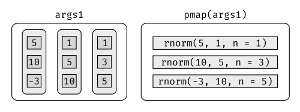

# Iteración

## Introducción

En [funciones], hablamos sobre la importancia de reducir la duplicación en el código creando funciones en lugar de copiar y pegar. Reducir la duplicación de código tiene tres beneficios principales:

1. Es más fácil ver el objetivo de tu código, lo diferente llama
	más atención a la vista que aquello que permanece igual.
        
2. Es más sencillo responder a cambios en los requerimientos.  A medida que tus 
	necesidades cambian, solo necesitarás realizar cambios en un lugar, en vez
	de recordar cambiar en cada lugar donde copiaste y pegaste el código.

3. Es probable que tengas menos errores porque cada línea de código es
    utilizado en más lugares.
    
Una herramienta para reducir la duplicación de código son las funciones, que reducen dicha duplicación al identificar patrones repetidos de código y extraerlos en piezas independientes que pueden reutilizarse y actualizarse fácilmente. Otra herramienta para reducir la duplicación es la __iteración__, que te ayuda cuando necesitas hacer la misma tarea con múltiples entradas: repetir la misma operación en diferentes columnas o en diferentes conjuntos de datos.
En este capítulo aprenderás sobre dos paradigmas de iteración importantes: la programación imperativa y la programación funcional. Por el lado imperativo, tienes herramientas como bucles _for_ (del inglés _para_) y bucles _while_ (del inglés _mientras_), que son un gran lugar para comenzar porque hacen que la iteración sea muy explícita, por lo que es obvio qué está pasando. Sin embargo, los bucles _for_ son bastante detallados y requieren bastante código que se duplica para cada bucle. La programación funcional (PF) ofrece herramientas para extraer este código duplicado, por lo que cada patrón común de bucle obtiene su propia función. Una vez que domines el vocabulario de PF, podrás resolver muchos problemas comunes de iteración con menos código, más facilidad y menos errores.

### Pre requisitos

Una vez que hayas dominado los bucles _for_ proporcionados por R base, aprenderás algunas de las potentes herramientas de programación proporcionadas por __purrr__, uno de los paquetes principales de _tidyverse_.

```{r setup, message = FALSE}
library(tidyverse)
library(datos)
```

## Bucles _for_

Imagina que tenemos este simple _tibble_:

```{r}
df <- tibble(
  a = rnorm(10),
  b = rnorm(10),
  c = rnorm(10),
  d = rnorm(10)
)
```

Queremos calcular la mediana de cada columna. _Podrías hacerlo_ copiando y pegando el siguiente código:

```{r}
median(df$a)
median(df$b)
median(df$c)
median(df$d)
```

Pero eso rompe nuestra regla de oro: nunca copie y pegue más de dos veces. En cambio, podríamos usar un bucle _for_:

```{r}
output <- vector("double", ncol(df))  # 1. _output_ (salida o resultado)
for (i in seq_along(df)) {            # 2. secuencia
  output[[i]] <- median(df[[i]])      # 3. cuerpo
}
output
```

Cada bucle tiene tres componentes:

1.  __output__: `output <- vector("double", length(x))`. 
    Antes de comenzar el bucle, siempre debes asignar suficiente espacio
    para la salida. Esto es muy importante para la eficiencia: si aumentas
    el bucle _for_ en cada iteración usando, por ejemplo, `c ()` , el bucle _for_
    será muy lento.
      
    Una forma general de crear un vector vacío de longitud dada es la función `vector ()`. 
	Tiene dos argumentos: el tipo de vector (_"logical"_, 
    _"integer"_, _"double"_, _"character"_, etc) y su longitud.
    
2.  La __secuencia__: `i in seq_along (df)`. Este código determina sobre qué iterar:
    cada ejecución del bucle _for_ asignará a `i` un valor diferente de
    `seq_along (df)`. Es útil pensar en `i` como un pronombre, como "eso".
    
	Es posible que no hayas visto `seq_along ()` con anterioridad. Es una versión segura de la
    familiar `1:length(l)`, con una diferencia importante: si se tiene un
    vector de longitud cero, `seq_along ()` hace lo correcto:
    
    ```{r}
    y <- vector("double", 0)
    seq_along(y)
    1:length(y)
    ```
    
    Probablemente no vas a crear un vector de longitud cero deliberadamente, pero
    es fácil crearlos accidentalmente. Si usamos `1: length (x)` en lugar
    de `seq_along (x)`, es posible que obtengamos un mensaje de error confuso.
    
3.	El __cuerpo__: `output[[i]] <- median(df[[i]])`. Este es el código que hace
	el trabajo. Se ejecuta repetidamente, con un valor diferente para `i` cada vez.
	La primera iteración ejecutará `output[[1]] <- median(df[[1]])`,
	la segunda ejecutará `output [[2]] <- median (df [[2]])`, y así sucesivamente.
	
¡Eso es todo lo que hay para el bucle _for_! Ahora es un buen momento para practicar creando algunos bucles _for_ básicos (y no tan básicos) usando los ejercicios que se encuentran a continuación. Luego avanzaremos en algunas variaciones del bucle _for_ que te ayudarán a resolver otros problemas que surgirán en la práctica.


### Ejercicios

1.  Escribir bucles _for_ para:

    1. Calcular la media de cada columna en `mtautos`.
    2. Determinar el tipo de cada columna en `vuelos`.
    3. Calcular el número de valores únicos en cada columna de `iris`.
    4. Genera 10 normales aleatorias para cada valor de $\mu = -10$, $0$, $10$ y $100$.
    
    Piensa en el resultado, la secuencia y el cuerpo __antes__ de empezar a escribir
    el bucle.

2.  Elimina el bucle _for_ en cada uno de los siguientes ejemplos tomando
     ventaja de una función existente que trabaja con vectores:
    
    ```{r, eval = FALSE}
    out <- ""
    for (x in letters) {
      out <- stringr::str_c(out, x)
    }
    
    x <- sample(100)
    sd <- 0
    for (i in seq_along(x)) {
      sd <- sd + (x[i] - mean(x)) ^ 2
    }
    sd <- sqrt(sd / (length(x) - 1))
    
    x <- runif(100)
    out <- vector("numeric", length(x))
    out[1] <- x[1]
    for (i in 2:length(x)) {
      out[i] <- out[i - 1] + x[i]
    }
    ```

3.  Combina tus habilidades para escribir funciones y bucles _for_:

    1. Escribe un bucle _for_ que imprima (_`prints()`_) la letra de la canción de niños
       "Cinco ranitas verdes".

    2. Convierte la canción infantil "10 monitos saltaban en la cama" en una función. Generalizar
       a cualquier cantidad de monitos en cualquier estructura para dormir.

    3. Convierte la canción "99 botellas de cerveza en la pared" en una función.
       Generalizar a cualquier cantidad, de cualquier tipo de recipiente que contenga 
       cualquier líquido sobre cualquier superficie.

4.  Es común ver bucles _for_ que no preasignan la salida y en su lugar
    aumentan la longitud de un vector en cada paso:
     
    ```{r, eval = FALSE}
    output <- vector("integer", 0)
    for (i in seq_along(x)) {
      output <- c(output, lengths(x[[i]]))
    }
    output
    ```
    
    ¿Cómo afecta esto el rendimiento? Diseña y ejecuta un experimento.

## Variaciones de bucles _for_

Una vez que tienes el bucle _for_ básico bajo tu cinturón, hay algunas variaciones que debes tener en cuenta. Estas variaciones son importantes independientemente de cómo hagas la iteración, así que no te olvides de ellas una vez que hayas dominado las técnicas de PF que aprenderás en la próxima sección.

Hay cuatro variaciones del ciclo _for_ básico:

1.  Modificar un objeto existente, en lugar de crear un nuevo objeto.
2.  Iterar sobre nombres o valores, en lugar de índices.
3.  Manejo de _outputs_ de longitud desconocida.
4.  Manejo de secuencias de longitud desconocida.

### Modificar un objeto existente

Algunas veces quiere usar un bucle for para modificar un objeto existente. Por ejemplo, recuerda nuestro desafío de [funciones]. Queríamos reescalar cada columna en un _data frame_:

```{r}
df <- tibble(
  a = rnorm(10),
  b = rnorm(10),
  c = rnorm(10),
  d = rnorm(10)
)
rescale01 <- function(x) {
  rng <- range(x, na.rm = TRUE)
  (x - rng[1]) / (rng[2] - rng[1])
}

df$a <- rescale01(df$a)
df$b <- rescale01(df$b)
df$c <- rescale01(df$c)
df$d <- rescale01(df$d)
```

Para resolver esto con un bucle _for_, volvemos a pensar en los tres componentes:

1.  __Output__: ya tenemos el _output_ --- ¡es lo mismo que la entrada!

2.  __Secuencia__: podemos pensar en un _data frame_ como una lista de columnas, por lo
     que podemos iterar sobre cada columna con `seq_along (df)`.

3.  __Cuerpo__: aplicar `rescale01 ()`.

Esto nos da:

```{r}
for (i in seq_along(df)) {
  df[[i]] <- rescale01(df[[i]])
}
```

Por lo general, se modificará una lista o un _data frame_ con este tipo de bucle, así que recuerde usar `[[`, not `[`. Podrás haber visto que usamos `[[` en todos los bucles _for_: creemos que es mejor usar `[[` incluso para vectores atómicos porque deja en claro que queremos trabajar con un solo elemento.

### Patrones de bucle

Hay tres formas básicas de hacer un bucle sobre un vector. Hasta ahora hemos visto la más general: iterar sobre los índices numéricos con `for (i in seq_along (xs))`, y extraer el valor con `x [[i]]`. Hay otras dos formas:

1.  Iterar sobre los elementos: `for (x in xs)`. Esta forma es la más útil si solo
    te preocupas por los efectos secundario, como graficar o grabar un archivo, porque es 
    dificil almacenar la salida (_output_) de forma eficiente.

2.  Iterar sobre los nombres: `for (nm in names(xs))`. te da el nombre, que se puede usar para acceder al valor con `x [[nm]]`. 
	Esto es útil si queremos utilizar el nombre en el título de un gráfico o 
    en el nombre de un archivo. Si estas creando una salida con nombre, asegúrate de nombrar el vector de resultados de esta manera:
    
    ```{r, eval = FALSE}
    results <- vector("list", length(x))
    names(results) <- names(x)
    ```

3.	Iterar sobre los índices numéricos es la forma más general, porque dada la posición se puede extraer tanto el nombre como el valor:

```{r, eval = FALSE}
for (i in seq_along(x)) {
  name <- names(x)[[i]]
  value <- x[[i]]
}
```

### Longitud de _output_ desconocida

Es posible que algunas veces no sepas el tamaño que tendrá el _output_. Por ejemplo, imagina que quieres simular algunos vectores aleatorios de longitudes aleatorias. Podrías tentarte a resolver este problema haciendo crecer progresivamente el vector:

```{r}
means <- c(0, 1, 2)

output <- double()
for (i in seq_along(means)) {
  n <- sample(100, 1)
  output <- c(output, rnorm(n, means[[i]]))
}
str(output)
```

Pero esto no es muy eficiente porque en cada iteración, R tiene que copiar todos los datos de las iteraciones anteriores. En términos técnicos, obtiene un comportamiento "cuadrático" ($O(n^2)$), lo que significa que un bucle que tiene tres veces más elementos tomaría nueve ($3^2$) veces más tiempo de ejecución.

Una mejor solución es guardar los resultados en una lista, y luego combinarlos en un solo vector después de que se complete el ciclo:

```{r}
out <- vector("list", length(means))
for (i in seq_along(means)) {
  n <- sample(100, 1)
  out[[i]] <- rnorm(n, means[[i]])
}
str(out)
str(unlist(out))
```

Aquí usamos `unlist ()` (del inglés _deslistar_) para aplanar una lista de vectores en un solo vector. Una opción más estricta es usar `purrr :: flatten_dbl ()` (del inglés _aplanar_) --- arrojará un error si la entrada no es una lista de dobles.

Este patrón ocurre también en otros lugares:

1.  Podriamos estar generando una cadena larga. En lugar de pegar (`paste ()`) juntos
    cada iteración con la anterior, guardamos el _output_ en un vector de caracteres y
    luego combinamos ese vector en una cadena con
    `paste(output, collapse = "")`.
   
2. Podríamos estar generando un _data frame_ grande. En lugar de enlazar (`rbind ()`) secuencialmente
   en cada iteración, guardamos el resultado en una lista y luego usamos
    `dplyr::bind_rows(output)` para combinar el _output_ en un solo _data frame_.

Cuidado con este patrón. Cuando lo veamos, cambiemos a un objeto de resultado más complejo y luego lo combinamos en un paso al final.

### Longitud de secuencia desconocida

A veces ni siquiera sabemos cuánto tiempo puede durar la secuencia de entrada. Esto es común cuando se hacen simulaciones. Por ejemplo, es posible que se quiera realizar un bucle hasta que se obtengan tres cabezas seguidas. No podemos hacer ese tipo de iteración con un bucle _for_. En su lugar, podemos utilizar un bucle _while_ (del inglés _mientras_). Un bucle _while_ es más simple que el bucle _for_ porque solo tiene dos componentes, una condición y un cuerpo:

```{r, eval = FALSE}
while (condición) {
  # cuerpo
}
```

Un bucle _while_ también es más general que un bucle _for_, porque podemos reescribir cualquier bucle _for_ como un bucle _while_, pero no podemos reescribir cada bucle _while_ como un bucle _for_:

```{r, eval = FALSE}
for (i in seq_along(x)) {
  # cuerpo
}

# Equivalente a 
i <- 1
while (i <= length(x)) {
  # cuerpo
  i <- i + 1 
}
```

Así es como podríamos usar un bucle _while_ para encontrar cuántos intentos se necesitan para obtener tres cabezas (_heads_ en inglés) seguidas:

```{r}
flip <- function() sample(c("T", "H"), 1)

flips <- 0
nheads <- 0

while (nheads < 3) {
  if (flip() == "H") {
    nheads <- nheads + 1
  } else {
    nheads <- 0
  }
  flips <- flips + 1
}
flips
```

Mencionamos los bucles _while_ brevemente, porque casi nunca los usamos. Se utilizan con mayor frecuencia para la simulación, que está fuera del alcance de este libro. Sin embargo, es bueno saber que existen para que estemos preparado para problemas en los que el número de iteraciones no se conoce de antemano.

### Ejercicios

1.  Imaginemos que tenemos un directorio lleno de archivos CSV que queremos leer.
    Tenemos sus ubicaciones en un vector, 
    `files <- dir("data/", pattern = "\\.csv$", full.names = TRUE)`, y ahora
    queremos leer cada uno con `read_csv()`. Escribe un bucle _for_ que los
    cargue en un solo _data frame_.

1.  ¿Qué pasa si utilizamos `for (nm in names(x))` y `x` no tiene _names_?
    ¿Qué pasa si solo algunos elementos están nombrados (_named_ en inglés) 
    ¿Qué pasa si los nombres (_names_ en inglés) no son únicos?

1.  Escribe una función que imprima el promedio de cada columna numérica en un
	  _data frame_, junto con su nombre. Por ejemplo, `mostrar_promedio(iris)` debe imprimir:
    
    ```{r, eval = FALSE}
    mostrar_promedio(iris)
    #> Sepal.Length: 5.84
    #> Sepal.Width:  3.06
    #> Petal.Length: 3.76
    #> Petal.Width:  1.20
    ```
    
    (Desafío adicional: ¿qué función utilizamos para asegurarnos que los números
    queden alineados a pesar que los nombres de las variables tienen diferentes longitudes?)
    
1.  ¿Qué hace este código? ¿cómo funciona? 

    ```{r, eval = FALSE}
    trans <- list( 
      disp = function(x) x * 0.0163871,
      am = function(x) {
        factor(x, labels = c("auto", "manual"))
      }
    )
    for (var in names(trans)) {
      mtcars[[var]] <- trans[[var]](mtcars[[var]])
    }
    ```

## Bucles _for_ vs. funcionales

Los bucles _for_ no son tan importantes en R como en otros lenguajes porque R es un lenguaje de programación funcional. Esto significa que es posible envolver los bucles en una función y llamar a esa función en lugar de usar el bucle _for_ directamente.

Para ver por qué esto es importante, consideremos (nuevamente) este simple _data frame_:

```{r}
df <- tibble(
  a = rnorm(10),
  b = rnorm(10),
  c = rnorm(10),
  d = rnorm(10)
)
```

Imaginemos que queremos calcular la media de cada columna. Podríamos hacer eso con un bucle _for_:

```{r}
output <- vector("double", length(df))
for (i in seq_along(df)) {
  output[[i]] <- mean(df[[i]])
}
output
```

Nos damos cuenta que vamos a querer calcular los promedios de cada columna con bastante frecuencia, por lo que lo extraemos en una función:

```{r}
col_mean <- function(df) {
  output <- vector("double", length(df))
  for (i in seq_along(df)) {
    output[i] <- mean(df[[i]])
  }
  output
}
```

Pero entonces pensamos que también sería útil poder calcular la mediana y la desviación estándar, así que copiamos y pegamos la función `col_mean ()` y reemplazamos `mean ()` con `median ()` y `sd ()`:

```{r}
col_median <- function(df) {
  output <- vector("double", length(df))
  for (i in seq_along(df)) {
    output[i] <- median(df[[i]])
  }
  output
}
col_sd <- function(df) {
  output <- vector("double", length(df))
  for (i in seq_along(df)) {
    output[i] <- sd(df[[i]])
  }
  output
}
```

¡Oh oh! Copiamos y pegamos este código dos veces, por lo que es hora de pensar cómo generalizarlo. Tengamos en cuenta que la mayoría de este código corresponde al _for_ y es repetitivo, haciendo difícil ver la única cosa (`mean ()`, `median ()`, `sd ()`) que es diferente entre las funciones.

¿Qué podemos hacer si vemos un conjunto de funciones como esta?:

```{r}
f1 <- function(x) abs(x - mean(x)) ^ 1
f2 <- function(x) abs(x - mean(x)) ^ 2
f3 <- function(x) abs(x - mean(x)) ^ 3
```

Con suerte, notaremos que hay mucha duplicación y la extraeremos en un argumento adicional:

```{r}
f <- function(x, i) abs(x - mean(x)) ^ i
```

Hemos reducido la posibilidad de errores (porque ahora tenemos 1/3 menos de código) y hemos facilitado la generalización de situaciones nuevas.

Podemos hacer exactamente lo mismo con `col_mean ()`, `col_median ()` y `col_sd ()` agregando un argumento que proporciona la función para aplicar a cada columna:

```{r}
col_summary <- function(df, fun) {
  out <- vector("double", length(df))
  for (i in seq_along(df)) {
    out[i] <- fun(df[[i]])
  }
  out
}
col_summary(df, median)
col_summary(df, mean)
```

La idea de pasar una función a otra es extremadamente poderosa, y es uno de los comportamientos que hacen de R un lenguaje de programación funcional. Puede que te tome un tiempo comprender la idea, pero vale la pena el esfuerzo. En el resto del capítulo, aprenderás y usarás el paquete __purrr__, que proporciona funciones que eliminan la necesidad de muchos bucles comunes. La familia de funciones de _apply_ (aplicar en innglés) en base R (`apply ()`, `lapply ()`, `tapply ()`, etc.) resuelve un problema similar, pero _purrr_ es más consistente y por lo tanto es más fácil de aprender.

El objetivo de usar las funciones _purrr_ en lugar de los bucles es permitir dividir los desafíos comunes de manipulación de listas en partes independientes:

1. ¿Cómo podemos resolver el problema para un solo elemento de la lista? 
	Una vez que encontramos la solución, _purrr_ se encarga de generalizala 
	a cada elemento de la lista.

2.	Si estamos resolviendo un problema complejo, ¿cómo podemos dividirlo 
	en pequeñas etapas que nos permitan avanzar paso a paso hacia la solución? 
	Con __purrr__, obtienes muchas piezas pequeñas que puedes ensamblar junto con el _pipe_.
	
Esta estructura facilita la resolución de nuevos problemas. También hace que sea más fácil entender nuestras soluciones a problemas antiguos cuando releemos un código anterior.

### Ejercicios

1.  Lee la documentación para `apply ()`. En el caso 2d, ¿qué dos bucles _for_ generaliza?

2. Adapta `col_summary ()` para que solo se aplique a las columnas numéricas. 
	Es posible que desees comenzar con la función `is_numeric ()` que devuelve un vector lógico que tenga un _TRUE_ por cada columna numérica.
	
## Las funciones _map_ (mapa en español)

El patrón de iterar sobre un vector, hacer algo con cada elemento y guardar los resultados es tan común que el paquete __purrr__ proporciona una familia de funciones para que lo hagan por nosotros. Hay una función para cada tipo de _output_:

* `map ()` crea una lista.
* `map_lgl ()` crea un vector lógico.
* `map_int ()` crea un vector entero.
* `map_dbl ()` crea un vector doble.
* `map_chr ()` crea un vector de caracteres.

Cada función toma un vector como entrada, aplica una función a cada elemento y luego devuelve un nuevo vector que tiene la misma longitud (y tiene los mismos nombres) que la entrada. El tipo de vector está determinado por el sufijo de la función _map_.

Una vez que domines estas funciones, descubrirás que lleva mucho menos tiempo resolver los problemas de iteración. Pero nunca debes sentirse mal por usar un bucle for en lugar de una función de mapeo. Las funciones de mapeo son un nivel superior de abstracción, y puede llevar mucho tiempo entender cómo funcionan. Lo importante es que resuelvas el problema en el que estás trabajando, no que escribas el código más conciso y elegante (¡aunque eso es definitivamente algo hacia lo que quieres llegar!).

Algunas personas te dirán que evites los bucles porque son lentos. ¡Están equivocados! (Bueno, al menos están bastante desactualizados, ya que los bucles han dejado de ser lentos desde hace muchos años). Los principales beneficios de usar funciones como `map ()` no es la velocidad, sino la claridad: hacen que tu código sea más fácil de escribir y leer.

Podemos usar estas funciones para realizar los mismos cálculos que el último bucle for. Esas funciones de resumen devolvían valores decimales, por lo que necesitamos usar `map_dbl ()`:

```{r}
map_dbl(df, mean)
map_dbl(df, median)
map_dbl(df, sd)
```

Comparado con el uso de un bucle for, el foco está en la operación que se está realizando (es decir, `mean ()`, `median ()`, `sd ()`), y no en llevar la cuenta de las acciones requeridas para recorrer cada elemento y almacenar la salida. Esto es aún más evidente si usamos el _pipe_:

```{r}
df %>% map_dbl(mean)
df %>% map_dbl(median)
df %>% map_dbl(sd)
```

Existen algunas diferencias entre `map _ * ()` y `col_summary ()`:

* Todas las funciones de purrr están implementadas en C. Esto las hace más
  rápidas a expensas de la legibilidad.
  
* El segundo argumento, `.f`, de la función a aplicar, puede ser una fórmula,
  un vector de caracteres, o un vector de enteros. Aprenderás acerca de estos
  atajos en la sección siguiente.
  
* `map_*()` usa ... ([dot dot dot]) para pasar los argumentos adicionales a `.f`
  cada vez que se llama:

    ```{r}
    map_dbl(df, mean, trim = 0.5)
    ```

* Las funciones map también preservan los nombres:

    ```{r}
    z <- list(x = 1:3, y = 4:5)
    map_int(z, length)
    ```

### Atajos

Existen algunos atajos que puedes usar con `.f` para ahorrar algo de escritura. Imagina que quieres ajustar un modelo lineal a cada grupo en un conjunto de datos. El siguiente ejemplo de juguete divide el dataset `mtautos` en tres partes (una para cada valor de cilindro) y ajusta el mismo modelo lineal a cada parte:

```{r}
models <- mtautos %>% 
  split(.$cilindros) %>% 
  map(function(df) lm(millas ~ peso, data = df))
```

La sintaxis para crear una función anónima en R es bastante detallada, por lo que purrr provee un atajo conveniente: una fórmula unidireccional.

```{r}
modelos <- mtautos %>% 
  split(.$cilindros) %>% 
  map(~lm(millas ~ peso, data = .))
```

Hemos usado `.` como pronombre: se refiere al elemento actual de la lista (del mismo modo que `i` se refiere al índice actual en el loop for).

Cuando examinas múltiples modelos, puedes querer extraer un estadístico resumen como lo es $R^2$. Para hacer eso primero necesitas correr `summary()` y luego extraer la componente `r.squared` (R-cuadrado). Podríamos hacerlo usando un atajo para las funciones anónimas:

```{r}
modelos %>% 
  map(summary) %>% 
  map_dbl(~.$r.squared)
```

Pero extraer las componentes con nombres es una operación común, por lo tanto purrr provee un atajo más corto: puedes usar una string.

```{r}
modelos %>% 
  map(summary) %>% 
  map_dbl("r.squared")
```

También puedes usar un entero para seleccionar elementos de acuerdo a su posición:

```{r}
x <- list(list(1, 2, 3), list(4, 5, 6), list(7, 8, 9))
x %>% map_dbl(2)
```

### R Base

Si estás familiarizado con la familia de funciones apply en R base, podrás haber notado algunas similitudes con las funciones de purrr:

* `lapply()` es básicamente idéntica a `map()`, excepto que `map()` es consistente
  con todas las otras funciones de purrr y puedes usar atajos para `.f`.

* `sapply()` de base es una envolvente de `lapply()` que automáticamente
  simplifica la salida. Esto es útilpara el trabajo interactivo pero es
  problemático en una función ya que nunca sabrás que tipo de salida
  vas a obtener:
    
    ```{r}
    x1 <- list(
      c(0.27, 0.37, 0.57, 0.91, 0.20),
      c(0.90, 0.94, 0.66, 0.63, 0.06), 
      c(0.21, 0.18, 0.69, 0.38, 0.77)
    )
    x2 <- list(
      c(0.50, 0.72, 0.99, 0.38, 0.78), 
      c(0.93, 0.21, 0.65, 0.13, 0.27), 
      c(0.39, 0.01, 0.38, 0.87, 0.34)
    )
    
    threshold <- function(x, cutoff = 0.8) x[x > cutoff]
    x1 %>% sapply(threshold) %>% str()
    x2 %>% sapply(threshold) %>% str()
    ```

* `vapply()` es una alternativa más segura a `sapply()` porque debes
  ingresar un argumento adicional que define el tipo. El único problema con
  `vapply()` es es que requiere mucha escritura:
  `vapply(df, is.numeric, logical(1))` es equivalente a `map_lgl(df, is.numeric)`. 
  Una ventaja de `vapply()` sobre las funciones map de purrr, es que también
  puede generar matrices --- las funciones map sólo generan vectores.

Aquí nos enfocamos en las funciones de purrr ya que proveen nombres y argumentos consistentes, atajos útiles y en el futuro proveerán paralelización simple y barras de progreso.

### Ejercicios

1. Escribe un código que use una de las funciones de map para:

    1. Calcular la media de cada columna en `mautos`.
    1. Obtener de que tipo es cada columna en `vuelos`.
    1. Calcular la cantidad de valores únicos en cada columna de `iris`.
    1. Generar diez normales aleatorias para cada $\mu = -10$, $0$, $10$, and $100$.

1.  ¿Cómo puedes crear un vector tal que para cada columna en un cuadro de datos indique si
    corresponde o no a un factor?

1.  ¿Qué ocurre si usas las funciones map en vectores que no son listas?
    ¿Qué hace `map(1:5, runif)`? ¿Por qué?

1.  ¿Qué hace `map(-2:2, rnorm, n = 5)`? ¿Por qué?
    ¿Qué hace `map_dbl(-2:2, rnorm, n = 5)`? ¿Por qué?

1.  Reescribe `map(x, function(df) lm(mpg ~ wt, data = df))` para eliminar
    todas las funciones anónimas.

## Manejando los errores

Cuando usas las funciones map para repetir muchas operaciones, la probabilidad de que una de las operaciones falle es mucho más alta. Cuando esto ocurre, obtendrás un mensaje de error y no una salida. Esto es molesto: ¿Por qué un error evita que accedas a todo lo que funcionó? ¿Cómo te aseguras de que una manzana podrida no arruine todo el barril?

En esta sección aprenderás a manejar estas situaciones con una nueva función: `safely()`. `safely()` es un adverbio: toma una función (un verbo) y entrega una versión modificada. En este caso, la función modificada nunca lanzará un error. En cambio, siempre devolverá una lista de dos elementos:

1. `result` es el resultado original. Si hubo un error, aparecerá como `NULL`,

1. `error` es un objeto de error. Si la operación fue exitosa, será `NULL`.

(Puede que estés familiarizado con la función `try()` de R base. Es similar, pero dado que a veces entrega el resultado original y a veces un objeto de error, es más díficil para trabajar.) 

Veamos esto con un ejemplo simple: `log()`:

```{r}
safe_log <- safely(log)
str(safe_log(10))
str(safe_log("a"))
```

Cuando la función es exitosa, el elemento `result` contiene el resultado y el elemento `error` es `NULL`. Cuando la función falla, el elemento `result` es `NULL` y el elemento `error` contiene un objeto de error.

`safely()` está diseñada para funcionar con map:

```{r}
x <- list(1, 10, "a")
y <- x %>% map(safely(log))
str(y)
```

Esto sería más fácil de trabajar si tuvieramos dos listas: una con todos los errores y otra con todas las salidas, Esto es fácil de obtener con `purrr::transpose()`:

```{r}
y <- y %>% transpose()
str(y)
```

Queda a tu criterio como manejar los errores, pero típicamente puedes mirar los valores de `x` donde `y` es un error, o trabajar con los valores que `y` que están ok:

```{r}
is_ok <- y$error %>% map_lgl(is_null)
x[!is_ok]
y$result[is_ok] %>% flatten_dbl()
```

Purrr provee otros dos adverbios utiles:

*   Como `safely()`, `possibly()` siempre da éxito. Es más simple que `safely()`, 
    ya que le das un valor por defecto para devolver cuando hay un error.

    ```{r}
    x <- list(1, 10, "a")
    x %>% map_dbl(possibly(log, NA_real_))
    ```
    
*   `quietly()` tiene un rol similar a `safely()`, pero en lugar de capturar
    los errores, captura la salida impresa, mensajes y advertencias:

    ```{r}
    x <- list(1, -1)
    x %>% map(quietly(log)) %>% str()
    ```

## Mapear sobre múltiples argumentos

Hasta ahora hemos mapeado sobre una única entrada. Pero a menudo tienes multiples entradas relacionadas y necesitas iterar sobre ellas en paralelo. Ese es el trabajo de las funciones `map2()` and `pmap()`. Por ejemplo, imagina que debes simular normales aleatorias con distintas medias. Ya sabes hacerlo con `map()`:

```{r}
mu <- list(5, 10, -3)
mu %>% 
  map(rnorm, n = 5) %>% 
  str()
```

¿Qué ocurre si también necesitas cambiar la desviación estándar? Una forma de hacerlo sería iterar sobre los índices e indexar en vectores de medias y desviaciones estándar:

```{r}
sigma <- list(1, 5, 10)
seq_along(mu) %>% 
  map(~rnorm(5, mu[[.]], sigma[[.]])) %>% 
  str()
```

Pero esto oscurece la intención del código. En su lugar podríamos usar `map2()` que itera sobre dos vectores en paralelo:

```{r}
map2(mu, sigma, rnorm, n = 5) %>% str()
```

`map2()` genera esta serie de llamadas a funciones:

```{r, echo = FALSE}
knitr::include_graphics("diagrams_w_text_as_path/es/lists-map2.svg")
```

Observa que los argumentos que varían para cada llamada van _antes_ de la función; argumentos que son los mismos para cada llamada van _después_.

Al igual que `map()`, `map2()` es una envolvente en torno a un loop for:

```{r}
map2 <- function(x, y, f, ...) {
  out <- vector("list", length(x))
  for (i in seq_along(x)) {
    out[[i]] <- f(x[[i]], y[[i]], ...)
  }
  out
}
```

También te podrás imaginar `map3()`, `map4()`, `map5()`, `map6()` etc, pero eso se vuelve tedioso rápidamente. En cambio, purrr provee `pmap()` que toma una lista de argumentos. Puedes usar eso si quieres cambiar la media, desviación estándar y el número de muestras:

```{r}
n <- list(1, 3, 5)
args1 <- list(n, mu, sigma)
args1 %>%
  pmap(rnorm) %>% 
  str()
```

Esto se ve así:

```{r, echo = FALSE}

```

Si no quieres nombrar todos los elementos de la lista, `pmap()` usará una coincidencia posicional al llamar a la función. Esto es un poco frágil y hace el código más difícil de entender, por lo que es mejor nombrar los argumentos:

```{r, eval = FALSE}
args2 <- list(mean = mu, sd = sigma, n = n)
args2 %>% 
  pmap(rnorm) %>% 
  str()
```

Esto genera llamadas más largas, pero más seguras:

```{r, echo = FALSE}
knitr::include_graphics("diagrams/es/lists-pmap-named.png")
```

Dado que los argumentos son todos del mismo largo, tiene sentido almacenarlos en un data frame:

```{r}
params <- tribble(
  ~mean, ~sd, ~n,
    5,     1,  1,
   10,     5,  3,
   -3,    10,  5
)
params %>% 
  pmap(rnorm)
```

En cuanto el código se vuelva complicado, creemos que un data frame es una aproximación ya que se asegura de que cada columna tenga nombre y el mismo largo que las demás columnas.

### Llamando distintas funciones

Existe un paso adicional en complejidad - así como cambias los argumentos de la función también puedes cambiar la función misma:

```{r}
f <- c("runif", "rnorm", "rpois")
param <- list(
  list(min = -1, max = 1), 
  list(sd = 5), 
  list(lambda = 10)
)
```

Para manejar esto, puedes usar `invoke_map()`:

```{r}
invoke_map(f, param, n = 5) %>% str()
```

```{r, echo = FALSE, out.width = NULL}
knitr::include_graphics("diagrams/es/lists-invoke.png")
```

El primer argumento es una lista de funciones o vectores de caracteres de nombres de funciones. El segundo argumento es una lista de listas que entrega los argumentos que cambian en cada función. Los argumentos subsecuentes pasan a cada función.

Nuevamente, puedes usar `tribble()` para hacer que crear tuplas coincidentes sea un poco más fácil:

```{r, eval = FALSE}
sim <- tribble(
  ~f,      ~params,
  "runif", list(min = -1, max = 1),
  "rnorm", list(sd = 5),
  "rpois", list(lambda = 10)
)
sim %>% 
  mutate(sim = invoke_map(f, params, n = 10))
```

## Walk {#walk}

Walk es una alternativa a map que puedes usar cuando quieres llamar a una función por sus efectos colaterales, por sobre el valor entregado. Típicamente hacemos esto cuando queremos mostrar la salida en pantalla o escribir archivos al disco - lo importante es la acción, no el valor resultante. Aquí hay un ejemplo simple:

```{r}
x <- list(1, "a", 3)

x %>% 
  walk(print)
```

`walk()` no es generalmente útil si se compara con `walk2()` o `pwalk()`. Por ejemplo, si tienes una lista de gráficos y un vector con nombres de archivos, puedes usar `pwalk()` para guardar cada archivo en su ubicación correspondiente en el disco:

```{r, eval = FALSE}
library(ggplot2)
plots <- mtcars %>% 
  split(.$cyl) %>% 
  map(~ggplot(., aes(mpg, wt)) + geom_point())
paths <- stringr::str_c(names(plots), ".pdf")

pwalk(list(paths, plots), ggsave, path = tempdir())
```

`walk()`, `walk2()` y `pwalk()` todas entregan `.x` invisiblemente, el primer argumento. Esto hace que sea útil para usar con cadenas de pipes.

## Otros patrones para los loops for

Purr entrega algunas funciones que se abstraen de los loops for. Los usarás de manera menos frecuente que las funciones map, pero son útiles de conocer. El objetivo aquí es ilustrar brevemente cada función, afortunadamente las recordarás si ves un problema similar en el futuro. Luego puedes consultar la documentación para más detalles.


### Funciones predicativas

Algunas funciones trabajan con funciones _predicativas_  que entregan un valor `TRUE` o `FALSE`.

`keep()` y `discard()` mantienen los elementos de la entrada donde el predicado es `TRUE` o `FALSE` respectivamente:

```{r}
iris %>% 
  keep(is.factor) %>% 
  str()

iris %>% 
  discard(is.factor) %>% 
  str()
```

`some()` y `every()` determinan si el predicado es verdadero para todos o para algunos de los elementos.

```{r}
x <- list(1:5, letters, list(10))

x %>% 
  some(is_character)

x %>% 
  every(is_vector)
```

`detect()` encuentra el primer elemento donde el predicado es verdadero; `detect_index()` entrega su posición.

```{r}
x <- sample(10)
x

x %>% 
  detect(~ . > 5)

x %>% 
  detect_index(~ . > 5)
```

`head_while()` y `tail_while()` toman elementos al inicio y final de un vector cuando el predicado es verdadero:

```{r}
x %>% 
  head_while(~ . > 5)

x %>% 
  tail_while(~ . > 5)
```

### Reduce y accumulate

A veces tendrás una lista compleja que quieres reducir a una lista simple aplicando repetidamente una función que reduce un par a un singleton. Esto es útil si quieres aplicar un verbo dplyr de dos tablas a múltiples tablas. Por ejemplo, si tienes una lista de data frames, y quieres reducirla a un unico data frame uniendo los elementos:

```{r}
dfs <- list(
  age = tibble(name = "John", age = 30),
  sex = tibble(name = c("John", "Mary"), sex = c("M", "F")),
  trt = tibble(name = "Mary", treatment = "A")
)

dfs %>% reduce(full_join)
```

O puedes tener una lista de vectores y quieres encontrar la intersección:

```{r}
vs <- list(
  c(1, 3, 5, 6, 10),
  c(1, 2, 3, 7, 8, 10),
  c(1, 2, 3, 4, 8, 9, 10)
)

vs %>% reduce(intersect)
```

La función `reduce()` toma una función "binaria" (e.g. una función con dos entradas primarias) y la aplica repetidamente a una lista hasta que resulte un elemento único.

`accumulate()` es similar pero mantiene todos los resultados intermedios. Podría usarse para implementar una suma acumulativa:

```{r}
x <- sample(10)
x
x %>% accumulate(`+`)
```

### Ejercicios

1.  Implementa tu propia versión de `every()` usando un loop for. Comparala con
    `purrr::every()`. ¿Qué hace la versión de purrr que la tuya no hace?

1.  Crea una mejora de `col_sum()` que aplique una función de resumen a cada
    columna numérica en un data frame.

1.  Un posible equivalente de `col_sum()` es:

    ```{r}
    col_sum3 <- function(df, f) {
      is_num <- sapply(df, is.numeric)
      df_num <- df[, is_num]

      sapply(df_num, f)
    }
    ```
    
    Pero tiene una cantidad de bugs que queda ilustrada con las siguientes entradas:

    ```{r, eval = FALSE}
    df <- tibble(
      x = 1:3, 
      y = 3:1,
      z = c("a", "b", "c")
    )
    # OK
    col_sum3(df, mean)
    # Has problems: don't always return numeric vector
    col_sum3(df[1:2], mean)
    col_sum3(df[1], mean)
    col_sum3(df[0], mean)
    ```
    
    ¿Cuál es la causa de esos bugs?
