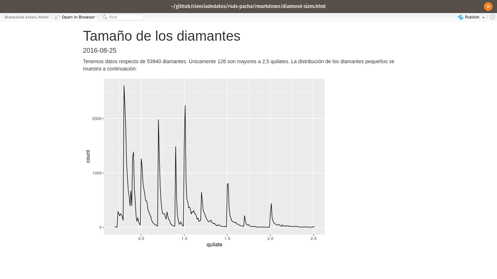

# R Markdown

## Introducción

R Markdown provee un marco de escritura para ciencia de datos, que combina tu código, sus resultados y tus comentarios en prosa. Los documentos de R Markdown son completamente reproducibles y soportan docenas de formatos de salida tales como PDFs, archivos de Word, presentaciones y más.

Los archivos R Markdown están diseñados para ser usados de tres maneras:

1. Para comunicarse con quienes toman decisiones, que desean enfocarse en las
 conclusiones, no en el código que subyace al análisis.

1. Para colaborar con otras personas que hacen ciencia de datosdatos (¡incluyendo a tu yo futuro!),
 quienes están interesados tanto en tus conclusiones como en el modo en el que
 llegaste a ellas (es decir, el código).

1. Como un ambiente en el cual _hacer_ ciencia de datos, como si fuera un  *notebook* de
 laboratorio moderno donde puedes capturar no solo que hiciste, sino también
 lo que estabas pensando cuando lo hacías.

R Markdown integra una cantidad de paquetes de R y herramientas externas. Esto implica que la ayuda, en general, no está disponible a través de ` ?`. En su lugar, a lo largo de este capítulo y cuando utilices R Markdown en el futuro, mantén estos recursos cerca:

* Hoja de referencia de R Markdown : _Help > Cheatsheets > R Markdown Cheat Sheet_

* Guía de referencia R Markdown : _Help > Cheatsheets > R Markdown Reference
 Guide_

Ambas hojas también se encuentran disponibles en https://rstudio.com/resources/cheatsheets/>.

### Prerrequisitos

Si bien necesitas el paquete __rmarkdown__, no necesitas cargarlo o instalarlo explícitamente, ya que RStudio hace ambas acciones de forma automática cuando es necesario.

```{r setup, include = FALSE}
chunk <- "```"
inline <- function(x = "") paste0("`` `r ", x, "` ``")
library(tidyverse)
library(datos)
```

## Elementos básicos de R Markdown

Este es un archivo R Markdown, un archivo de texto plano que tiene la extensión `.Rmd`:

```{r echo = FALSE, comment = ""}
cat(htmltools::includeText("rmarkdown/diamond-sizes.Rmd"))
```

Contiene tres tipos importantes de contenido:

 1. Un encabezado YAML (opcional) rodeado de `---`
 1. __Bloques__ de código de R rodeados de ```` ``` ````.
 1. Texto mezclado con formateos de texto simple como `# Encabezado` e `_itálicas_`.

Cuando abres un archivo `.Rmd`, obtienes una interfaz de *notebook* donde el código y el *output* están intercalados. Puedes ejecutar cada bloque de código haciendo clic en el ícono ejecutar (se parece a un botón de reproducir en la parte superior del bloque de código), o presionando Cmd/Ctrl + Shift + Enter. RStudio ejecuta el código y muestra los resultados incustrados en el código:

```{r, echo = FALSE, out.width = "75%"}
knitr::include_graphics("rmarkdown/tamanio-diamantes-cuadernillo.png")
```

Para producir un reporte completo que contenga todo el texto, código y resultados, haz clic en "Knit" o presionar Cmd/Ctrl + Shift + K. Puede hacerse también de manera programática con `rmarkdown::render("1-example.Rmd")`. Esto mostrará el reporte en el panel *viewer* y creará un archivo HTML independiente que puedes compartir con otras personas.

```{r, echo = FALSE, out.width = "75%"}

```

Cuando haces *knit* el documento (_knit_ significa tejer en inglés), R Markdown envía el .Rmd a _knitr_ (http://yihui.name/knitr/) que ejecuta todos los bloques de código y crea un nuevo documento markdown (.md) que incluye el código y su output. El archivo markdown generado por _knitr_ es procesado entonces por pandoc (http://pandoc.org/) que es el responsable de crear el archivo terminado. La ventaja de este flujo de trabajo en dos pasos es que puedes crear un muy amplio rango de formatos de salida, como aprenderás en [Formatos de R markdown ].

```{r, echo = FALSE, out.width = "75%"}
knitr::include_graphics("images/RMarkdownFlow.png")
```

Para comenzar con tu propio archivo `.Rmd`, selecciona *File > New File > R Markdown...* en la barra de menú. RStudio iniciará un asistente que puedes usar para pre-rellenar tu archivo con contenido útil que te recuerda cómo funcionan las principales características de R Markdown.

Las siguientes secciones profundizan en los tres componentes de un documento de R Markdown en más detalle: el texto Markdown, los bloques de código y el encabezado YAML.

### Ejercicios

1. Crea un nuevo *notebook* usando _File > New File > R Notebook_. Lee las
 instrucciones. Practica ejecutando los bloques. Verifica que puedes modificar el código, re-ejecútalo, y observa la salida modificada.

1. Crea un nuevo documento R Markdown con _File > New File > R Markdown..._
 Haz clic en el icono apropiado de *Knit*. Haz *Knit* usando el atajo de teclado apropiado. Verifica que puedes modificar el *input* y la actualización del *output*.

1. Compara y contrasta el *notebook* de R con los archivos de R markdown que has
 creado antes. ¿Cómo son similares los outputs? ¿Cómo son diferentes? ¿Cómo son similares los inputs? ¿En qué se diferencian? ¿Qué ocurre si copias el encabezado YAML de uno al otro?

1. Crea un nuevo documento R Markdown para cada uno de los tres formatos
 incorporados: HTML, PDF and Word. Haz *knit* en cada uno de estos tres documentos. ¿Como difiere el output? ¿Cómo difiere el input? (Puedes necesitar instalar LaTeX para poder compilar el output en PDF--- RStudio te preguntará si esto es necesario).

## Formateo de texto con Markdown

La prosa en los archivos `.Rmd` está escrita en Markdown, una colección simple de convenciones para dar formato a archivos de texto plano. Markdown está diseñado para ser fácil de leer y fácil de escribir. Es también muy fácil de aprender. La siguiente guía muestra cómo usar el Markdown de Pandoc, una versión ligeramente extendida de Markdown que R Markdown comprende.

```{r, echo = FALSE, comment = ""}
cat(readr::read_file("rmarkdown/markdown.Rmd"))
```

La mejor manera de aprender estas convenciones es simplemente probar. Tomará unos días, pero pronto se convertirán en algo natural y no necesitarás pensar en ellas. Si te olvidas, puedes tener una útil hoja de referencia con *Help > Markdown Quick Reference*.

### Ejercicios

1. Practica lo que has aprendido crando un CV breve. El título debería ser tu nombre,
 y deberías incluir encabezados para (por lo menos) educación o empleo. Cada una de las secciones debería incluir una lista con viñetas de trabajos/ títulos obtenidos. Resalta el año en negrita.

1. Usando la referencia rápida de R Markdown, descubre como:

 1. Agregar una nota al pie.
 1. Agregar una linea horizontal.
 1. Agregar una cita en bloque.

1. Copia y pega los contenidos de `diamond-sizes.Rmd` desde
 <https://github.com/hadley/r4ds/tree/master/rmarkdown> a un documento local de R Markdown. Revisa que puedes ejecutarlo, agrega texto después del polígono de frecuencias que describa sus características más llamativas.

## Bloques de código

Para ejecutar código dentro de un documento R Markdown, necesitas insertar un bloque o _chunk_, en inglés. Hay tres maneras para hacerlo:

1. Con el atajo de teclado: Cmd/Ctrl + Alt + I

1. Con el ícono "_Insert_" en la barra de edición

1. Tipeando manualmente los delimitadores de bloque ` ```{r} ` y ` ``` `.

Obviamente, nuestra recomendación es que aprendas a usar el atajo de teclado. A largo plazo, te ahorrará mucho tiempo.

Puedes continuar ejecutando el código usando el atajo de teclado que para este momento (¡esperamos!) ya conoces y amas : Cmd/Ctrl + Enter. Sin embargo, los bloques de código tienen otro atajo de teclado: Cmd/Ctrl + Shift + Enter, que ejecuta todo el código en el bloque. Piensa el bloque como una función. Un bloque debería ser relativamente autónomo y enfocado en torno a una sola tarea.

Las siguientes secciones describen el encabezado de bloque, que consiste en ```` ```{r ````, seguido por un nombre opcional para el bloque, seguido luego por opciones separadas por comas y un `}`. Luego viene tu código de R. El término del bloque se indica con un ```` ``` ```` final.

### Nombres de los bloques

Los bloques puede tener opcionalmente nombres: ```` ```{r nombre} ````. Esto presenta tres ventajas:

1. Puedes navegar más fácilmente a bloques específicos usando el navegador de código
 desplegable abajo a la izquierda en el editor de *script*:

 ```{r, echo = FALSE, out.width = "30%"}
knitr::include_graphics("screenshots/rmarkdown-chunk-nav.png")
 ```

1. Los gráficos producidos por los bloques tendrán nombres útiles que hace que sean
 más fáciles de utilizar en otra parte. Más sobre esto en la sección sobre [otras opciones importantes].

1. Puedes crear redes de bloques guarados en el caché para evitar re-ejecutar cómputos costosos
 en cada ejecución. Más sobre esto más adelante.

Hay un nombre de bloque que tiene comportamiento especial: `setup`. Cuando te encuentras en modo *notebook*, el bloque llamado setup se ejecutará automáticamente una vez, antes de ejecutar cualquier otro código.

### Opciones de los bloques

La salida de los bloques puede personalizarse con __options__, que son argumentos suministrados en el encabezado del bloque. Knitr provee casi 60 opciones que puedes usar para personalizar tus bloques de código. Aquí cubriremos las opciones de bloques más importantes que usarás más frecuentemente. Puedes ver la lista completa en <http://yihui.name/knitr/options/>.

El conjunto más importante de opciones controla si tu bloque de código es ejecutado y qué resultados estarán insertos en el reporte final:

* `eval = FALSE` evita que el código sea evaluado. (Y, obviamente, si el código no es
 ejecutado no se generaran resultados). Esto es útil para mostrar códigos de ejemplo, o para deshabilitar un gran bloque de código sin comentar cada línea.

* `include = FALSE` ejecuta el código, pero no muestra el código o los resultados
 en el documento final. Usa esto para código de configuración que no quieres que abarrote tu reporte.

* `echo = FALSE` evita que se vea el código, pero sí muestra los resultados en el archivo
 final. Utiliza esto cuando quieres escribir reportes enfocados a personas que no quieren ver el código subyacente de R.

* `message = FALSE` o `warning = FALSE` evita que aparezcan mensajes o advertencias
 en el archivo final.

* `results = 'hide'` oculta el *output* impreso; `fig.show = 'hide'` oculta
 gráficos.

* `error = TRUE` causa que el *render* continúe incluso si el código devuelve un error.
 Esto es algo que raramente quieres incluir en la versión final de tu reporte, pero puede ser muy útil si necesitas depurar exactamente qué ocurre dentro de tu `.Rmd`. Es también útil si estás enseñando R y quieres incluir deliberadamente un error. Por defecto, `error = FALSE` provoca que el *knitting* falle si hay incluso un error en el documento.

La siguiente tabla resume qué tipos de *output* suprime cada opción:

Opción | Ejecuta | Muestra | Output | Gráficos | Mensajes |Advertencias
-------------------|----------|-----------|--------|----------|----------|------------
`eval = FALSE` | - | | - | - | - | -
`include = FALSE` | | - | - | - | - | -
`echo = FALSE` | | - | | | |
`results = "hide"` | | | - | | |
`fig.show = "hide"`| | | | - | |
`message = FALSE` | | | | | - |
`warning = FALSE` | | | | | | -

### Tablas

Por defecto, R Markdown imprime data frames y matrices tal como se ven en la consola:

```{r}
mtcars[1:5, ]
```

Si prefieres que los datos tengan formato adicional, puedes usar la función `knitr::kable`. El siguiente código genera una Tabla \@ref(tab:kable).

```{r kable}
knitr::kable(
  mtcars[1:5, ],
  caption = "Un kable de knitr."
)
```

Lee la documentación para `?knitr::kable` para ver los otros modos en los que puedes personalizar la tabla. Para una mayor personalización, considera los paquetes __xtable__, __stargazer__, __pander__, __tables__ y __ascii__. Cada uno provee un set de herramientas para generar tablas con formato a partir código de R.

Hay también una gran cantidad de opciones para controlar cómo las figuras están embebidas o incrustadas. Aprenderás sobre esto en la sección [guardando tus gráficos].

### Caching

Normalmente, cada *knit* de un documento empieza desde una sesión limpia. Esto es genial para la reproducibilidad, porque se asegura que has capturado cada cómputo importante en el código. Sin embargo, puede ser doloroso si tienes cómputos que toman mucho tiempo. La solución es `cache = TRUE`. Cuando está configurada, esto guarda el output del bloque en un archivo con un nombre especial en el disco. En ejecuciones siguientes, _knitr_ revisará si el código ha cambiado, y si no ha hecho, reutilizará los resultados del caché.

El sistema de caché debe ser usado con cuidado, porque por defecto está solo basado en el código, no en sus dependencias. Por ejemplo, aquí el bloque `datos_procesados` depende del bloque `datos_crudos`:
 
    `r chunk`{r datos_crudos}
    datos_crudos <- readr::read_csv("un_archivo_muy_grande.csv")
    `r chunk`
    
    `r chunk`{r datos_procesados, cache = TRUE}
    datos_procesados <- datos_crudos %>% 
      filter(!is.na(variable_important)) %>% 
      mutate(nueva_variable = transformacion_complicada(x, y, z))
    `r chunk`


Hacer *caching* en el bloque `datos_procesados` significa que se re-ejecutará si el pipeline de _dplyr_ se modifica, pero no re-ejecutará si cambia la llamada a `read_csv()`. Puedes evitar este problema con la opción de bloque `dependson` (_depende de_, en inglés):


    `r chunk`{r datos_procesados, cache = TRUE, dependson = "datos_crudos"}
    datos_procesados <- datos_crudos %>% 
      filter(!is.na(variable_important)) %>% 
      mutate(nueva_variable = transformacion_complicada(x, y, z))
    `r chunk`


`dependson` debiese incluir un vector de caracteres de *cada* bloque del que depende el bloque cacheado. _Knitr_ actualizará los resultados para el bloque cacheado cada vez que detecta que una de sus dependencias ha cambiado.

Ten en cuenta que los bloques de código no se actualizarán si `un_archivo_muy_grande.csv` cambia, porque el caché de _knitr_ solo hace seguimiento de los cambios dentro del archivo `.Rmd`. Si quieres seguir también los cambios hechos en ese archivo, puedes usar la opción `cache.extra`. Esta es una expresión arbitraria de R que invalidará el *caché* cada vez que cambie. Una buena función a usar es `file.info()`: genera mucha información sobre el archivo incluyendo cuándo fue su última modificación. Puedes escribir entonces:

    `r chunk`{r datos_crudos, cache.extra = file.info("un_archivo_muy_grande.csv")}
    datos_crudos <- readr::read_csv("un_archivo_muy_grande.csv")
    `r chunk`

A medida que tus estrategias de *cacheo* se vuelvan progresivamente más complicadas, es una buena idea limpiar regularmente todos tus *cachés* con `knitr::clean_cache()`.

Hemos utilizado el consejo de [David Robinson](https://twitter.com/drob/status/738786604731490304) para nombrar estos bloques: cada bloque debe nombrarse según el objeto principal que crea. Esto hace mucho más fácil entender la especificación `dependson`.

### Opciones globales

A medida que trabajes más con _knitr_, descubrirás que algunas de las opciones de bloque por defecto no se ajustan a tus necesidades y querrás cambiarlas. Puedes hacer esto incluyendo `knitr::opts_chunk$set()` en un bloque de código. Por ejemplo, cuando escribimos libros y tutoriales seteamos:

```{r, eval = FALSE}
knitr::opts_chunk$set(
  comment = "#>",
  collapse = TRUE
)
```

Esto utiliza nuestro formato preferido de comentarios y se asegura que el código y el *output* se mantengan entrelazados. Por otro lado, si preparas un reporte, puedes fijar:
```{r eval = FALSE}
knitr::opts_chunk$set(
  echo = FALSE
)
```

Esto ocultará por defectoel código, así que solo mostrará los bloques que deliberadamente has elegido mostrar (con `echo = TRUE`). Puedes considerar fijar `message = FALSE` y `warning = FALSE`, pero eso puede hacer más díficil la tarea de depurar problemas, porque no verías ningún mensajes en el documento final.

### Código dentro de una línea

Hay otro modo de incluir código R en un documento R Markdown: directamente en el texto, con:`r inline()`. Esto puede ser muy útil si mencionas propiedades de tus datos en el texto. Por ejemplo, en el documento de ejemplo que utilizamos al comienzo del capítulo teníamos:

> Tenemos datos sobre `r inline('nrow(diamonds)')` diamantes.
> Solo `r inline('nrow(diamonds) - nrow(smaller)')` son de más de
> 2.5 quilates. La distribución de los restantes se muestra a continuación:

Cuando hacemos *knit*, los resultados de estos cómputos están insertos en el texto:

> Tenemos datos de 53940 diamantes. Solo 126 son de más de
> 2.5 quilates. La distribución de los restantes se muestra a continuación:

Cuando insertas números en el texto, la función `format()` es tu amiga. Esta permite establecer el número de dígitos (`digits`) para que no imprimas con un grado ridículo de precisión y el separador de miles (`big.mark`) para hacer que los números sean más fáciles de leer. Siempre combinamos estos en una función de ayuda:

```{r}
coma <- function(x) format(x, digits = 2, big.mark = ",")
coma(3452345)
coma(.12358124331)
```

### Ejercicios

1. Incluye una sección que explore cómo los tamaños de diamantes varían por corte, color y claridad. Asume que escribes un reporte para alguien que no conoce R, por lo que en lugar de fijar `echo = FALSE` en cada bloque, fija una opción global.

1. Descarga `diamond-sizes.Rmd` de <https://github.com/cienciadedatos/r4ds/blob/traduccion/rmarkdown>. Agrega una sección
 que describa los 20 diamantes mas grandes, incluyendo una tabla que muestre sus atributos más importantes.

1. Modifica `diamonds-sizes.Rmd` para usar `coma()` para producir un formato de *output* ordenado. También incluye el porcentaje de diamantes que son mayores a 2.5 quilates.

1. Define una red de bloques donde `d` dependa de `c` y de `b`, y
 tanto `b` y `c` dependan de `a`. Haz que cada bloque imprima `lubridate::now()`, fija `cache = TRUE` y verifica que estás comprendiendo cómo se almacena en *cache*.

## Solucionando problemas

Solucionar problemas en documentos de R Markdown puede ser muy desafiante, ya que no te encuentras usando R en un ambiente de R interactivo. Es por eso que necesitarás aprender algunos trucos nuevos. La primera cosa que siempre debes intentar es recrear el problema en una sesión interactiva. Reinicia R, ejecuta todos los bloques de código (ya sea desde el menú Code, desde el menú desplegable bajo Run o con el atajo del teclado Ctrl + Alt + R). Si tienes suerte, eso recreará el problema y podrás descubrir lo que está ocurriendo interactivamente.

Si eso no ayuda, debe haber algo diferente entre tu ambiente interactivo y el ambiente de R Markdown. Tendrás que explorar sistemáticamente las opciones. La diferencia más común es el directorio de trabajo: el directorio de trabajo de R Markdown es el directorio en el que se encuentra. Revisa que el directorio de trabajo es el que esperas incluyendo `getwd()` en un bloque.

A continuación, piensa en todas las cosas que podrían causar el error. Necesitarás revisar sistemáticamente que tu sesión de R y tu sesión de R Markdown sean la misma. La manera más fácil de hacer esto es fijar `error = TRUE` en el bloque que causa problemas, y luego usa `print()` y `str()` para revisar que la configuración es la esperada.

## Encabezado YAML

Puedes controlar otras configuraciones de "documento completo" haciendo ajustes a los parámetros del encabezado YAML. Estarás preguntándote que significa YAML: es la sigla en inglés de la frase *"yet another markup language"*, que significa *"otro lenguaje de marcado más"*. Este lenguaje de marcado está diseñado para representar datos jerárquicos de modo tal que sea fácil de escribir y leer para humanos. R Markdown lo utiliza para controlar muchos detalles del *output.* Aquí discutiremos dos: parámetros del documento y bibliografías.

### Parámetros

Los documentos R Markdown pueden incluir uno o mas parámetros cuyos valores pueden ser fijados cuando se renderiza el reporte. Los parámetros son útiles cuando quieres re-renderizar el mismo reporte con valores distintos para varios inputs clave. Por ejemplo, podrías querer producir reportes de venta por ramas, resultados de un examen por alumno, resúmenes demográficos por país. Para declarar uno o más parámetros, utiliza el campo `params`.

Este ejemplo utiliza el parámetro `my_class` para determinar que clase de auto mostrar:

```{r, echo = FALSE, out.width = "100%", comment = ""}
cat(readr::read_file("rmarkdown/fuel-economy.Rmd"))
```

Como puedes ver, los parámetros están disponibles dentro de los bloques de código como una lista de solo lectura llamada `params`.

Puedes escribir vectores atómicos directamente en el encabezado YAML. Puedes también ejecutar expresiones arbitrarias de R agregando `!r` antes del valor del parámetro. Esta es una buena manera de especificar parámetros de fecha/hora.

```yaml
params:
 start: !r lubridate::ymd("2015-01-01")
 snapshot: !r lubridate::ymd_hms("2015-01-01 12:30:00")
```

En RStudio, puedes hacer clic en la opción "Knit with Parameters" en el menú desplegable *Knit* para fijar parámetros, renderizar y previsualizar en un solo paso amigable. Puedes personalizar el diálogo fijando otras opciones en el encabezado. Ver para más detalles <http://rmarkdown.rstudio.com/developer_parameterized_reports.html#parameter_user_interfaces> (en inglés).

De manera alternativa, si necesitas producir varios reportes parametrizados, puedes ejecutar `rmarkdown::render()` con una lista de `params`:

```{r eval = FALSE}
rmarkdown::render("fuel-economy.Rmd", params = list(mi_clase = "suv"))
```

Esto es particularmente poderoso en conjunto con `purrr:pwalk()`. El siguiente ejemplo crea un reporte para cada valor de `clase` que se encuentra  en `millas`. Primero creamos un data frame que tiene una fila para cada clase, dando el nombre de archivo (`filename`) del reporte y los `params`:

```{r}
reportes <- tibble(
  clase = unique(millas$clase),
  filename = stringr::str_c("economia-combustible-", clase, ".html"),
  params = purrr::map(clase, ~ list(mi_clase = .))
)
reportes
```

Entonces unimos los nombres de las columnas con los nombres de los argumentos de `render()`, y utilizamos la función `pwalk()` (*parallel walk*) del paquete **purrr** para invocar `render()` una vez en cada fila:

```{r, eval = FALSE}
reportes %>%
  select(output_file = filename, params) %>%
  purrr::pwalk(rmarkdown::render, input = "fuel-economy.Rmd")
```

### Bibliografías y citas

Pandoc puede generar automáticamente citas y bibliografía en varios estilos. Para usar esta característica, especifica un archivo de bibliografía usando el campo `bibliography` en el encabezado de tu archivo. El campo debe incluir una ruta del directorio que contiene tu archivo .Rmd al archivo que contiene el archivo de bibliografía:

```yaml
bibliography: rmarkdown.bib
```

Puedes usar muchos formatos comunes de biliografía incluyendo BibLaTeX, BibTeX, endnote, medline.

Para crear una cita dentro de tu archivo .Rmd, usa una clave compuesta de ‘@’ + el identificador de la cita del archivo de la bibliografía. Después, ubica esta cita entre corchetes. Aquí hay algunos ejemplos:

```markdown
Multiple citas se separan con un `;`: Bla bla[@smith04; @doe99].

Puedes incluir comentarios arbritarios dentro de los corchetes:
Bla bla [ver @doe99, pp. 33-35; también @smith04, ch. 1].

Remover los corchetes para crear una cita dentro del texto: @smith04
dice bla, o @smith04 [p. 33] dice bla.

Agrega un signo `-` antes de la cita para eliminar el nombre del autor:

Smith dice bla [-@smith04].
```

Cuando R Markdown *renderice* tu archivo, construirá y agregará una bibliografía al final del documento. La bibliografía contendrá cada una de las referencias citadas de tu archivo de bibliografía, pero no contendrá un encabezado de sección. Como resultado, es una práctica común finalizar el archivo con un encabezado de sección para la bibliografía, tales como `# Referencias` or `# Bibliografía`.

Puedes cambiar el estilo de tus citas y bibliografía referenciando un archivo CSL (sigla de "citation style language", es decir, lenguaje de estilo de citas) en el campo `csl`:

```yaml
bibliography: rmarkdown.bib
csl: apa.csl
```

Tal y como en el campo de bilbiografía, tu archivo csl debería contener una ruta al archivo. Aquí asumimos que el archivo csl está en el mismo directorio que el archivo .Rmd. Un buen lugar para encontrar archivos CSL para estilos de bibliografía comunes es <http://github.com/citation-style-language/styles>.

## Aprendiendo más

R Markdown es todavía relativamente reciente y sigue creciendo con rapidez. El mejor lugar para estar al tanto de las innovaciones es el sitio oficial de R Markdown: <http://rmarkdown.rstudio.com>.

Hay dos tópicos importantes que no hemos mencionado aquí: colaboraciones y los detalles de comunicar de manera precisa tus ideas a otros seres humanos. La colaboración es una parte vital de la ciencia de datos moderna y puedes hacer tu vida mucho más fácil si usas herramientas de control de versión, tales como Git y GitHub. Recomendamos dos recursos gratuitos que te enseñarán Git:

1. "Happy Git with R": una introducción amigable a Git y GitHub para personas que usan R, de Jenny Bryan. El libro esta disponible de manera libre en línea en: <http://happygitwithr.com>

1. El capitulo "Git and GitHub" de _R Packages_, de Hadley Wickham. Puedes también leerlo online: <https://r-pkgs.org/git.html>.

Tampoco hemos hablado acerca de qué es lo que realmente deberías escribir para poder comunicar claramente los resultados de tu análisis. Para mejorar tu escritura, recomendamos leer cualquiera de estos libros (en inglés): [_Style: Lessons in Clarity and Grace_](https://amzn.com/0134080416) de Joseph M. Williams & Joseph Bizup o  [_The Sense of Structure: Writing from the Reader's Perspective_](https://amzn.com/0205296327) de George Gopen. Ambos libros te ayudarán a entender la estructura de oraciones y párrafos, y te darán las herramientas para hacer más clara tu escritura. (Estos libros son bastante caros si se compran nuevos, pero dado que son usados en muchas clases de inglés es posible encontrar copias baratas de segunda mano). George Gopen también ha escrito varios artículos cortos en inglés sobre escritura en <https://www.georgegopen.com/the-litigation-articles.html>. Están dirigidos a abogados, pero casi todo también se aplica en el contexto de la ciencia de datos.
