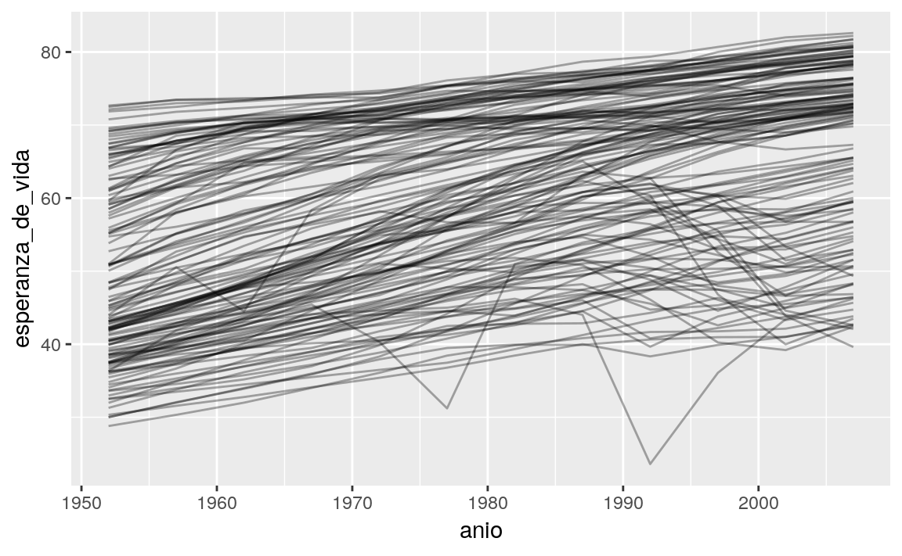
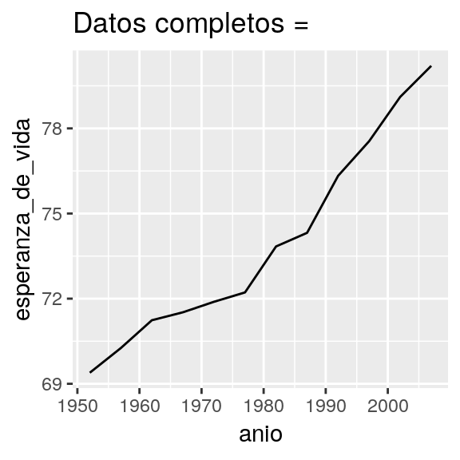
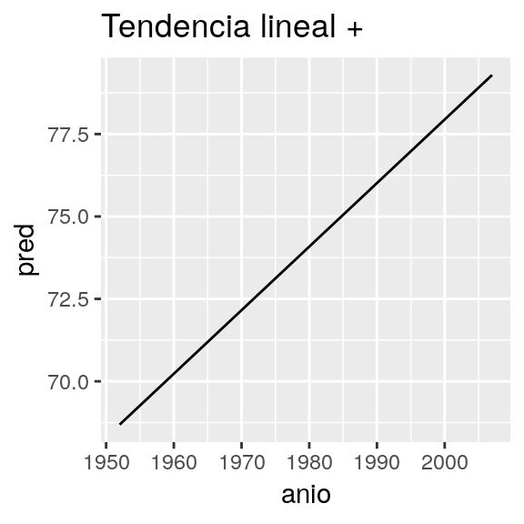
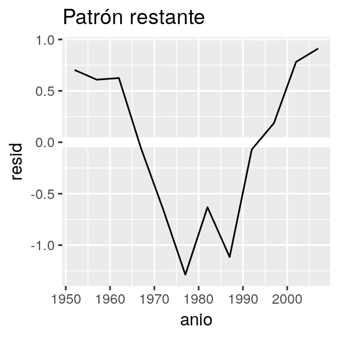

# Muchos modelos

## Introducción

En este capítulo vas a aprender tres ideas poderosas que te van a ayudar a trabajar fácilmente con un gran número de modelos:

1.  Usar muchos modelos simples para entender mejor conjuntos de datos complejos.

1.  Usar columnas-lista (_list-columns_) para almacenar estructuras de datos arbitrarias en un _data frame_.
    Ésto, por ejemplo, te permitirá tener una columna que contenga modelos lineales.
   
1.  Usar el paquete __broom__, de David Robinson, para transformar modelos en datos ordenados.
    Ésta es una técnica poderosa para trabajar con un gran número de modelos
    porque una vez que tienes datos ordenados, puedes aplicar todas las técnicas que 
    has aprendido anteriormente en el libro.

Empezaremos entrando de lleno en un ejemplo motivador usando datos sobre la esperanza de vida alrededor del mundo. Es un conjunto de datos pequeño pero que ilustra cuán importante puede ser modelar para mejorar tus visualizaciones. Utilizaremos un número grande de modelos simples para extraer algunas de las señales más fuertes y que podamos ver las sutiles que permanecen. También veremos cómo las medidas de resumen de los modelos nos pueden ayudar a encontrar datos atípicos y tendencias inusuales.

Las siguientes secciones ahondarán en más detalles acerca de las técnicas:

1. En [columnas-lista], aprenderás más acerca de la estructura de datos columna-lista,
   y por qué es válido poner listas en _data frames_.
   
1. En [creando columnas-lista], aprenderás las tres maneras principales en las que 
   crearás columnas-lista.
   
1. En [simplificando columnas-lista] aprenderás cómo convertir columnas-lista de vuelta
   a vectores atómicos regulares (o conjuntos de vectores atómicos) para que puedas trabajar
   con ellos más fácilmente.
   
1. En [haciendo datos ordenados con broom], aprenderás sobre el conjunto de herramientas completo
   provisto por __broom__ (del inglés _escoba_), y verás cómo puede ser aplicado a otros tipos de 
   estructuras de datos.

Este capítulo es aspiracional en cierta medida: si este libro es tu primera introducción a R, este capítulo es probable que sea una lucha para ti. Requiere que tengas profundamente internalizadas ideas acerca de modelamiento, estructuras de datos, e iteración. Así que no te preocupes si no lo entiendes --- solo aparta este capítulo por un par de meses, y vuelve cuando quieras ejercitar tu cerebro.

### Prerrequisitos

Trabajar con muchos modelos requiere muchos de los paquetes del __tidyverse__ (para exploración de datos, doma y programación) y __modelr__ para facilitar el modelamiento.


```r
library(modelr)
library(tidyverse)
```

## gapminder

Para motivar el poder de muchos modelos simples, vamos a mirar los datos de "gapminder". Estos datos fueron popularizados por Hans Rosling, un doctor y estadístico sueco. Si nunca has escuchado de él, para de leer este capítulo ahora mismo y ve a mirar uno de sus videos! Él es un presentador de datos fantástico e ilustra cómo puedes usar datos para presentar una historia convincente. Un buen lugar para empezar es este video corto filmado en conjunto con la BBC: <https://www.youtube.com/watch?v=jbkSRLYSojo>.

Los datos de gapminder resumen la progresión de países a través del tiempo, mirando estadísticos como esperanza de vida y PIB. Los datos son de fácil acceso en R, gracias a Jenny Bryan que creó el paquete __gapminder__. Utilizaremos la versión en español contenida en el paquete __datos__ (TODO: ver cómo poner esto):


```r
library(datos)
paises
#> # A tibble: 1,704 x 6
#>   pais       continente  anio esperanza_de_vida poblacion pib_per_capita
#>   <fct>      <fct>      <int>             <dbl>     <int>          <dbl>
#> 1 Afganistan Asia        1952              28.8   8425333           779.
#> 2 Afganistan Asia        1957              30.3   9240934           821.
#> 3 Afganistan Asia        1962              32.0  10267083           853.
#> 4 Afganistan Asia        1967              34.0  11537966           836.
#> 5 Afganistan Asia        1972              36.1  13079460           740.
#> 6 Afganistan Asia        1977              38.4  14880372           786.
#> # … with 1,698 more rows
```

En este caso de estudio, nos enfocaremos en solo tres variables para responder la pregunta "¿Cómo la esperanza de vida (`esperanza_de_vida`) cambia a través del tiempo (`anio`) para cada país (`pais`)?". Un buen lugar para empezar es con un gráfico:


```r
paises %>%
  ggplot(aes(anio, esperanza_de_vida, group = pais)) +
  geom_line(alpha = 1 / 3)
```



Es un conjunto de datos pequeño: solo tiene ~1,700 observaciones y 3 variables. Pero aún así es difícil ver qué está pasando! En general, parece que la esperanza de vida ha estado mejorando en forma constante. Sin embargo, si miras de cerca, puedes notar algunos países que no siguen este patrón. ¿Cómo podemos hacer que esos países se vean más fácilmente?

Una forma es usar el mismo enfoque que en el último capítulo: hay una señal fuerte (en general crecimiento lineal) que hace difícil ver tendencias más sutiles. Separaremos estos factores estimando un modelo con una tendencia lineal. El modelo captura el crecimiento estable en el tiempo, y los residuos mostrarán lo que queda fuera.

Ya sabes cómo hacer eso si tenemos un solo país:


```r
nz <- filter(paises, pais == "Nueva Zelandia")
nz %>%
  ggplot(aes(anio, esperanza_de_vida)) +
  geom_line() +
  ggtitle("Datos completos = ")

nz_mod <- lm(esperanza_de_vida ~ anio, data = nz)
nz %>%
  add_predictions(nz_mod) %>%
  ggplot(aes(anio, pred)) +
  geom_line() +
  ggtitle("Tendencia lineal + ")

nz %>%
  add_residuals(nz_mod) %>%
  ggplot(aes(anio, resid)) +
  geom_hline(yintercept = 0, colour = "white", size = 3) +
  geom_line() +
  ggtitle("Patrón restante")
```



¿Cómo podemos ajustar fácilmente ese modelo para cada país?

### Datos anidados

Te puedes imaginar copiando y pegando ese código múltiples veces; pero ya has aprendido una mejor forma! Extrae el código en común con una función y repítelo usando una función map (TODO: no me queda claro que tenga sentido poner que el nombre de esta función venga del inglés, y no sé si ponerla en cursiva) de __purrr__. Este problema se estructura un poco diferente respecto a lo que has visto antes. En lugar de repetir una acción por cada variable, queremos repetirla para cada país, un subconjunto de filas. Para hacer eso, necesitamos una nueva estructura de datos: el __*data frame* anidado__ (_nested data frame_). Para crear un _data frame_ anidado empezamos con un _data frame_ agrupado, y lo "anidamos":


```r
por_pais <- paises %>%
  group_by(pais, continente) %>%
  nest()

por_pais
#> # A tibble: 142 x 3
#>   pais       continente data             
#>   <fct>      <fct>      <list>           
#> 1 Afganistan Asia       <tibble [12 × 4]>
#> 2 Albania    Europa     <tibble [12 × 4]>
#> 3 Argelia    Africa     <tibble [12 × 4]>
#> 4 Angola     Africa     <tibble [12 × 4]>
#> 5 Argentina  Americas   <tibble [12 × 4]>
#> 6 Australia  Oceania    <tibble [12 × 4]>
#> # … with 136 more rows
```

(Estoy haciendo un poco de trampa agrupando por `continente` y `pais` al mismo tiempo. Dado el `pais`, `continente` es fijo, así que no agrega ningún grupo más, pero es una forma fácil de llevarnos una variable adicional para el camino.)

Ésto crea un _data frame_ que tiene una fila por grupo (por país), y una columna bastante inusual: `data`. `data` es una lista de _data frames_ (o _tibbles_, para ser precisos). Esto parece una idea un poco loca: tenemos un _data frame_ con una columna que es una lista de otros _data frames_! Explicaré brevemente por qué pienso que es una buena idea.

La columna `data` es un poco difícil de examinar porque es una lista moderadamente complicada, y todavía estamos trabajando para tener buenas herramientas para explorar estos objetos. Desafortunadamente usar `str()` no es recomendable porque usualmente producirá un _output_ (salida de código) muy extenso. Pero si extraes un solo elemento de la columna `data` verás que contiene todos los datos para ese país (en este caso, Afganistán).


```r
por_pais$data[[1]]
#> # A tibble: 12 x 4
#>    anio esperanza_de_vida poblacion pib_per_capita
#>   <int>             <dbl>     <int>          <dbl>
#> 1  1952              43.1   9279525          2449.
#> 2  1957              45.7  10270856          3014.
#> 3  1962              48.3  11000948          2551.
#> 4  1967              51.4  12760499          3247.
#> 5  1972              54.5  14760787          4183.
#> 6  1977              58.0  17152804          4910.
#> # … with 6 more rows
```

Nota la diferencia entre un _data frame_ agrupado estándar y un _data frame_ anidado: en un _data frame_ agrupado, cada fila es una observación; en un _data frame_ anidado, cada fila es un grupo. Otra forma de pensar en un conjunto de datos anidado es que ahora tenemos una meta-observación: una fila que representa todo el transcurso de tiempo para un país, en lugar de solo un punto en el tiempo.

### Columnas-lista

Ahora que tenemos nuestro _data frame_ anidado, estamos en una buena posición para ajustar algunos modelos. Tenemos una función para ajustar modelos:


```r
modelo_pais <- function(df) {
  lm(esperanza_de_vida ~ anio, data = df)
}
```

Y queremos aplicarlo a cada _data frame_. Los _data frames_ están en una lista, así que podemos usar `purrr::map()` para aplicar `modelo_pais` a cada elemento:


