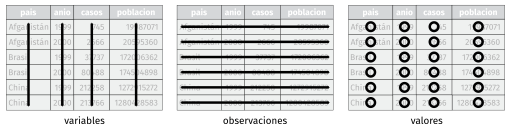
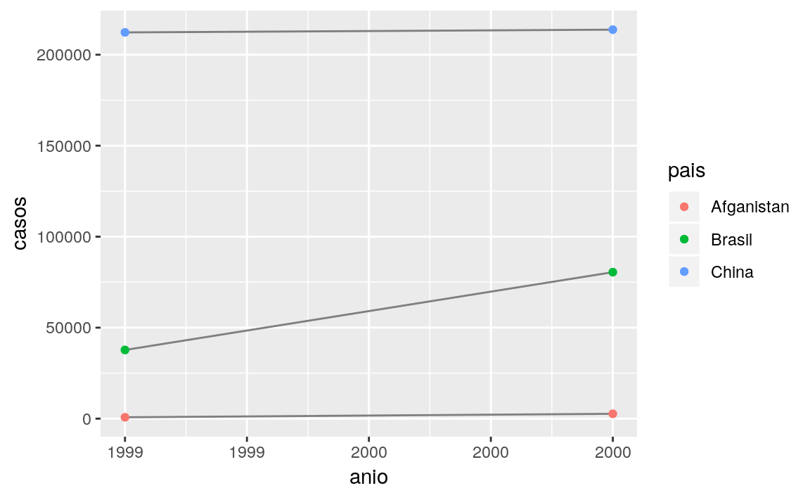

# Datos ordenados

## Introducción

> "Todas las familias felices se parecen unas a otras, pero cada familia infeliz lo es a su manera." --– León Tolstoy

> "Todos los datos ordenados se parecen unos a otros, pero cada dato desordenado lo es a su manera" --- Hadley Wickham

En este capítulo aprenderás una metodología consistente para organizar datos en R, a esta metodología le llamaremos __tidy data__ (datos ordenados). Llevar tus datos a este formato requiere algo de trabajo previo, sin embargo dicho trabajo tiene retorno positivo en el largo plazo. Una vez que tengas tus datos ordenados y las herramientas para ordenar datos que provee el tidyverse, vas a gastar mucho menos tiempo pasando de una forma de representar datos a otra, permietiéndote destinar más tiempo a las preguntas analíticas.

Este capítulo te dará una introducción práctica a datos ordenados (o *tidy data* en inglés) y las herramientas que provee el paquete __tidyr__. Si desear saber más acerca de la teoría subyacente, puede que te guste el artículo *Tidy Data* publicado en la revista Journal of Statistical Software, <http://www.jstatsoft.org/v59/i10/paper>.

### Prerrequisitos

En este capítulo nos enfocaremos en tidyr, un paquete que provee un conjunto de herramientas que te ayudarán a ordenar datos desordenados. tidyr es parte del núcleo del tidyverse.


```r
library(tidyverse)
library(datos)
```

## Datos ordenados

Puedes representar la misma información de múltiples formas. El ejemplo a continuación muestra los mismos datos ordenados de cuatro manera distintas. Cada dataset muestra los mismos valores de cuatro variables *pais*, *anio*, *poblacion* y *casos*, pero cada conjunto de datos organiza los valores de forma distinta.


```r
tabla1
#> # A tibble: 6 x 4
#>   pais        anio  casos  poblacion
#>   <fct>      <int>  <int>      <int>
#> 1 Afganistan  1999    745   19987071
#> 2 Afganistan  2000   2666   20595360
#> 3 Brasil      1999  37737  172006362
#> 4 Brasil      2000  80488  174504898
#> 5 China       1999 212258 1272915272
#> 6 China       2000 213766 1280428583
tabla2
#> # A tibble: 12 x 4
#>   pais        anio tipo         cuenta
#>   <fct>      <int> <fct>         <int>
#> 1 Afganistan  1999 casos           745
#> 2 Afganistan  1999 poblacion  19987071
#> 3 Afganistan  2000 casos          2666
#> 4 Afganistan  2000 poblacion  20595360
#> 5 Brasil      1999 casos         37737
#> 6 Brasil      1999 poblacion 172006362
#> # … with 6 more rows
tabla3
#> # A tibble: 6 x 3
#>   pais        anio tasa             
#>   <fct>      <int> <fct>            
#> 1 Afganistan  1999 745/19987071     
#> 2 Afganistan  2000 2666/20595360    
#> 3 Brasil      1999 37737/172006362  
#> 4 Brasil      2000 80488/174504898  
#> 5 China       1999 212258/1272915272
#> 6 China       2000 213766/1280428583

# Dividido en dos tibbles
tabla4a # casos
#> # A tibble: 3 x 3
#>   pais       `1999` `2000`
#>   <fct>       <int>  <int>
#> 1 Afganistan    745   2666
#> 2 Brasil      37737  80488
#> 3 China      212258 213766
tabla4b # poblacion
#> # A tibble: 3 x 3
#>   pais           `1999`     `2000`
#>   <fct>           <int>      <int>
#> 1 Afganistan   19987071   20595360
#> 2 Brasil      172006362  174504898
#> 3 China      1272915272 1280428583
```

Las anteriores son representaciones de los mismos datos subyacentes, pero no todas son igualmente fáciles de usar. Un tipo de conjunto de datos, el conjunto de datos ordenado, será mucho más fácil de trabajar en el tidyverse.

Existen tres reglas interrelacionadas que hacen que un conjunto de datos sea ordenado:

1.  Cada variable tiene su propia columna.
1.  Cada observación tiene su propia fila.
1.  Cada valor tiene su propia celda.

La figura \@ref(fig:tidy-structure) muestra estas reglas visualmente.

<div class="figure" style="text-align: center">

<p class="caption">(\#fig:tidy-structure)Reglas que hacen que un conjunto de datos sea ordenado: las variables están en columnas, las observaciones en filas, y los valores en celdas.</p>
</div>

Estas reglas están interrelacionadas ya que es imposible cumplir dos de las tres.
Esta interrelación lleva a un conjunto práctico de instrucciones mucho más simple:

1.  Coloca cada conjunto de datos en un tibble.
1.  Coloca cada variable en una columna.

En este ejemplo, solo `tabla1` está ordenado. Es la única representación en que cada columna es una variable.

¿Por qué asegurarse de que los datos estén ordenados? Existen dos principales ventajas:

1.  Existe una ventaja general de elegir una forma consistente de almacenar datos. Si tienes una estructura de datos consistente, es más fácil aprender las herramientas que funcionan con ella ya que tienen una uniformidad subyacente.
1.  Existe una ventaja específica al situar las variables en las columnas ya que permite que la naturaleza vectorizada de R brille. Como habrás aprendido en [mutate](#mutate-funs) y [summary](#summary-funs), muchas de las funciones que vienen con R trabajan con vectores de valores. Esto hace que transformar datos ordenados sea casi natural.

dplyr, ggplot2 y el resto de los paquetes del tidyverse están diseñados para trabajar con datos ordenados. Aquí hay algunos ejemplos de cómo se podría trabajar con `tabla1`.


```r
# Calcular tasa por cada 10,000 habitantes
tabla1 %>%
  mutate(tasa = casos / poblacion * 10000)
#> # A tibble: 6 x 5
#>   pais        anio  casos  poblacion  tasa
#>   <fct>      <int>  <int>      <int> <dbl>
#> 1 Afganistan  1999    745   19987071 0.373
#> 2 Afganistan  2000   2666   20595360 1.29 
#> 3 Brasil      1999  37737  172006362 2.19 
#> 4 Brasil      2000  80488  174504898 4.61 
#> 5 China       1999 212258 1272915272 1.67 
#> 6 China       2000 213766 1280428583 1.67

# Calcular casos por anio
tabla1 %>%
  count(anio, wt = casos)
#> # A tibble: 2 x 2
#>    anio      n
#>   <int>  <int>
#> 1  1999 250740
#> 2  2000 296920

# Visualizar cambios en el tiempo
library(ggplot2)
ggplot(tabla1, aes(anio, casos)) +
  geom_line(aes(group = pais), colour = "grey50") +
  geom_point(aes(colour = pais))
```



### Ejercicios

1.  Usando prosa, describe como las variables y observaciones se organizan en las tablas de ejemplo.

1.  Calcula la `tasa` para las tablas `tabla2` y `tabla4a` + `tabla4b`.
    Necesitarás las siguientes operaciones:

    1.  Extrae el número de casos de tuberculosis por país y año.
    1.  Extrae la población por país y año.
    1.  Divide los casos por la población y multiplica por 10000.
    1.  Inserta los datos en el lugar adecuado.

    ¿Cuál representación es más fácil de trabajar? ¿Cuál es la más difícil? ¿Por qué?

1.  Recrea el gráfico que muestra el cambio en el número de casos usando la `tabla2` en lugar de la `tabla1`. ¿Qué debes hacer en primer lugar?

## Reunir y Esparcir

Los principios de los datos ordenados parecen tan obvios que te preguntarás si acaso vas a encontrar un dataset que no esté ordenado. Desafortunadamente, gran parte de los datos que vas a encontrar están desordenados. Existen dos principales razones para esto:

1. La mayoría de las personas no están familiarizadas con los principios de datos ordenados y es difícil derivarlos por cuenta propia a menos que pases _mucho_ tiempo trabajando con datos.

2. Los datos a menudo están organizados para facilitar tareas distintas del análisis. Por ejemplo, los datos se organizan para que su registro sea lo más sencillo posible.

Esto significa que para la mayoría de los análisis, necesitarás ordenar los datos. El primer paso siempre es entender el significado de las variables y observaciones. Esto a veces es fácil, otras veces deberás consultar con quienes crearon el dataset. El segundo paso es resolver uno de los siguientes problemas frecuentes:

1. Una variable se esparce entre varias columnas

1. Una observación se esparce entre múltiples filas.

Típicamente un dataset tiene uno de los problemas, ¡si contiene ambos significa que tienes muy mala suerte! Para solucionar estos problemas necesitarás las dos funciones más importantes de tidyr: `gather()` (reunir) y `spread()` (esparcir).

### Gather

Un problema común se tiene cuando en un dataset los nombres de las columnas no representan nombres de variables, sino que representan los _valores_ de una variable. Tomando el caso de la `tabla4a`: los nombres de las columnas `1999` y `2000` representan los valores de la variable `anio` y cada fila representa dos observaciones en lugar de una.


```r
tabla4a
#> # A tibble: 3 x 3
#>   pais       `1999` `2000`
#>   <fct>       <int>  <int>
#> 1 Afganistan    745   2666
#> 2 Brasil      37737  80488
#> 3 China      212258 213766
```

Para ordenar un dataset como este necesitamos reunir (__gather__) tales columnas en un nuevo par de variables. Para describir dicha operación necesitamos tres parámetros:

* El conjunto de columnas que representan valores y no variables. En este ejemplo son las columnas `1999` y `2000`.

* El nombre de la variable cuyos valores forman los nombres de las columnas. Llamaremos a esto `key` (llave) y en este caso corresponde a `anio`.

* El nombre de la variable cuyos valores se esparcen por las celdas. Llamaremos a esto `value` (valor) y en este caso corresponde al número de `casos`.

Juntando estos parámetros se puede realizar una llamada a `gather()`:


```r
tabla4a %>%
  gather(`1999`, `2000`, key = "anio", value = "casos")
#> # A tibble: 6 x 3
#>   pais       anio   casos
#>   <fct>      <chr>  <int>
#> 1 Afganistan 1999     745
#> 2 Brasil     1999   37737
#> 3 China      1999  212258
#> 4 Afganistan 2000    2666
#> 5 Brasil     2000   80488
#> 6 China      2000  213766
```

Las columnas a reunir quedan seleccionadas siguiendo el estilo de notación de `dplyr::select()`. En este caso hay dos columnas, por lo que las listamos individualmente. Nota que "1999" y "2000" son nombres no-sintáxicos (debido a que no comienzan con una letra) por lo que los rodeamos con acentos graves (o _backticks_, en inglés). Para refrescar tu memoria respecto de la selección de columnas, consulta [select](#select).

<div class="figure" style="text-align: center">

<p class="caption">(\#fig:tidy-gather)Reuniendo `tabla4` a un formato ordenado.</p>
</div>

En el resultado final, las columnas reunidas se eliminan y obtenemos la nuevas variables `key` y `value`. De otro modo, la relacién entre las variables originales se mantiene. Visualmente, esto se observa en la Figura \@ref(fig:tidy-gather). Podemos usar `gather()` para ordenar `tabla4b` de modo similar. La única diferencia es la variable almacenada en los valores de las celdas:


```r
tabla4b %>%
  gather(`1999`, `2000`, key = "anio", value = "poblacion")
#> # A tibble: 6 x 3
#>   pais       anio   poblacion
#>   <fct>      <chr>      <int>
#> 1 Afganistan 1999    19987071
#> 2 Brasil     1999   172006362
#> 3 China      1999  1272915272
#> 4 Afganistan 2000    20595360
#> 5 Brasil     2000   174504898
#> 6 China      2000  1280428583
```

Para combinar las versiones ordenadas de `tabla4a` y `tabla4b` en un único tibble, necesitamos usar `dplyr::left_join()`, función que aprenderás en [datos relacionales].


```r
tidy4a <- tabla4a %>%
  gather(`1999`, `2000`, key = "anio", value = "casos")

tidy4b <- tabla4b %>%
  gather(`1999`, `2000`, key = "anio", value = "poblacion")

left_join(tidy4a, tidy4b)
#> Joining, by = c("pais", "anio")
#> # A tibble: 6 x 4
#>   pais       anio   casos  poblacion
#>   <fct>      <chr>  <int>      <int>
#> 1 Afganistan 1999     745   19987071
#> 2 Brasil     1999   37737  172006362
#> 3 China      1999  212258 1272915272
#> 4 Afganistan 2000    2666   20595360
#> 5 Brasil     2000   80488  174504898
#> 6 China      2000  213766 1280428583
```

### Spread

Extender (__spread__) es lo opuesto de __gather__. Lo usas cuando una observación aparece en múltiples filas. Por ejemplo, toma la tabla `tabla2`: una observación es un país en un año, pero cada observación aparece en dos filas.


```r
tabla2
#> # A tibble: 12 x 4
#>   pais        anio tipo         cuenta
#>   <fct>      <int> <fct>         <int>
#> 1 Afganistan  1999 casos           745
#> 2 Afganistan  1999 poblacion  19987071
#> 3 Afganistan  2000 casos          2666
#> 4 Afganistan  2000 poblacion  20595360
#> 5 Brasil      1999 casos         37737
#> 6 Brasil      1999 poblacion 172006362
#> # … with 6 more rows
```

Para ordenar esto, primero analiza la representación de un modo similar a cómo se haría con `gather()`. Esta vez, sin embargo, necesitamos únicamente dos parámetros:


* La columna que contiene los nombres de las variables, la columna `key`. En este caso corresponde a `tipo`.

* La columna que contiene valores de múltiples variables, la columna `value`. En este caso corresponde a `cuenta`.

Una vez resuelto esto, podemos usar `spread()`, como se muestra programáticamente abajo y visualmente en la Figura \@ref(fig:tidy-spread).


```r
tabla2 %>%
  spread(key = tipo, value = cuenta)
#> # A tibble: 6 x 4
#>   pais        anio  casos  poblacion
#>   <fct>      <int>  <int>      <int>
#> 1 Afganistan  1999    745   19987071
#> 2 Afganistan  2000   2666   20595360
#> 3 Brasil      1999  37737  172006362
#> 4 Brasil      2000  80488  174504898
#> 5 China       1999 212258 1272915272
#> 6 China       2000 213766 1280428583
```

<div class="figure" style="text-align: center">

<p class="caption">(\#fig:tidy-spread)Esparcir la `tabla2` la vuelve ordenada</p>
</div>

Como te habrás dado cuenta a partir de los argumentos comunes `key` y `value`, `gather()` y `spread()` son complementarios. `gather()` genera tablas estrechas y largas, `spread()` genera tablas anchas y cortas.

### Ejercicios

1.  ¿Por qué `gather()` y `spread()` no son perfectamente simétricas?
    Observa cuidadosamente el siguiente ejemplo:


```r
  stocks <- tibble(
    anio = c(2015, 2015, 2016, 2016),
    semestre = c(1, 2, 1, 2),
    retorno = c(1.88, 0.59, 0.92, 0.17)
  )
  stocks %>%
    spread(anio, retorno) %>%
    gather("anio", "retorno", `2015`:`2016`)
```

    (Pista: observa los tipos de variables y piensa en los nombres de las columnas)

    Tanto `spread()` como `gather()` tienen el argumento `convert` (convertir). ¿Qué hace dicho argumento?

1.  ¿Por qué falla el siguiente código?


```r
tabla4a %>%
  gather(`1999`, `2000`, key = "anio", value = "casos")
#> # A tibble: 6 x 3
#>   pais       anio   casos
#>   <fct>      <chr>  <int>
#> 1 Afganistan 1999     745
#> 2 Brasil     1999   37737
#> 3 China      1999  212258
#> 4 Afganistan 2000    2666
#> 5 Brasil     2000   80488
#> 6 China      2000  213766
```

1.  ¿Por qué no se puede extender la siguiente tabla? ¿Cómo agregarias una nueva columna para resolver el problema?


```r
personas <- tribble(
  ~ nombre, ~ llave, ~ valor,
  #-----------------|--------|------
  "Phillip Woods", "edad", 45,
  "Phillip Woods", "estatura", 186,
  "Phillip Woods", "edad", 50,
  "Jessica Cordero", "edad", 37,
  "Jessica Cordero", "estatura", 156
)
```

1.  Ordena la siguiente tabla. ¿Necesitas extenderla o contraerla? ¿Cuáles son las variables?


```r
embarazo <- tribble(
  ~ embarazo, ~ hombre, ~ mujer,
  "si", NA, 10,
  "no", 20, 12
)
```

## Separar y unir

Hasta ahora has aprendido a ordenar las tablas `tabla2` y `tabla4`, pero no la `tabla3` que tiene un problema diferente: contiene una columna (`tasa`) la cual contiene dos variables (`casos` y `poblacion`). Para solucionar este problema, necesitamos la función `separate()` (separar). También aprenderás acerca del complemento de `separate()`: `unite()` (unir), que se usa cuando una única variable se reparte en varias columnas.

### Separar

`separate()` divide una columna en varias columnas, dividiendo de acuerdo a la posición de un carácter separador. Tomando la `tabla3`:


```r
tabla3
#> # A tibble: 6 x 3
#>   pais        anio tasa             
#>   <fct>      <int> <fct>            
#> 1 Afganistan  1999 745/19987071     
#> 2 Afganistan  2000 2666/20595360    
#> 3 Brasil      1999 37737/172006362  
#> 4 Brasil      2000 80488/174504898  
#> 5 China       1999 212258/1272915272
#> 6 China       2000 213766/1280428583
```

La columna `tasa` contiene las variables `casos` y `poblacion`, necesitamos dividir esto en dos variables. `separate()` toma el nombre de la columna a separar y el nombre de las columnas a donde irá el resultado, tal como se muestra en la Figura \@ref(fig:tidy-separate) y el código a continuación.


```r
tabla3 %>%
  separate(tasa, into = c("casos", "poblacion"))
#> # A tibble: 6 x 4
#>   pais        anio casos  poblacion 
#>   <fct>      <int> <chr>  <chr>     
#> 1 Afganistan  1999 745    19987071  
#> 2 Afganistan  2000 2666   20595360  
#> 3 Brasil      1999 37737  172006362 
#> 4 Brasil      2000 80488  174504898 
#> 5 China       1999 212258 1272915272
#> 6 China       2000 213766 1280428583
```

<div class="figure" style="text-align: center">

<p class="caption">(\#fig:tidy-separate)Separar la `tabla3` la vuelve ordenada</p>
</div>

Por defecto, `separate()` dividirá una columna donde aparezca un carácter no alfanumérico (i.e. un carácter que no es un número o letra). Por ejemplo, en el siguiente código, `separate()` divide los valores de `tasa` donde aparece la  _slash_. Si deseas usar un carácter específico para separar una columna, puedes especificarlo en el argumento `sep` de `separate()`. Por ejemplo, lo anterior se puede re-escribir del siguiente modo:


```r
tabla3 %>%
  separate(tasa, into = c("casos", "poblacion"), sep = "/")
```

(Formalmente, `sep` es una expresión regular y aprenderás más sobre esto en [strings].)

Mira atentamente los tipos de columna: notarás que `casos` y `poblacion` son columnas de tipo carácter. Este es el comportamiento por defecto en `separate()`: preserva el tipo de columna. Aquí, sin embargo, no es muy útil ya que se trata de números. Podemos pedir a separate() que intente convertir a un tipo más adecuado usando `convert = TRUE`:


```r
tabla3 %>%
  separate(tasa, into = c("casos", "poblacion"), convert = TRUE)
#> # A tibble: 6 x 4
#>   pais        anio  casos  poblacion
#>   <fct>      <int>  <int>      <int>
#> 1 Afganistan  1999    745   19987071
#> 2 Afganistan  2000   2666   20595360
#> 3 Brasil      1999  37737  172006362
#> 4 Brasil      2000  80488  174504898
#> 5 China       1999 212258 1272915272
#> 6 China       2000 213766 1280428583
```

También puedes pasar un vector de enteros a `sep`. `separate()` interpreta los enteros como las posiciones donde dividir. Los valores positivos comienzan en 1 al extremo izquierdo de las cadenas de texto; los valores negativos comienzan en -1 al extremo derecho de las cadena de texto. Cuando uses enteros para separar cadenas de textos, el largo de `sep` debe ser uno menos que el número de nombres en `into`.

Puedes usar este arreglo para separar los últimos dos dígitos de cada año. Esto deja los datos menos ordenados, pero es útil en otros casos, como se verá más adelante.


```r
tabla3 %>%
  separate(anio, into = c("siglo", "anio"), sep = 2)
#> # A tibble: 6 x 4
#>   pais       siglo anio  tasa             
#>   <fct>      <chr> <chr> <fct>            
#> 1 Afganistan 19    99    745/19987071     
#> 2 Afganistan 20    00    2666/20595360    
#> 3 Brasil     19    99    37737/172006362  
#> 4 Brasil     20    00    80488/174504898  
#> 5 China      19    99    212258/1272915272
#> 6 China      20    00    213766/1280428583
```

### Unir

`unite()` es el inverso de `separate()`: combina múltiples columnas en una única columna. Necesitarás esta función con mucha menos frecuencia que `separate()`, pero aún así es una buena herramienta para tener en el bolsillo trasero.

<div class="figure" style="text-align: center">

<p class="caption">(\#fig:tidy-unite)Unir la `tabla5` la vuelve ordenada</p>
</div>

Podemos usar `unite()` para unir las columnas *siglo* y *anio* creadas en el ejemplo anterior. Los datos están guardados en `datos::tabla5`. `unite()` toma un data frame, el nombre de la nueva variable a crear, y un conjunto de columnas a combinar, las que se especifican siguiendo el estilo de la función `dplyr::select()`:


```r
tabla5 %>%
  unite(nueva, siglo, anio)
#> # A tibble: 6 x 3
#>   pais       nueva tasa             
#>   <fct>      <chr> <fct>            
#> 1 Afganistan 19_99 745/19987071     
#> 2 Afganistan 20_00 2666/20595360    
#> 3 Brasil     19_99 37737/172006362  
#> 4 Brasil     20_00 80488/174504898  
#> 5 China      19_99 212258/1272915272
#> 6 China      20_00 213766/1280428583
```

En este caso también necesitamos el arguento `sep`. El separador por defecto es el guión bajo (`_`) entre los valores de las distintas columnas. Si no queremos una separación usamos `""`:


```r
tabla5 %>%
  unite(nueva, siglo, anio, sep = "")
#> # A tibble: 6 x 3
#>   pais       nueva tasa             
#>   <fct>      <chr> <fct>            
#> 1 Afganistan 1999  745/19987071     
#> 2 Afganistan 2000  2666/20595360    
#> 3 Brasil     1999  37737/172006362  
#> 4 Brasil     2000  80488/174504898  
#> 5 China      1999  212258/1272915272
#> 6 China      2000  213766/1280428583
```

### Ejercicios

1.  ¿Qué hacen los argumentos `extra` y `fill` en `separate()`?
    Experimenta con las diversas opciones a partir de los siguientes datasets de ejemplo.

    
    ```r
    tibble(x = c("a,b,c", "d,e,f,g", "h,i,j")) %>%
      separate(x, c("one", "two", "three"))
    
    tibble(x = c("a,b,c", "d,e", "f,g,i")) %>%
      separate(x, c("one", "two", "three"))
    ```

1.  Tanto `unite()` como `separate()` tienen un argumento `remove`. ¿Qué es lo que hace? 
¿Por qué lo dejarías en `FALSE`?

1.  Compara y contrasta `separate()` y `extract()`. ¿Por qué existen tres variaciones de 
separación (por posición, separador y grupos), pero solo una forma de unir?

## Valores faltantes

Cambiar la representación de un dataset conlleva el riesgo de generar valores faltantes. Sorprendentemente, un valor puede perderse de dos formas:

* __Explícita__, i.e. aparece como `NA`.
* __Implícita__, i.e. simplemente no aparece en los datos.

Ilustremos esta idea con un dataset muy sencillo:


```r
acciones <- tibble(
  anio = c(2015, 2015, 2015, 2015, 2016, 2016, 2016),
  trimestre = c(1, 2, 3, 4, 2, 3, 4),
  retorno = c(1.88, 0.59, 0.35, NA, 0.92, 0.17, 2.66)
)
```

Existen dos valores faltantes en este dataset:

* El retorno del cuarto trimestre de 2015 que está explícitamente perdido, debido a que la celda donde el valor debiera estar contiene `NA`.

* El retorno del primer semestre de 2016 está implícitamente perdido, debido a que simplemente no aparece en el dataset.

Una forma de pensar respecto de esta diferencia es al estilo de un mantra Zen: Un valor perdido explícito es la presencia de una ausencia; un valor perdido implícito es la ausencia de una presencia. 

La forma en que se representa un dataset puede dejar explícitos los valores implícitos. Por ejemplo, podemos volver explícitos los valores faltantes implícitos al mover los años a las columnas:


```r
acciones %>%
  spread(anio, retorno)
#> # A tibble: 4 x 3
#>   trimestre `2015` `2016`
#>       <dbl>  <dbl>  <dbl>
#> 1         1   1.88  NA   
#> 2         2   0.59   0.92
#> 3         3   0.35   0.17
#> 4         4  NA      2.66
```

Debido a que estos valores faltantes explícitos pueden no ser tan importantes en otras representaciones de los datos, puedes especificar `na.rm = TRUE` en `gather()` para dejar explícitos los valores faltantes implícitos:


```r
acciones %>%
  spread(anio, retorno) %>%
  gather(anio, retorno, `2015`:`2016`, na.rm = TRUE)
#> # A tibble: 6 x 3
#>   trimestre anio  retorno
#>       <dbl> <chr>   <dbl>
#> 1         1 2015     1.88
#> 2         2 2015     0.59
#> 3         3 2015     0.35
#> 4         2 2016     0.92
#> 5         3 2016     0.17
#> 6         4 2016     2.66
```

Otra herramienta importante para hacer explícitos los valores faltantes en datos ordenados es `complete()`:


```r
acciones %>%
  complete(anio, trimestre)
#> # A tibble: 8 x 3
#>    anio trimestre retorno
#>   <dbl>     <dbl>   <dbl>
#> 1  2015         1    1.88
#> 2  2015         2    0.59
#> 3  2015         3    0.35
#> 4  2015         4   NA   
#> 5  2016         1   NA   
#> 6  2016         2    0.92
#> # … with 2 more rows
```

`complete()` toma un conjunto de columnas y encuentra todas las combinaciones únicas. Luego se asegura de que el dataset original contiene todos los valores, completando con `NA`s donde sea necesario.

Existe otra herramienta importante que deberías conocer al momento de trabajar con valores faltantes. En algunos casos en que la fuente de datos se ha usado principalmente para ingresar datos, los valores faltantes indican que el valor previo debe arrastrarse hacia adelante:


```r
tratamiento <- tribble(
  ~ sujeto, ~ tratamiento, ~ respuesta,
  "Derrick Whitmore", 1, 7,
  NA, 2, 10,
  NA, 3, 9,
  "Katherine Burke", 1, 4
)
```

Puedes completar los valores faltantes usando `fill()`. Esta función toma un conjunto de columnas sobre las cuales los valores faltantes son reemplazados por el valor anterior más cercano que se haya reportado (también conocido como el método LOCF, del inglés *last observation carried forward*).


```r
tratamiento %>%
  fill(sujeto)
#> # A tibble: 4 x 3
#>   sujeto           tratamiento respuesta
#>   <chr>                  <dbl>     <dbl>
#> 1 Derrick Whitmore           1         7
#> 2 Derrick Whitmore           2        10
#> 3 Derrick Whitmore           3         9
#> 4 Katherine Burke            1         4
```

### Ejercicios

1.  Compara y contrasta el argumento `fill` que se usa en `spread()` con `complete()`.

1.  ¿Qué hace el argumento de dirección en `fill()`?

## Estudio de caso

Para finalizar el capítulo, combinemos todo lo que aprendiste para atacar un problema real de ordenamiento de datos. El dataset `datos::oms` contiene datos de tuberculosis (TB) detallados por año, país, edad, sexo y método de diagnóstico. Los datos provienen del *Informe de Tuberculosis de la Organización Mundial de la Salud 2014*, disponible en <http://www.who.int/tb/country/data/download/en/>.

Existe abundante información epidemiológica en este dataset, pero es complicado trabajar con estos datos tal como son entregados:


```r
oms
#> # A tibble: 7,240 x 60
#>   pais  iso2  iso3   anio nuevos_fpp_h014 nuevos_fpp_h1524 nuevos_fpp_h2534
#>   <fct> <fct> <fct> <int>           <int>            <int>            <int>
#> 1 Afgh… AF    AFG    1980              NA               NA               NA
#> 2 Afgh… AF    AFG    1981              NA               NA               NA
#> 3 Afgh… AF    AFG    1982              NA               NA               NA
#> 4 Afgh… AF    AFG    1983              NA               NA               NA
#> 5 Afgh… AF    AFG    1984              NA               NA               NA
#> 6 Afgh… AF    AFG    1985              NA               NA               NA
#> # … with 7,234 more rows, and 53 more variables: nuevos_fpp_h3534 <int>,
#> #   nuevos_fpp_h4554 <int>, nuevos_fpp_h5564 <int>, nuevos_fpp_h65 <int>,
#> #   nuevos_fpp_m014 <int>, nuevos_fpp_m1524 <int>, nuevos_fpp_m2534 <int>,
#> #   nuevos_fpp_m3534 <int>, nuevos_fpp_m4554 <int>,
#> #   nuevos_fpp_m5564 <int>, nuevos_fpp_m65 <int>, nuevos_fpn_h014 <int>,
#> #   nuevos_fpn_h1524 <int>, nuevos_fpn_h2534 <int>,
#> #   nuevos_fpn_h3534 <int>, nuevos_fpn_h4554 <int>,
#> #   nuevos_fpn_h5564 <int>, nuevos_fpn_h65 <int>, nuevos_fpn_m014 <int>,
#> #   nuevos_fpn_m1524 <int>, nuevos_fpn_m2534 <int>,
#> #   nuevos_fpn_m3534 <int>, nuevos_fpn_m4554 <int>,
#> #   nuevos_fpn_m5564 <int>, nuevos_fpn_m65 <int>, nuevos_ep_h014 <int>,
#> #   nuevos_ep_h1524 <int>, nuevos_ep_h2534 <int>, nuevos_ep_h3534 <int>,
#> #   nuevos_ep_h4554 <int>, nuevos_ep_h5564 <int>, nuevos_ep_h65 <int>,
#> #   nuevos_ep_m014 <int>, nuevos_ep_m1524 <int>, nuevos_ep_m2534 <int>,
#> #   nuevos_ep_m3534 <int>, nuevos_ep_m4554 <int>, nuevos_ep_m5564 <int>,
#> #   nuevos_ep_m65 <int>, nuevosrecaida_h014 <int>,
#> #   nuevosrecaida_h1524 <int>, nuevosrecaida_h2534 <int>,
#> #   nuevosrecaida_h3534 <int>, nuevosrecaida_h4554 <int>,
#> #   nuevosrecaida_h5564 <int>, nuevosrecaida_h65 <int>,
#> #   nuevosrecaida_m014 <int>, nuevosrecaida_m1524 <int>,
#> #   nuevosrecaida_m2534 <int>, nuevosrecaida_m3534 <int>,
#> #   nuevosrecaida_m4554 <int>, nuevosrecaida_m5564 <int>,
#> #   nuevosrecaida_m65 <int>
```

Este es un ejemplo muy típico de un dataset de la vida real. Contiene columnas redundantes, códigos extraños de variables y muchos valores faltantes. En breve, `oms` está desordenado y necesitamos varios pasos para ordenarlo. Al igual que dplyr, tidyr está diseñado de modo tal que cada función hace bien una cosa. Esto significa que en una situación real deberás encadenar múltiples verbos.

La mejor forma de comenzar es reunir las columnas que no representan variables. Miremos lo que hay:

* Pareciera ser que `pais`, `iso2` e `iso3` son variables redundantes que se refieren al país.

* `anio` es claramente una variable.

* No sabemos aún el significado de las otras columnas, pero dada la estructura de los nombres de las variables (e.g. `nuevos_fpp_h014`, `nuevos_ep_h014`, `nuevos_ep_m014`) parecieran ser valores y no variables.

Necesitamos agrupar todas las columnas desde `nuevos_fpp_h014` hasta `recaidas_m65`. No sabemos aún que representa esto, por lo que le daremos el nombre genérico de `"llave"`. Sabemos que las celdas representan la cuenta de casos, por lo que usaremos la variable `casos`.

Existen múltiples valores faltantes en la representación actual, por lo que de momento usaremos `na.rm` para centrarnos en los valores que están presentes.


```r
oms1 <- oms %>%
  gather(nuevos_fpp_h014:nuevosrecaida_m65, key = "llave", value = "casos", na.rm = TRUE)
oms1
#> # A tibble: 76,046 x 6
#>   pais        iso2  iso3   anio llave           casos
#>   <fct>       <fct> <fct> <int> <chr>           <int>
#> 1 Afghanistan AF    AFG    1997 nuevos_fpp_h014     0
#> 2 Afghanistan AF    AFG    1998 nuevos_fpp_h014    30
#> 3 Afghanistan AF    AFG    1999 nuevos_fpp_h014     8
#> 4 Afghanistan AF    AFG    2000 nuevos_fpp_h014    52
#> 5 Afghanistan AF    AFG    2001 nuevos_fpp_h014   129
#> 6 Afghanistan AF    AFG    2002 nuevos_fpp_h014    90
#> # … with 7.604e+04 more rows
```

Podemos tener una noción de la estructura de los valores en la nueva columna `llave` si hacemos un conteo:


```r
oms1 %>%
  count(llave)
#> # A tibble: 56 x 2
#>   llave               n
#>   <chr>           <int>
#> 1 nuevos_ep_h014   1038
#> 2 nuevos_ep_h1524  1026
#> 3 nuevos_ep_h2534  1020
#> 4 nuevos_ep_h3534  1024
#> 5 nuevos_ep_h4554  1020
#> 6 nuevos_ep_h5564  1015
#> # … with 50 more rows
```

Puedes deducir lo siguiente por cuenta propia pensando y experimentando un poco, pero afortunadamente tenemos el diccionario de datos a mano. Este nos dice lo siguiente:

1.  Lo que aparece antes del primer `_` en las columnas denota si la columna contiene casos nuevos o antiguos de       
    tuberculosis. En este dataset, cada columna contiene nuevos casos.

2.  Lo que aparece luego de indicar si se refiere casos nuevos o antiguos es el tipo de tuberculosis:

    *   `recaida` se refiere a casos reincidentes
    *   `ep` se refiere a tuberculosis extra pulmonar
    *   `fpn` se refiere a casos de tuberculosis pulmonar que no se pueden detectar mediante examen de frotis pulmonar (frotis pulmonar negativo)
    *   `fpp` se refiere a casos de tuberculosis pulmonar que se pueden detectar mediante examen de frotis pulmonar (frotis pulmonar positivo)

3.  La letra que aparece después del último `_` se refiere al sexo de los pacientes. El conjunto de datos agrupa en hombres (`h`) y mujeres (`m`).

4.  Los números finales se refieren al grupo etareo que se ha organizado en siete categorías:

    * `014` = 0 -- 14 años de edad
    * `1524` = 15 -- 24 años de edad
    * `2534` = 25 -- 34 años de edad
    * `3544` = 35 -- 44 años de edad
    * `4554` = 45 -- 54 años de edad
    * `5564` = 55 -- 64 años de edad
    * `65` = 65 o más años de edad

Necesitamos hacer un pequeño cambio al formato de los nombres de las columnas: desafortunadamente lo nombres de las columnas son ligeramente inconsistentes debido a que en lugar de `nuevos_recaida` tenemos `nuevosrecaida` (es difícil darse cuenta de esto en esta parte, pero si no lo arreglas habrá errores en los pasos siguientes). Aprenderás sobre `str_replace()` en [strings], pero la idea básica es bastante simple: reemplazar los caracteres "nuevosrecaida" por "nuevos_recaida". Esto genera nombres de variables consistentes.


```r
oms2 <- oms1 %>%
  mutate(llave = stringr::str_replace(llave, "nuevosrecaida", "nuevos_recaida"))
oms2
#> # A tibble: 76,046 x 6
#>   pais        iso2  iso3   anio llave           casos
#>   <fct>       <fct> <fct> <int> <chr>           <int>
#> 1 Afghanistan AF    AFG    1997 nuevos_fpp_h014     0
#> 2 Afghanistan AF    AFG    1998 nuevos_fpp_h014    30
#> 3 Afghanistan AF    AFG    1999 nuevos_fpp_h014     8
#> 4 Afghanistan AF    AFG    2000 nuevos_fpp_h014    52
#> 5 Afghanistan AF    AFG    2001 nuevos_fpp_h014   129
#> 6 Afghanistan AF    AFG    2002 nuevos_fpp_h014    90
#> # … with 7.604e+04 more rows
```

Podemos separar los valores en cada código aplicando `separate()` dos veces. La primera aplicación dividirá los códigos en cada `_`.


```r
oms3 <- oms2 %>%
  separate(llave, c("nuevos", "tipo", "sexo_edad"), sep = "_")
oms3
#> # A tibble: 76,046 x 8
#>   pais        iso2  iso3   anio nuevos tipo  sexo_edad casos
#>   <fct>       <fct> <fct> <int> <chr>  <chr> <chr>     <int>
#> 1 Afghanistan AF    AFG    1997 nuevos fpp   h014          0
#> 2 Afghanistan AF    AFG    1998 nuevos fpp   h014         30
#> 3 Afghanistan AF    AFG    1999 nuevos fpp   h014          8
#> 4 Afghanistan AF    AFG    2000 nuevos fpp   h014         52
#> 5 Afghanistan AF    AFG    2001 nuevos fpp   h014        129
#> 6 Afghanistan AF    AFG    2002 nuevos fpp   h014         90
#> # … with 7.604e+04 more rows
```

A continuación podemos eliminar la columna `nuevos` ya que es constante en este dataset. Además eliminaremos `iso2` e `iso3` ya que son redundantes.


```r
oms3 %>%
  count(nuevos)
#> # A tibble: 1 x 2
#>   nuevos     n
#>   <chr>  <int>
#> 1 nuevos 76046
oms4 <- oms3 %>%
  select(-nuevos, -iso2, -iso3)
```

Luego separamos `sexo_edad` en `sexo` y `edad` dividiendo luego del primer carácter:


```r
oms5 <- oms4 %>%
  separate(sexo_edad, c("sexo", "edad"), sep = 1)
oms5
#> # A tibble: 76,046 x 6
#>   pais         anio tipo  sexo  edad  casos
#>   <fct>       <int> <chr> <chr> <chr> <int>
#> 1 Afghanistan  1997 fpp   h     014       0
#> 2 Afghanistan  1998 fpp   h     014      30
#> 3 Afghanistan  1999 fpp   h     014       8
#> 4 Afghanistan  2000 fpp   h     014      52
#> 5 Afghanistan  2001 fpp   h     014     129
#> 6 Afghanistan  2002 fpp   h     014      90
#> # … with 7.604e+04 more rows
```

¡Ahora el dataset `oms` está ordenado!

Hemos mostrado el código parte por parte, asignando los resultados intermedios a nuevas variables. Esta no es la forma típica de trabajo. En cambio, lo que se hace es formar incrementalmente un encadenamiento complejo:


```r
oms %>%
  gather(llave, valor, nuevos_fpp_h014:nuevosrecaida_m65, na.rm = TRUE) %>%
  mutate(llave = stringr::str_replace(llave, "nuevosrecaida", "nuevos_recaida")) %>%
  separate(llave, c("nuevos", "tipo", "sexo_edad")) %>%
  select(-nuevos, -iso2, -iso3) %>%
  separate(sexo_edad, c("sexo", "edad"), sep = 1)
```

### Ejercicios

1.  En este caso de estudio fijamos `na.rm = TRUE` para simplificar la verificación de que tenemos los valores correctos. ¿Es esto razonable? Piensa en como los valores faltantes están representados en este dataset. ¿Existen valores faltantes implícitos? ¿Cuál es la diferencia entre `NA` y cero?

1.  ¿Qué ocurre si omites la aplicación de `mutate()`?
    (`mutate(llave = stringr::str_replace(llave, "nuevosrecaida", "nuevos_recaida"))`)

1.  Afirmamos que `iso2` e `iso3` son redundantes respecto a `pais`. Confirma esta premisa.

1.  Para cada país, año y sexo calcula el total del número de casos de tuberculosis. Crea una visualización informativa de los datos.

## Datos no ordenados

Antes de pasar a otros tópicos, es conveniente referirse brevemente a datos no ordenados. Anteriormente en el capítulo, usamos el término peyorativo "desordenados" para referirnos a datos no ordenados. Esto es una sobresimplificación: existen múltiples estructuras de datos debidamente fundamentadas que no corresponden a datos ordenados. Existen dos principales razones para usar otras estructuras de datos:

* Las representaciones alternativas pueden traer ventajas importantes en términos de desempeño o tamaño.

* Algunos áreas especializadas han evolucionado y tienen sus propias convenciones para almacenar datos, las que pueden diferir respecto de las convenciones de datos ordenados.

Cada uno de estas razones significa que necesitarás algo distinto a un tibble (o data frame). Si tus datos naturalmente se ajustan a una estructura rectangular compuesta de observaciones y variables, pensamos que datos ordenados debería ser tu elección por defecto. Sin embargo, existen buenas razones para usar otras estructuras; datos ordenados no es la única forma.

Si quieres aprender más acerca de datos no ordenados, recomendamos fuertemente este artículo del blog de Jeff Leek:
 <http://simplystatistics.org/2016/02/17/non-tidy-data/>
